# Projet *PetBoarding* : Analyse V 1.0

Version initiale de l'analyse du système PetBoarding - Plateforme de gestion de pension et services pour animaux domestiques.

Cette version couvre :
- L'architecture Clean Architecture en .NET avec Angular 19
- Les fonctionnalités de gestion des utilisateurs, prestations, réservations et animaux
- L'implémentation CQRS avec authentification JWT
- L'interface utilisateur moderne basée sur Angular Material

## 1. Table des matières
- [1. Table des matières](#1-table-des-matières)
- [2. Objectif du document](#2-objectif-du-document)
- [3. Sélection des cas d'utilisation](#3-sélection-des-cas-dutilisation)
- [4. Cas d'utilisation](#4-cas-dutilisation)
  - [4.1. Groupe 1 : Gestion des utilisateurs](#41-groupe-1--gestion-des-utilisateurs)
    - [4.1.1. S'inscrire au système](#411-sinscrire-au-système)
    - [4.1.2. Se connecter](#412-se-connecter)
    - [4.1.3. Gérer son profil](#413-gérer-son-profil)
  - [4.2. Groupe 2 : Gestion des prestations](#42-groupe-2--gestion-des-prestations)
    - [4.2.1. Consulter les prestations disponibles](#421-consulter-les-prestations-disponibles)
    - [4.2.2. Créer une prestation](#422-créer-une-prestation)
    - [4.2.3. Modifier une prestation](#423-modifier-une-prestation)
  - [4.3. Groupe 3 : Gestion des animaux](#43-groupe-3--gestion-des-animaux)
    - [4.3.1. Enregistrer un animal](#431-enregistrer-un-animal)
    - [4.3.2. Gérer les vaccinations](#432-gérer-les-vaccinations)
  - [4.4. Groupe 4 : Gestion des réservations](#44-groupe-4--gestion-des-réservations)
    - [4.4.1. Créer une réservation](#441-créer-une-réservation)
    - [4.4.2. Consulter ses réservations](#442-consulter-ses-réservations)
    - [4.4.3. Gérer le panier](#443-gérer-le-panier)
- [5. Regroupement des classes](#5-regroupement-des-classes)
  - [5.1. Groupe Domaine](#51-groupe-domaine)
  - [5.2. Groupe Application (CQRS)](#52-groupe-application-cqrs)
  - [5.3. Groupe Infrastructure](#53-groupe-infrastructure)
  - [5.4. Groupe Présentation (API + Frontend)](#54-groupe-présentation-api--frontend)
- [6. Annexes](#6-annexes)
  - [6.1. Terminologie](#61-terminologie)
  - [6.2. Architecture technique](#62-architecture-technique)

## 2. Objectif du document

Ce document contient une analyse orientée objet du système PetBoarding, une plateforme de gestion de pension et services pour animaux domestiques. L'analyse suit les principes de la Clean Architecture et de la méthodologie Domain-Driven Design (DDD).

Le système utilise une architecture moderne avec :
- **Backend** : .NET 8+ avec Clean Architecture et CQRS
- **Frontend** : Angular 19 avec architecture standalone et signals
- **Base de données** : PostgreSQL
- **Authentification** : JWT avec refresh tokens

L'objectif est d'établir la liste des classes métier et d'application nécessaires, ainsi que leurs interactions dans un contexte d'architecture en couches.

## 3. Sélection des cas d'utilisation

*Évaluation des cas d'utilisation selon les critères de risques et pertinence :*

**Échelle des risques :**
1. Fonctionnalité standard déjà maîtrisée
2. Patterns architecturaux connus mais nécessitant adaptation
3. Intégration de technologies modernes (Angular 19, .NET 8)
4. Logique métier complexe nécessitant analyse approfondie
5. Fonctionnalités innovantes ou non documentées

**Échelle de pertinence :**
1. Fonctionnalité cosmétique
2. Amélioration de l'expérience utilisateur  
3. Fonctionnalité importante mais non critique
4. Fonctionnalité essentielle au métier
5. Fonctionnalité critique pour le fonctionnement du système

| Cas d'utilisation | Risques | Pertinence | Prioritaire |
|-------------------|---------|------------|-------------|
| **S'inscrire au système** | 2 | 5 | oui |
| **Se connecter** | 1 | 5 | oui |
| **Gérer son profil** | 2 | 4 | oui |
| **Consulter les prestations** | 2 | 5 | oui |
| **Créer une prestation** | 2 | 5 | oui |
| **Modifier une prestation** | 2 | 4 | oui |
| **Enregistrer un animal** | 3 | 5 | oui |
| **Gérer les vaccinations** | 3 | 4 | oui |
| **Créer une réservation** | 4 | 5 | oui |
| **Consulter ses réservations** | 2 | 5 | oui |
| **Gérer le panier** | 3 | 4 | oui |
| Gestion des notifications | 4 | 3 | non |
| Rapports et statistiques | 3 | 3 | non |

Les cas d'utilisation sélectionnés couvrent le cycle de vie complet d'un utilisateur dans le système : inscription, gestion de profil, enregistrement d'animaux, consultation de prestations, création de réservations et gestion du panier.

## 4. Cas d'utilisation

### 4.1. Groupe 1 : Gestion des utilisateurs

#### 4.1.1. S'inscrire au système

L'utilisateur s'inscrit en fournissant ses informations personnelles et crée un compte dans le système.

##### Entités et classes candidates

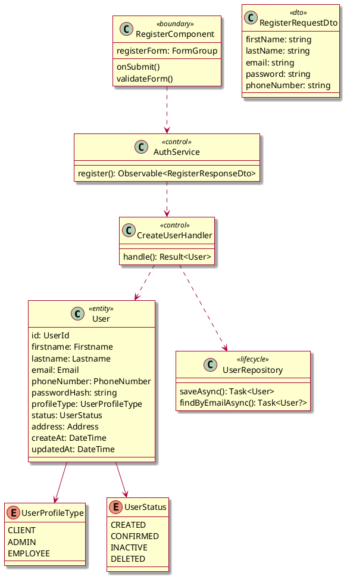

##### Diagramme de séquence (cas nominal)

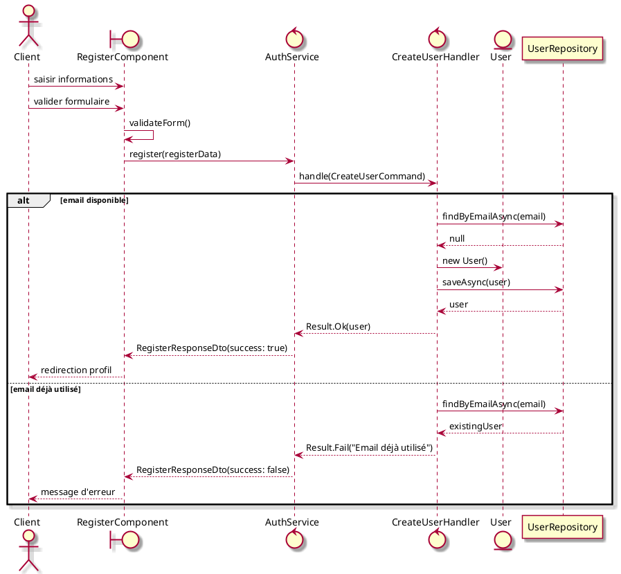

##### Classes consolidées

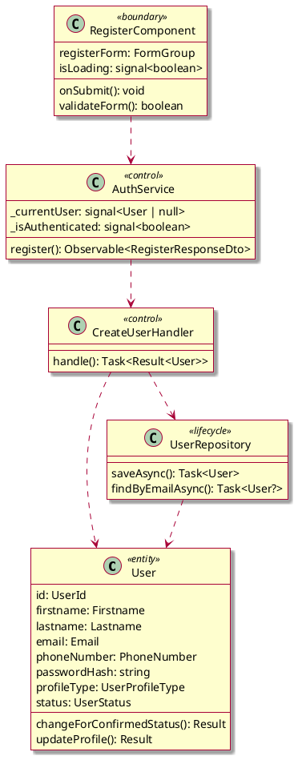

#### 4.1.2. Se connecter

L'utilisateur se connecte avec son email et mot de passe pour accéder aux fonctionnalités du système.

##### Classes candidates

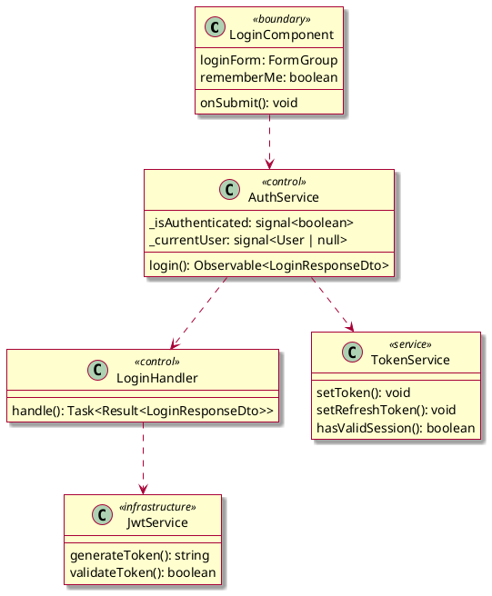

##### Diagramme de séquence (cas nominal)

```plantuml
@startuml
skin rose

actor Client as c
boundary LoginComponent as ui
control AuthService as auth
control LoginHandler as handler
service TokenService as token
entity User as u
participant UserRepository as repo

c -> ui : saisir email/password
c -> ui : cliquer connexion
ui -> auth : login(email, password, rememberMe)
auth -> handler : handle(LoginCommand)
handler -> repo : findByEmailAsync(email)
repo --> handler : user

alt utilisateur trouvé et password correct
  handler -> u : checkPassword(password)
  u --> handler : true
  handler -> token : generateToken(user)
  token --> handler : jwtToken
  handler --> auth : LoginResponseDto(success: true, token, user)
  auth -> token : setToken(jwtToken)
  auth -> auth : _currentUser.set(user)
  auth -> auth : _isAuthenticated.set(true)
  auth --> ui : success response
  ui --> c : redirection dashboard
else échec authentification
  handler --> auth : LoginResponseDto(success: false)
  auth --> ui : error response  
  ui --> c : message d'erreur
end

@enduml
```

#### 4.1.3. Gérer son profil

L'utilisateur authentifié peut consulter et modifier ses informations personnelles.

##### Classes candidates

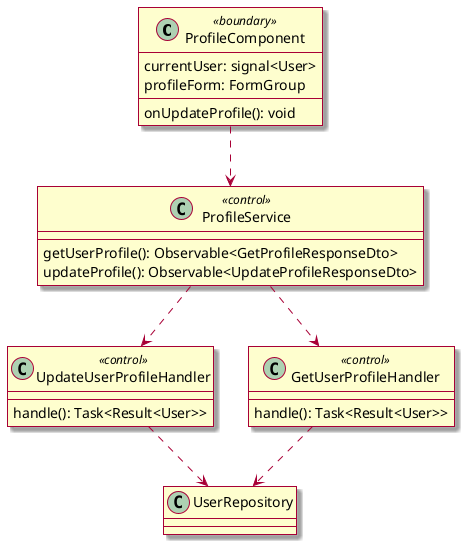

### 4.2. Groupe 2 : Gestion des prestations

#### 4.2.1. Consulter les prestations disponibles

Les utilisateurs peuvent consulter la liste des prestations offertes par l'établissement.

##### Classes candidates

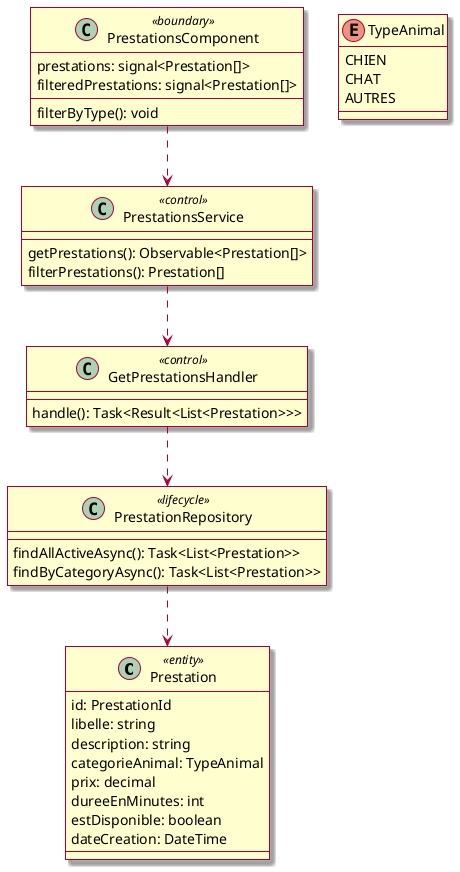

##### Diagramme de séquence (cas nominal)

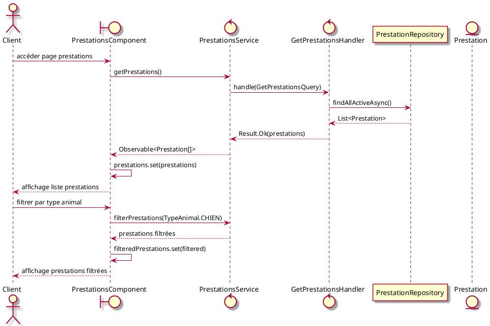

#### 4.2.2. Créer une prestation

Un administrateur peut créer de nouvelles prestations dans le système.

##### Classes candidates

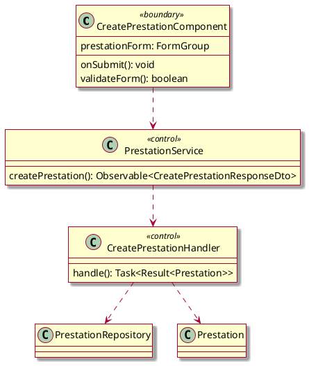

#### 4.2.3. Modifier une prestation

Un administrateur peut modifier les caractéristiques d'une prestation existante.

##### Diagramme de séquence

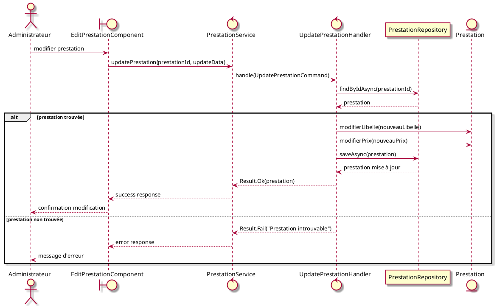

### 4.3. Groupe 3 : Gestion des animaux

#### 4.3.1. Enregistrer un animal

Un client peut enregistrer les informations de ses animaux dans le système.

##### Classes candidates

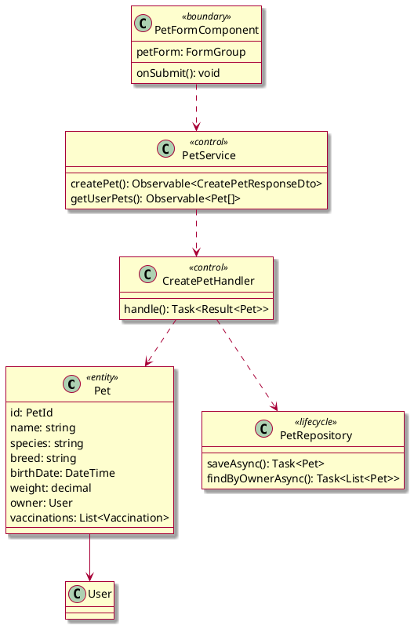

#### 4.3.2. Gérer les vaccinations

Le système permet d'enregistrer et suivre les vaccinations des animaux.

##### Classes candidates

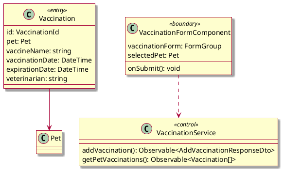

### 4.4. Groupe 4 : Gestion des réservations

#### 4.4.1. Créer une réservation

Un client peut créer une réservation pour une prestation donnée.

##### Classes candidates

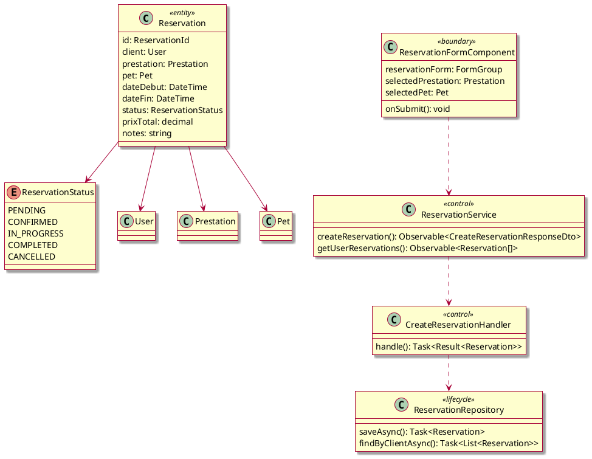

##### Diagramme de séquence (cas nominal)

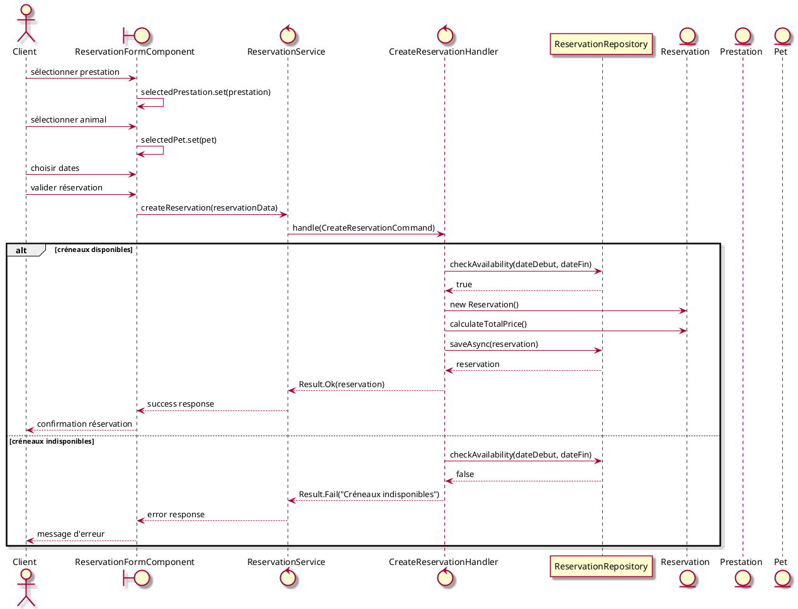

#### 4.4.2. Consulter ses réservations

Un client peut consulter l'historique de ses réservations.

##### Classes candidates

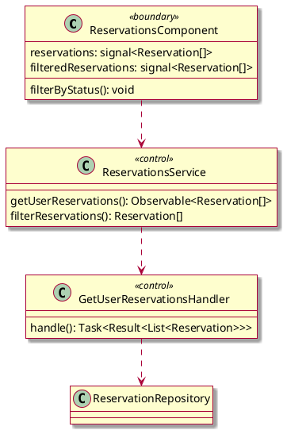

#### 4.4.3. Gérer le panier

Le système permet d'ajouter des prestations au panier avant de finaliser les réservations.

##### Classes candidates

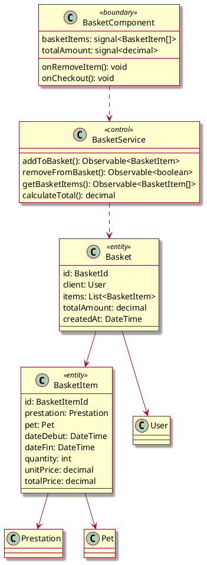

## 5. Regroupement des classes

### 5.1. Groupe Domaine

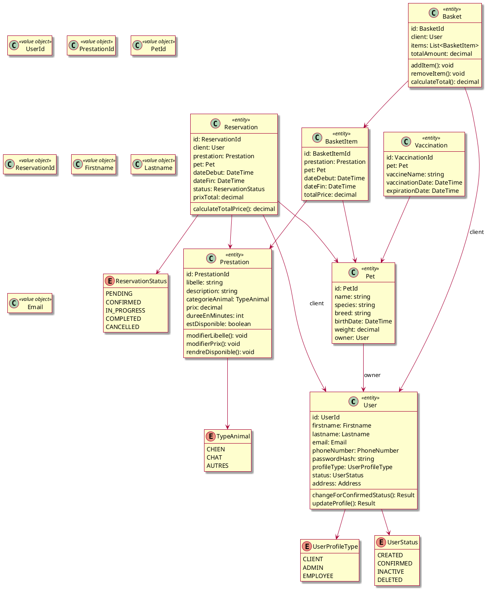

### 5.2. Groupe Application (CQRS)

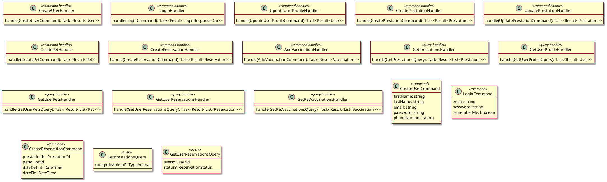

### 5.3. Groupe Infrastructure

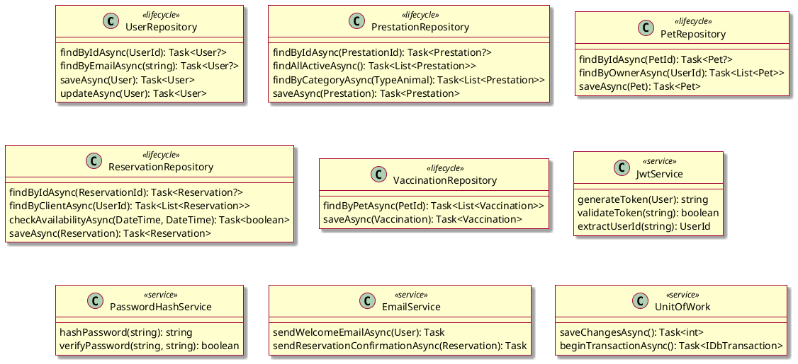

### 5.4. Groupe Présentation (API + Frontend)

```plantuml
@startuml
skin rose

' Backend - API Endpoints
class AuthenticationEndpoints <<boundary>> {
  registerAsync(RegisterRequestDto): Task<IResult>
  loginAsync(LoginRequestDto): Task<IResult>
  refreshTokenAsync(): Task<IResult>
}

class UsersEndpoints <<boundary>> {
  createUserAsync(CreateUserDto): Task<IResult>
  getUserProfileAsync(): Task<IResult>
  updateUserProfileAsync(UpdateUserDto): Task<IResult>
}

class PrestationsEndpoints <<boundary>> {
  getPrestationsAsync(): Task<IResult>
  createPrestationAsync(CreatePrestationRequest): Task<IResult>
  updatePrestationAsync(UpdatePrestationRequest): Task<IResult>
}

class ReservationsEndpoints <<boundary>> {
  createReservationAsync(CreateReservationRequest): Task<IResult>
  getUserReservationsAsync(): Task<IResult>
}

' Frontend - Components
class LoginComponent <<boundary>> {
  loginForm: FormGroup
  isLoading: signal<boolean>
  onSubmit(): void
}

class RegisterComponent <<boundary>> {
  registerForm: FormGroup
  onSubmit(): void
}

class PrestationsComponent <<boundary>> {
  prestations: signal<Prestation[]>
  filteredPrestations: signal<Prestation[]>
  filterByType(): void
}

class PetFormComponent <<boundary>> {
  petForm: FormGroup
  onSubmit(): void
}

class ReservationFormComponent <<boundary>> {
  reservationForm: FormGroup
  selectedPrestation: Prestation
  selectedPet: Pet
  onSubmit(): void
}

class BasketComponent <<boundary>> {
  basketItems: signal<BasketItem[]>
  totalAmount: signal<decimal>
  onCheckout(): void
}

' Frontend - Services
class AuthService <<control>> {
  register(): Observable<RegisterResponseDto>
  login(): Observable<LoginResponseDto>
  _currentUser: signal<User | null>
  _isAuthenticated: signal<boolean>
}

class PrestationsService <<control>> {
  getPrestations(): Observable<Prestation[]>
  createPrestation(): Observable<CreatePrestationResponseDto>
}

class ReservationService <<control>> {
  createReservation(): Observable<CreateReservationResponseDto>
  getUserReservations(): Observable<Reservation[]>
}

class BasketService <<control>> {
  addToBasket(): Observable<BasketItem>
  getBasketItems(): Observable<BasketItem[]>
}

' Relations Frontend
LoginComponent ..> AuthService
RegisterComponent ..> AuthService
PrestationsComponent ..> PrestationsService  
ReservationFormComponent ..> ReservationService
BasketComponent ..> BasketService

@enduml
```

## 6. Annexes

### 6.1. Terminologie

**Clean Architecture**
: Architecture en couches avec inversion de dépendance, où le domaine métier est au centre et ne dépend d'aucune couche externe.

**CQRS (Command Query Responsibility Segregation)**
: Séparation des responsabilités entre les commandes (écriture) et les requêtes (lecture).

**Value Object**
: Objet immuable défini par ses valeurs plutôt que par son identité.

**Domain Event**
: Événement métier qui se produit dans le domaine et peut déclencher des actions dans d'autres parties du système.

**JWT (JSON Web Token)**
: Standard de token d'authentification encodé en JSON, utilisé pour l'authentification stateless.

**Signals (Angular)**
: Primitive réactive d'Angular pour la gestion d'état, alternative moderne aux Observables pour certains cas.

**Standalone Components**
: Composants Angular 19 qui ne nécessitent pas de modules et peuvent être utilisés de manière autonome.

### 6.2. Architecture technique

**Stack technique :**
- **Backend** : .NET 8, Entity Framework Core, PostgreSQL
- **Frontend** : Angular 19, TypeScript, Angular Material, Bootstrap
- **Authentification** : JWT avec refresh tokens
- **Containerisation** : Docker, docker-compose
- **Tests** : Architecture tests avec NetArchTest

**Patterns architecturaux :**
- Clean Architecture avec DDD
- CQRS avec MediatR
- Repository + Unit of Work
- Dependency Injection
- Event Sourcing (partiel avec Domain Events)

**Organisation frontend :**
- Feature-based architecture
- Signals pour la gestion d'état
- Injection function pattern
- Standalone components sans NgModules
- Contracts pattern pour les DTOs

Ce système PetBoarding illustre une architecture moderne et robuste adaptée aux besoins métier de gestion de pension pour animaux, avec une séparation claire des responsabilités et une approche orientée domaine.