# Projet _PetBoarding_ : Conception V 1.0

## 1. Table des matières

- [1. Table des matières](#1-table-des-matières)
- [2. Objectif du document](#2-objectif-du-document)
  - [2.1. Sur l'état du document](#21-sur-létat-du-document)
- [3. Architecture](#3-architecture)
  - [3.1. Choix des technologies](#31-choix-des-technologies)
    - [3.1.1. Administration du système](#311-administration-du-système)
    - [3.1.2. Côté clients](#312-côté-clients)
    - [3.1.3. Gestion des prestations et réservations](#313-gestion-des-prestations-et-réservations)
  - [3.2. Contraintes techniques](#32-contraintes-techniques)
- [4. Technologies utilisées](#4-technologies-utilisées)
  - [4.1. Serveur web](#41-serveur-web)
  - [4.2. Stockage des données](#42-stockage-des-données)
  - [4.3. Couche de persistance](#43-couche-de-persistance)
  - [4.4. Couche métier](#44-couche-métier)
  - [4.5. Couche application](#45-couche-application)
  - [4.6. Couche présentation](#46-couche-présentation)
  - [4.7. Authentification](#47-authentification)
  - [4.8. Environnement de développement](#48-environnement-de-développement)
  - [4.9. Tests](#49-tests)
  - [4.10. Cache distribué](#410-cache-distribué)
  - [4.11. Système d'événements de domaine](#411-système-dévénements-de-domaine)
  - [4.12. Service d'envoi d'email](#412-service-denvoi-demail)
  - [4.13. Monitoring et observabilité](#413-monitoring-et-observabilité)
  - [4.14. Architecture et dépendances](#414-architecture-et-dépendances)
  - [4.15. Déploiement](#415-déploiement)
  - [4.16. TaskWorker et traitement asynchrone](#416-taskworker-et-traitement-asynchrone)
  - [4.17. Optimisation base de données et index](#417-optimisation-base-de-données-et-index)
- [5. Préliminaire à la conception](#5-préliminaire-à-la-conception)
- [6. Cas d'utilisation](#6-cas-dutilisation)
  - [6.1. Rappel : modèle conceptuel](#61-rappel--modèle-conceptuel)
  - [6.2. Sous domaine : gestion des utilisateurs](#62-sous-domaine--gestion-des-utilisateurs)
    - [6.2.1. Créer un compte utilisateur](#621-créer-un-compte-utilisateur)
      - [6.2.1.1. Diagramme de séquences](#6211-diagramme-de-séquences)
      - [6.2.1.2. Diagramme de classes](#6212-diagramme-de-classes)
    - [6.2.2. Authentification d'un utilisateur](#622-authentification-dun-utilisateur)
      - [6.2.2.1. Diagramme de séquences](#6221-diagramme-de-séquences)
      - [6.2.2.2. Diagramme de classes](#6222-diagramme-de-classes)
  - [6.3. Sous domaine : gestion des prestations](#63-sous-domaine--gestion-des-prestations)
    - [6.3.1. Visualiser les prestations disponibles](#631-visualiser-les-prestations-disponibles)
      - [6.3.1.1. Diagramme de séquences](#6311-diagramme-de-séquences)
      - [6.3.1.2. Diagramme de classes](#6312-diagramme-de-classes)
  - [6.4. Sous domaine : gestion des réservations](#64-sous-domaine--gestion-des-réservations)
    - [6.4.1. Créer une réservation](#641-créer-une-réservation)
      - [6.4.1.1. Diagramme de séquences](#6411-diagramme-de-séquences)
      - [6.4.1.2. Diagramme de classes](#6412-diagramme-de-classes)
    - [6.4.2. Gérer le panier de réservations](#642-gérer-le-panier-de-réservations)
      - [6.4.2.1. Diagramme de séquences](#6421-diagramme-de-séquences)
      - [6.4.2.2. Diagramme de classes](#6422-diagramme-de-classes)
  - [6.5. Sous domaine : gestion du planning et des créneaux](#65-sous-domaine--gestion-du-planning-et-des-créneaux)
    - [6.5.1. Consulter les créneaux disponibles](#651-consulter-les-créneaux-disponibles)
      - [6.5.1.1. Diagramme de séquences](#6511-diagramme-de-séquences)
      - [6.5.1.2. Diagramme de classes](#6512-diagramme-de-classes)
    - [6.5.2. Créer un planning pour une prestation](#652-créer-un-planning-pour-une-prestation)
      - [6.5.2.1. Diagramme de séquences](#6521-diagramme-de-séquences)
      - [6.5.2.2. Diagramme de classes](#6522-diagramme-de-classes)
  - [6.6. Sous domaine : gestion des animaux de compagnie](#66-sous-domaine--gestion-des-animaux-de-compagnie)
    - [6.6.1. Créer un animal de compagnie](#661-créer-un-animal-de-compagnie)
      - [6.6.1.1. Diagramme de séquences](#6611-diagramme-de-séquences)
      - [6.6.1.2. Diagramme de classes](#6612-diagramme-de-classes)
    - [6.6.2. Gérer le profil d'un animal](#662-gérer-le-profil-dun-animal)
      - [6.6.2.1. Diagramme de séquences](#6621-diagramme-de-séquences)
      - [6.6.2.2. Diagramme de classes](#6622-diagramme-de-classes)
  - [6.7. Sous domaine : gestion des paiements](#67-sous-domaine--gestion-des-paiements)
    - [6.7.1. Traiter un paiement](#671-traiter-un-paiement)
      - [6.7.1.1. Diagramme de séquences](#6711-diagramme-de-séquences)
      - [6.7.1.2. Diagramme de classes](#6712-diagramme-de-classes)
  - [6.8. Sous domaine : système de notifications](#68-sous-domaine--système-de-notifications)
    - [6.8.1. Envoi d'email automatique](#681-envoi-demail-automatique)
      - [6.8.1.1. Diagramme de séquences](#6811-diagramme-de-séquences)
      - [6.8.1.2. Diagramme de classes](#6812-diagramme-de-classes)
- [7. Regroupement des classes](#7-regroupement-des-classes)
  - [7.1. Groupe domaine](#71-groupe-domaine)
  - [7.2. Groupe cycle de vie](#72-groupe-cycle-de-vie)
  - [7.3. Groupe application](#73-groupe-application)
  - [7.4. Groupe interface utilisateur](#74-groupe-interface-utilisateur)
- [8. Choix, questions ouvertes et remarques](#8-choix-questions-ouvertes-et-remarques)
  - [8.1. Architecture Clean Architecture](#81-architecture-clean-architecture)
  - [8.2. Pattern CQRS](#82-pattern-cqrs)
  - [8.3. Gestion des créneaux et planning](#83-gestion-des-créneaux-et-planning)
  - [8.4. Critique de cette version du modèle](#84-critique-de-cette-version-du-modèle)
- [9. Annexes](#9-annexes)
  - [9.1. Terminologie](#91-terminologie)
  - [9.2. Autres annexes](#92-autres-annexes)
    - [9.2.1. Bibliographie](#921-bibliographie)

## 2. Objectif du document

Ce document aborde l'architecture, la conception et les choix techniques pour l'implémentation du projet « PetBoarding ». Les diagrammes suivent le langage de modélisation UML et les principes de la Clean Architecture.

- On commencera par énumérer les diverses contraintes techniques qui pèsent sur notre projet ;
- on décrira ensuite les technologies choisies ;
- puis l'architecture (les deux étant évidemment liés) ;
- et enfin, nous décrirons le design de notre système en revenant sur les _use cases_.

### 2.1. Sur l'état du document

Ce document présente l'architecture et la conception du système PetBoarding dans sa version actuelle. Le projet implémente une architecture Clean Architecture avec séparation claire des responsabilités entre les couches Domain, Application, Infrastructure, Persistence et API.

## 3. Architecture

### 3.1. Choix des technologies

Il est bien entendu possible de sélectionner plusieurs technologies différentes pour un même type de couches. Les points à considérer sont en particulier :

- la complexité de l'interface utilisateur ;
- les contraintes de déploiement ;
- le nombre et le type d'utilisateurs ;
- l'interaction avec le **système** de réservation ;
- les performances ;
- le passage à l'échelle ;
- la sécurité

#### 3.1.1. Administration du système

- Gestion des prestations, des utilisateurs et des plannings ;
- Interface d'administration intégrée dans l'application web ;
- Authentification par JWT avec gestion des permissions ;
- Sécurité renforcée avec autorisation basée sur les rôles.

#### 3.1.2. Côté clients

L'interface utilisateur est moderne et responsive. Une Single Page Application (SPA) Angular convient parfaitement pour :

- La navigation fluide entre les prestations
- La gestion interactive du panier
- La visualisation du planning en temps réel
- L'expérience utilisateur optimisée sur mobile et desktop

#### 3.1.3. Gestion des prestations et réservations

- Interface complexe nécessitant une réactivité en temps réel ;
- Gestion des créneaux de disponibilité avec mise à jour instantanée ;
- Système de panier avec persistance temporaire ;
- Intégration possible avec des systèmes de paiement ;
- Notifications en temps réel pour les changements de planning.

### 3.2. Contraintes techniques

- Le système doit être accessible via le web pour les clients ;
- Gestion en temps réel des créneaux de disponibilité pour éviter les conflits de réservation ;
- L'application s'adresse à des centres de pension pour animaux avec gestion de multiples prestations ;
- Maîtrise des technologies .NET et Angular ;
- Le système doit être fiable pour la gestion des réservations et paiements ;
- L'application doit être sécurisée avec authentification et autorisation robustes.

## 4. Technologies utilisées

### 4.1. Serveur web

Pour des raisons de performance et de maintenabilité, on utilise une application .NET 8 avec des Minimal APIs hébergée dans un conteneur Docker. Le serveur utilisé est Kestrel.

### 4.2. Stockage des données

Les données sont stockées dans une base de données PostgreSQL, qui offre de bonnes performances et une fiabilité éprouvée pour les applications transactionnelles.

### 4.3. Couche de persistance

La couche de persistance utilise Entity Framework Core avec le pattern Repository et Unit of Work pour l'abstraction des données.

### 4.4. Couche métier

La couche métier suit les principes du Domain Driven Design avec :

- Entités riches avec logique métier
- Value Objects pour la sécurité de type
- Services de domaine pour la logique transversale
- Events de domaine pour la communication entre agrégats

### 4.5. Couche application

La couche application implémente le pattern CQRS (Command Query Responsibility Segregation) avec :

- Commands pour les opérations de modification
- Queries pour les opérations de lecture
- Handlers dédiés pour chaque commande/requête

### 4.6. Couche présentation

La couche présentation est composée de :

- **Backend** : Minimal APIs .NET avec pattern d'endpoints
- **Frontend** : Application Angular 19 avec architecture standalone components
- Communication via API REST avec authentification JWT

### 4.7. Authentification

Authentification et autorisation basées sur :

- JWT (JSON Web Tokens) avec refresh tokens
- Système de permissions granulaires
- Autorisation basée sur les rôles et permissions
- Intercepteurs pour la gestion automatique des tokens

### 4.8. Environnement de développement

- **Backend** : .NET 8 SDK, Docker pour la base de données
- **Frontend** : Node.js, Angular CLI
- Développement conteneurisé avec Docker Compose
- Hot reload pour les deux parties

### 4.9. Tests

Le projet PetBoarding dispose d'une suite complète de tests organisée en plusieurs projets spécialisés, utilisant principalement **xUnit**, **FluentAssertions**, et **Moq** comme frameworks de test :

#### 4.9.1. Tests d'architecture (ArchitectureTests)

- **Framework** : NetArchTest avec xUnit
- **Objectif** : Valider les contraintes de Clean Architecture et les règles de dépendances entre couches
- **Localisation** : `Core_PetBoarding_Backend/Tests/ArchitectureTests/`
- **Tests implémentés** :
  - Validation de l'isolation des couches (Domain, Application, Infrastructure, Persistence)
  - Vérification des règles de dépendances inversées
  - Contrôle de la pureté du domaine métier

#### 4.9.2. Tests unitaires du domaine (DomainUnitTests)

- **Framework** : xUnit avec FluentAssertions
- **Objectif** : Tester la logique métier pure et les value objects du domaine
- **Localisation** : `DomainUnitTests/`
- **Couverture** :
  - Value objects (Address, Email, Firstname, StreetName, ...)
  - Entités métier (User, Pet, Prestation, ...)
  - Règles de validation et invariants métier

#### 4.9.3. Tests unitaires de l'infrastructure (InfrastructureUnitTests)

- **Framework** : xUnit avec Moq et FluentAssertions
- **Objectif** : Tester les services d'infrastructure sans dépendances externes
- **Localisation** : `InfrastructureUnitTests/`
- **Modules testés** :
  - Authentification JWT et gestion des permissions
  - Services de cache (Memcached) avec mocks
  - Système d'événements et messaging (MassTransit)
  - Services d'envoi d'email avec templates

#### 4.9.4. Tests d'intégration de persistance (PersistenceIntegrationTests)

- **Framework** : xUnit avec Testcontainers PostgreSQL et FluentAssertions
- **Objectif** : Tester complètement l'intégration de la couche persistance avec une base de données réelle
- **Localisation** : `PersistenceIntegrationTests/`
- **Architecture** :
  - `PostgreSqlTestBase` : Classe de base gérant le cycle de vie des conteneurs PostgreSQL
  - `TestBase` : Infrastructure commune pour les tests avec configuration automatique du DbContext
  - `EntityTestFactory` : Factory pour la création d'entités de test cohérentes
- **Couverture détaillée** :
  - **Repositories** : Tests complets de tous les repositories (User, Prestation, Reservation)
  - **Unit of Work** : Validation des transactions et de la cohérence des données
  - **ApplicationDbContext** : Tests de configuration EF Core et mapping des entités
  - **Configurations** : Validation des configurations Entity Framework (UserConfiguration, etc.)
  - **Performance** : Tests de performance avec analyse des requêtes générées
  - **Intégration base de données** : Tests end-to-end avec données réelles
- **Approche avancée** :
  - Conteneurs PostgreSQL isolés par test pour éviter les interférences
  - Tests de concurrence et gestion des conflits
  - Validation des contraintes de base de données et indexes
  - Tests de migration et de rollback

#### 4.9.5. Structure et technologies communes

- **Framework de base** : .NET 9.0 avec xUnit
- **Assertions** : FluentAssertions pour une syntaxe expressive
- **Mocking** : Moq pour les dépendances externes
- **Couverture** : Coverlet pour l'analyse de couverture de code
- **Intégration continue** : Compatible avec les pipelines de build automatisés

### 4.10. Cache distribué

Le système utilise Memcached comme solution de cache distribué pour optimiser les performances :

- **Technologie** : Memcached avec la librairie Enyim.Caching
- **Pattern** : Cache-Aside avec fallback automatique
- **Configuration** : Service injecté via ICacheService
- **Durée par défaut** : 30 minutes configurable
- **Gestion d'erreurs** : Dégradation gracieuse en cas de panne du cache

Entités mises en cache :

- Utilisateurs (par ID et email)
- Prestations
- Sessions utilisateur
- Données de profil des animaux

### 4.11. Système d'événements de domaine

Architecture événementielle avec RabbitMQ et MassTransit :

- **Message Broker** : RabbitMQ pour la persistance des messages
- **Framework** : MassTransit pour l'abstraction .NET
- **Pattern** : Event-Driven Architecture avec Publish/Subscribe
- **Events disponibles** :
  - UserRegisteredEvent : Création d'un utilisateur
  - PetRegisteredEvent : Enregistrement d'un animal
  - ReservationCreatedEvent : Nouvelle réservation
  - PaymentProcessedEvent : Traitement de paiement

### 4.12. Service d'envoi d'email

Service de notification par email intégré avec les événements de domaine :

- **Protocole** : SMTP avec System.Net.Mail
- **Templates** : Système de templates HTML avec placeholders
- **Configuration** : Support SMTP sécurisé (SSL/TLS)
- **Types d'emails** :
  - Email de bienvenue après inscription
  - Confirmations de réservation
  - Confirmations de paiement
  - Rappels de vaccination

### 4.13. Monitoring et observabilité

Le système PetBoarding intègre une stack complète de monitoring et d'observabilité pour assurer le suivi des performances, le debugging et la maintenance proactive de l'application.

#### 4.13.1. Tracing distribué avec Jaeger et OpenTelemetry

- **Framework** : OpenTelemetry .NET SDK pour l'instrumentation automatique et manuelle
- **Collector** : Jaeger All-in-One pour la collecte, le stockage et la visualisation des traces
- **Protocol** : OTLP (OpenTelemetry Protocol) via gRPC pour le transport des données
- **Configuration** :
  - Service name configuré par application (PetBoarding.Api, PetBoarding.TaskWorker)
  - Endpoint Jaeger : `http://jaeger:4317`
  - Auto-instrumentation pour HTTP, Entity Framework, et MassTransit
- **Fonctionnalités** :
  - Tracing des requêtes HTTP avec détails des performances
  - Suivi des requêtes base de données avec requêtes SQL générées
  - Correlation des traces entre API et TaskWorker via les événements
  - Analyse des goulets d'étranglement et temps de réponse
  - Interface web Jaeger UI disponible sur le port 16686

#### 4.13.2. Logging centralisé avec SeriLog et Seq

- **Framework de logging** : Serilog avec support des logs structurés
- **Centralisation** : Seq pour l'agrégation et l'analyse des logs
- **Configuration** :
  - URL Seq : `http://seq` (port 5341 pour l'interface web)
  - Authentification : admin/petboarding123
  - Format JSON structuré avec enrichissement automatique
- **Niveaux de log** :
  - **Error** : Exceptions et erreurs critiques
  - **Warning** : Situations anormales non bloquantes
  - **Information** : Événements métier importants (création utilisateur, réservation, etc.)
  - **Debug** : Détails techniques pour le debugging
- **Enrichissement automatique** :
  - SourceContexte
  - Nom de la librairie
  - Propriétés custom pour les événements métier

#### 4.13.3. Métriques et alerting

- **Métriques OpenTelemetry** : Compteurs personnalisés pour les événements métier
- **Métriques système** : CPU, mémoire, connexions base de données
- **Dashboards** : Visualisation via Jaeger UI pour les traces et Seq pour les logs
- **Corrélation** : Lien automatique entre traces, logs et métriques via correlation ID

#### 4.13.4. Configuration réseau observability

- **Réseau dédié** : `observability-network` pour isoler les services de monitoring
- **Volumes persistants** :
  - `.containers/jaeger-data` : Stockage des traces Jaeger
  - `.containers/seq-data` : Stockage des logs Seq
- **Ports exposés** :
  - Jaeger UI : 16686
  - Jaeger OTLP gRPC : 4317
  - Jaeger OTLP HTTP : 4318
  - Seq Web UI : 5341
  - Seq Ingestion : 5342

### 4.14. Architecture et dépendances

L'architecture suit les principes de la Clean Architecture avec inversion des dépendances :

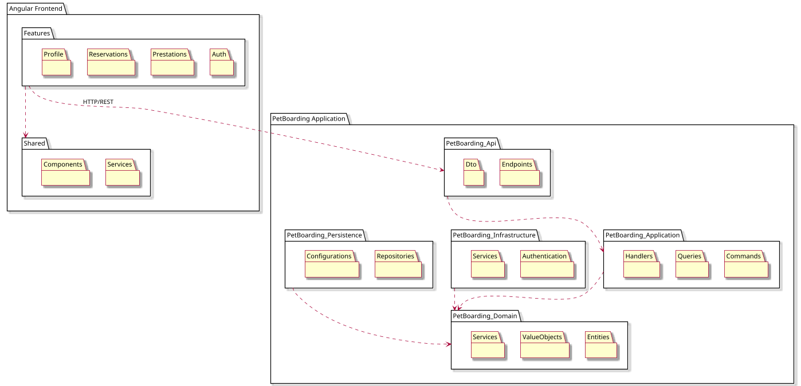
```plantuml
@startuml packages
scale 0.8
skin rose

package "PetBoarding Application" {
  package "PetBoarding_Api" {
    package "Endpoints" {
    }
    package "Dto" {
    }
  }

  package "PetBoarding_Application" {
    package "Commands" {
    }
    package "Queries" {
    }
    package "Handlers" {
    }
  }

  package "PetBoarding_Domain" {
    package "Entities" {
    }
    package "ValueObjects" {
    }
    package "Services" {
    }
  }

  package "PetBoarding_Infrastructure" {
    package "Authentication" {
    }
    package "Services" {
    }
  }

  package "PetBoarding_Persistence" {
    package "Repositories" {
    }
    package "Configurations" {
    }
  }
}

package "Angular Frontend" {
  package "Features" {
    package "Auth" {
    }
    package "Prestations" {
    }
    package "Reservations" {
    }
    package "Profile" {
    }
  }

  package "Shared" {
    package "Services" {
    }
    package "Components" {
    }
  }
}

PetBoarding_Api ..> PetBoarding_Application
PetBoarding_Application ..> PetBoarding_Domain
PetBoarding_Infrastructure ..> PetBoarding_Domain
PetBoarding_Persistence ..> PetBoarding_Domain
Features ..> Shared
Features ..> PetBoarding_Api : HTTP/REST

@enduml
```

### 4.15. Déploiement

L'architecture de déploiement a été étendue pour inclure un écosystème complet avec monitoring, messaging et cache distribué. Le système utilise Docker Compose pour orchestrer l'ensemble des services.

#### 4.15.1. Architecture de déploiement complète

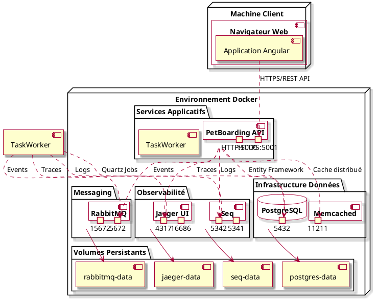
```plantuml
@startuml deploiement_complet
!pragma layout smetana
skin rose

node "Machine Client" {
  component "Navigateur Web" {
    component "Application Angular"
  }
}

node "Environnement Docker" {
  
  package "Services Applicatifs" {
    component "PetBoarding API" {
      port "HTTPS:5001" as api_https
      port "HTTP:5000" as api_http
    }
    component "TaskWorker" as worker
  }
  
  package "Infrastructure Données" {
    database "PostgreSQL" as postgres {
      port "5432" as db_port
    }
    component "Memcached" as cache {
      port "11211" as cache_port
    }
  }
  
  package "Messaging" {
    component "RabbitMQ" as rabbitmq {
      port "5672" as amqp_port
      port "15672" as rabbit_ui
    }
  }
  
  package "Observabilité" {
    component "Jaeger UI" as jaeger {
      port "16686" as jaeger_ui
      port "4317" as otlp_grpc
    }
    component "Seq" as seq {
      port "5341" as seq_ui
      port "5342" as seq_ingest
    }
  }
  
  package "Volumes Persistants" {
    component "postgres-data" as pg_vol
    component "rabbitmq-data" as rabbit_vol
    component "jaeger-data" as jaeger_vol
    component "seq-data" as seq_vol
  }
}

[Application Angular] ..> api_https : HTTPS/REST API
[PetBoarding API] ..> db_port : Entity Framework
[TaskWorker] ..> db_port : Quartz Jobs
[PetBoarding API] ..> cache_port : Cache distribué
[PetBoarding API] ..> amqp_port : Events
[TaskWorker] ..> amqp_port : Events
[PetBoarding API] ..> otlp_grpc : Traces
[TaskWorker] ..> otlp_grpc : Traces
[PetBoarding API] ..> seq_ingest : Logs
[TaskWorker] ..> seq_ingest : Logs

postgres --> pg_vol
rabbitmq --> rabbit_vol
jaeger --> jaeger_vol
seq --> seq_vol

@enduml
```

#### 4.15.2. Services Docker Compose

**Services principaux** :

- **petboarding_api** : API principale .NET 9 (ports 5000/5001)
- **petboarding_taskworker** : Worker service pour tâches asynchrones
- **postgres.database** : Base de données PostgreSQL 17 (port 5432)

**Services d'infrastructure** :

- **memcached** : Cache distribué (port 11211)
- **rabbitmq** : Message broker avec interface de management (ports 5672/15672)

**Services d'observabilité** :

- **jaeger** : Tracing distribué avec Jaeger All-in-One (ports 16686/4317/4318)
- **seq** : Logging centralisé (ports 5341/5342)

#### 4.15.3. Réseaux Docker

**Segmentation réseau** pour l'isolation et la sécurité :

- **app-network** : Communication entre services applicatifs
- **database-network** : Accès base de données
- **cache-network** : Accès au cache Memcached
- **messaging-network** : Communication RabbitMQ
- **observability-network** : Services de monitoring isolés

#### 4.15.4. Configuration environnement

**Variables d'environnement communes** :

```yaml
# Base de données
ConnectionStrings__Database: Host=postgres.database;Port=5432;Database=petboarding;Username=postgres;Password=postgres

# RabbitMQ
RabbitMQ__Host: rabbitmq
RabbitMQ__Username: petboarding
RabbitMQ__Password: petboarding123

# Observabilité
JAEGER_ENDPOINT: http://jaeger:4317
SEQ_URL: http://seq
OTEL_SERVICE_NAME: PetBoarding.Api # ou PetBoarding.TaskWorker
```

#### 4.15.5. Volumes persistants

**Stockage des données** :
- `.containers/petboarding-db` : Données PostgreSQL
- `.containers/rabbitmq-data` : Messages RabbitMQ persistants
- `.containers/jaeger-data` : Traces Jaeger
- `.containers/seq-data` : Logs Seq
- `~/.aspnet/https` : Certificats HTTPS pour développement

#### 4.15.6. Health checks et dépendances

**Supervision de santé** :
- PostgreSQL : `pg_isready` check toutes les 5 secondes
- RabbitMQ : `rabbitmq-diagnostics ping` toutes les 30 secondes

**Orchestration des dépendances** :
- L'API attend PostgreSQL, Memcached, RabbitMQ, Jaeger et Seq
- Le TaskWorker attend l'API, PostgreSQL, RabbitMQ, Jaeger et Seq

#### 4.15.7. Commandes de déploiement

```bash
# Démarrage complet de l'stack
docker-compose up --build

# Services accessibles :
# API : https://localhost:5001
# Swagger : https://localhost:5001/swagger
# RabbitMQ UI : http://localhost:15672
# Jaeger UI : http://localhost:16686
# Seq UI : http://localhost:5341
# PostgreSQL : localhost:5432
```

### 4.16. TaskWorker et traitement asynchrone

Le système PetBoarding utilise un composant **TaskWorker** dédié pour le traitement asynchrone des tâches de maintenance et de nettoyage. Ce service fonctionne en arrière-plan et s'exécute indépendamment de l'API principale.

#### Architecture du TaskWorker

- **Framework** : Quartz.NET pour la planification et l'exécution de jobs
- **Persistance** : PostgreSQL pour le stockage de l'état des jobs (clustering, historique)
- **Pattern** : CQRS avec MediatR pour la cohérence architecturale avec le reste de l'application
- **Isolation** : Service autonome (.NET Worker Service) avec ses propres processus et logs
- **Clustering** : Support multi-instances avec coordination via base de données
- **Configuration** : Séparée avec appsettings.json dédiés

#### Jobs implémentés

**CleanExpiredBasketsJob** :

- **Objectif** : Nettoyer les paniers expirés et libérer les créneaux réservés temporairement
- **Fréquence** : Configurable (par défaut : 10 minutes)
- **Handler** : `ProcessExpiredBasketsCommandHandler` via MediatR
- **Configuration** : `TaskWorker:ExpiredBasketCleanupIntervalMinutes` et `TaskWorker:BasketExpirationMinutes` (défaut: 30 min)

**ProcessExpiredReservationsJob** :

- **Objectif** : Traiter les réservations expirées et mettre à jour leur statut
- **Fréquence** : Configurable (par défaut : 15 minutes)
- **Handler** : `ProcessExpiredReservationsCommandHandler`
- **Configuration** : `TaskWorker:ExpiredReservationProcessingIntervalMinutes`

#### Configuration et déploiement

Le TaskWorker utilise la même base de données que l'API principale mais s'exécute en tant que service distinct :

**Structure du projet** :

- **Localisation** : `Core_PetBoarding_Backend/PetBoarding_TaskWorker/`
- **Type** : .NET Worker Service autonome
- **Dependencies** : Partage les couches Application, Infrastructure et Persistence
- **Configuration** : appsettings.json séparés avec paramètres spécifiques


**Déploiement Docker** :

- Partage la même base de données PostgreSQL que l'API
- Configuration via variables d'environnement
- Orchestration via docker-compose.yml

**Paramètres de configuration** :

- `ExpiredBasketCleanupIntervalMinutes` : Intervalle de nettoyage des paniers (défaut: 10 min)
- `BasketExpirationMinutes` : Durée de vie des paniers temporaires (défaut: 30 min)
- `ExpiredReservationProcessingIntervalMinutes` : Traitement des réservations expirées (défaut: 15 min)

#### Avantages de l'approche

- **Séparation des préoccupations** : Traitements lourds et où à interval isolés de l'API
- **Haute disponibilité** : Clustering Quartz pour la redondance
- **Observabilité** : Logs détaillés et surveillance des jobs
- **Scalabilité** : Possibilité de déployer plusieurs instances
- **Cohérence** : Réutilise les handlers CQRS existants

### 4.17. Optimisation base de données et index

Le système PetBoarding implémente une stratégie d'optimisation complète basée sur **19 index de performance** ciblant les requêtes les plus fréquentes. Cette optimisation suit une approche déclarative avec Entity Framework Core.

#### Architecture d'indexation

**Approche déclarative** :

- Index définis dans les fichiers `*Configuration.cs` avec Entity Framework
- Génération automatique du SQL optimisé pour PostgreSQL
- Versioning intégré via les migrations EF Core
- Type-safety et validation au compile-time

**Types d'index utilisés** :

- **Index composites** : Optimisation des requêtes multi-critères
- **Index partiels** : Avec filtres WHERE pour réduire la taille
- **Index avec tri** : IsDescending() pour optimiser les ORDER BY
- **Index uniques** : Contraintes d'intégrité avec performance

#### Index critiques par domaine

**Authentification (UserConfiguration)** :

- `idx_users_email_password` : Optimise les connexions utilisateur (gain 90%+)
- `idx_users_email` : Validation unicité et recherches par email

**Gestion des réservations (ReservationConfiguration)** :

- `idx_reservations_userid_createdat` : Historique utilisateur avec tri chronologique
- `idx_reservations_user_displayed` : Index partiel pour réservations visibles seulement
- `idx_reservations_date_range` : Optimise les recherches par plages de dates

**Catalogue prestations (PrestationConfiguration)** :

- `idx_prestations_disponible` : Index partiel pour prestations disponibles uniquement
- `idx_prestations_disponible_categorie` : Filtres multiples performances

**Gestion planning (ReservationSlotConfiguration)** :

- `idx_reservation_slots_reservation_available` : Jointures optimisées avec contrainte unique
- `idx_reservation_slots_active` : Index partiel pour créneaux non libérés

#### Stratégie de mise en production

**Migration automatique** :

```bash
# Application des index via migration EF Core
dotnet ef database update --project PetBoarding_Persistence --startup-project PetBoarding_Api
```

**Avantages de l'approche EF Core** :

- Pas de verrouillage des tables pendant la création
- Rollback automatique complet via méthode Down()
- Application reste accessible pendant la migration
- SQL optimisé automatiquement pour PostgreSQL

**Impact performance attendu** :

- Authentification : amélioration de 90%+ des temps de connexion
- Historique réservations : gain de 80%+ sur les requêtes utilisateur
- Recherche prestations : amélioration de 70%+ pour les listes filtrées
- Gestion planning : optimisation de 75%+ des requêtes temporelles

Pour plus de détails techniques, voir le document `README_PerformanceIndexes.md` dans le projet PetBoarding_Persistence.

## 5. Préliminaire à la conception

La conception suit une approche itérative basée sur les principes de la Clean Architecture. Le système PetBoarding gère la réservation de prestations pour animaux avec :

- Gestion des utilisateurs et authentification
- Catalogue de prestations par type d'animal
- Système de réservation avec planning en temps réel
- Panier de réservations avec paiement
- Gestion des profils utilisateurs et animaux

L'architecture CQRS permet une séparation claire entre les opérations de lecture et d'écriture, optimisant les performances et la maintenabilité.

## 6. Cas d'utilisation

### 6.1. Rappel : modèle conceptuel

Le modèle conceptuel principal comprend les entités suivantes :

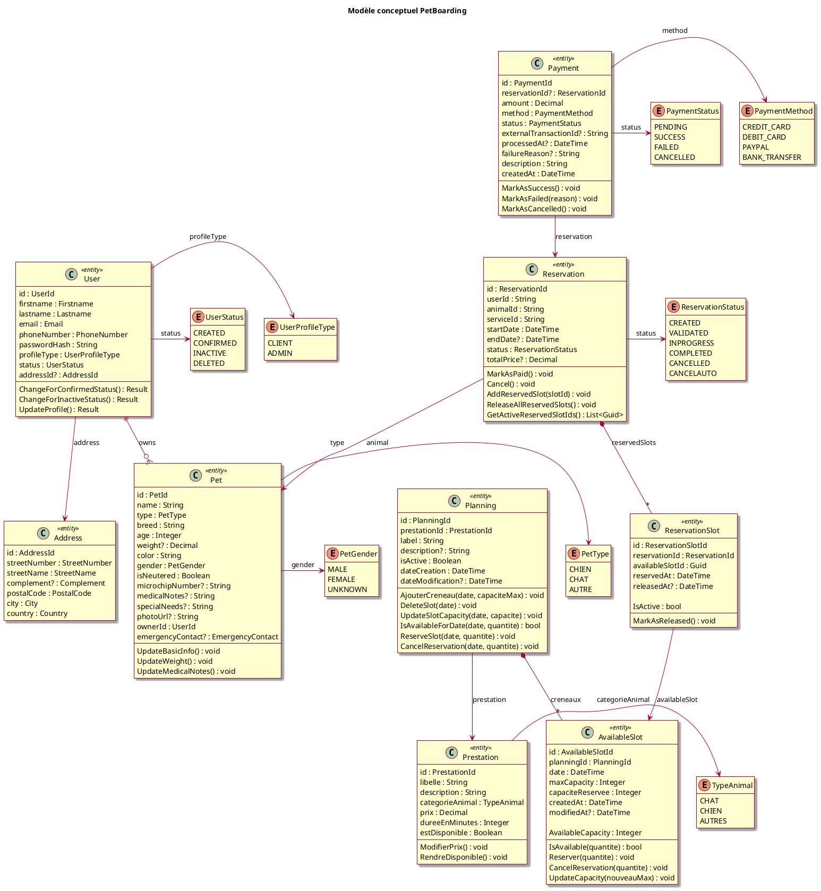
```plantuml
@startuml
skin rose
hide empty members
title Modèle conceptuel PetBoarding

class User <<entity>> {
  id : UserId
  firstname : Firstname
  lastname : Lastname
  email : Email
  phoneNumber : PhoneNumber
  passwordHash : String
  profileType : UserProfileType
  status : UserStatus
  addressId? : AddressId

  ChangeForConfirmedStatus() : Result
  ChangeForInactiveStatus() : Result
  UpdateProfile() : Result
}

class Address <<entity>> {
  id : AddressId
  streetNumber : StreetNumber
  streetName : StreetName
  complement? : Complement
  postalCode : PostalCode
  city : City
  country : Country
}

class Prestation <<entity>> {
  id : PrestationId
  libelle : String
  description : String
  categorieAnimal : TypeAnimal
  prix : Decimal
  dureeEnMinutes : Integer
  estDisponible : Boolean

  ModifierPrix() : void
  RendreDisponible() : void
}

class Planning <<entity>> {
  id : PlanningId
  prestationId : PrestationId
  label : String
  description? : String
  isActive : Boolean
  dateCreation : DateTime
  dateModification? : DateTime

  AjouterCreneau(date, capaciteMax) : void
  DeleteSlot(date) : void
  UpdateSlotCapacity(date, capacite) : void
  IsAvailableForDate(date, quantite) : bool
  ReserveSlot(date, quantite) : void
  CancelReservation(date, quantite) : void
}

class AvailableSlot <<entity>> {
  id : AvailableSlotId
  planningId : PlanningId
  date : DateTime
  maxCapacity : Integer
  capaciteReservee : Integer
  createdAt : DateTime
  modifiedAt? : DateTime

  AvailableCapacity : Integer
  IsAvailable(quantite) : bool
  Reserver(quantite) : void
  CancelReservation(quantite) : void
  UpdateCapacity(nouveauMax) : void
}

class Reservation <<entity>> {
  id : ReservationId
  userId : String
  animalId : String
  serviceId : String
  startDate : DateTime
  endDate? : DateTime
  status : ReservationStatus
  totalPrice? : Decimal

  MarkAsPaid() : void
  Cancel() : void
  AddReservedSlot(slotId) : void
  ReleaseAllReservedSlots() : void
  GetActiveReservedSlotIds() : List<Guid>
}

class ReservationSlot <<entity>> {
  id : ReservationSlotId
  reservationId : ReservationId
  availableSlotId : Guid
  reservedAt : DateTime
  releasedAt? : DateTime

  IsActive : bool
  MarkAsReleased() : void
}

class Pet <<entity>> {
  id : PetId
  name : String
  type : PetType
  breed : String
  age : Integer
  weight? : Decimal
  color : String
  gender : PetGender
  isNeutered : Boolean
  microchipNumber? : String
  medicalNotes? : String
  specialNeeds? : String
  photoUrl? : String
  ownerId : UserId
  emergencyContact? : EmergencyContact

  UpdateBasicInfo() : void
  UpdateWeight() : void
  UpdateMedicalNotes() : void
}

class Payment <<entity>> {
  id : PaymentId
  reservationId? : ReservationId
  amount : Decimal
  method : PaymentMethod
  status : PaymentStatus
  externalTransactionId? : String
  processedAt? : DateTime
  failureReason? : String
  description : String
  createdAt : DateTime

  MarkAsSuccess() : void
  MarkAsFailed(reason) : void
  MarkAsCancelled() : void
}

enum UserProfileType {
  CLIENT
  ADMIN
}

enum UserStatus {
  CREATED
  CONFIRMED
  INACTIVE
  DELETED
}

enum TypeAnimal {
  CHAT
  CHIEN
  AUTRES
}

enum ReservationStatus {
  CREATED
  VALIDATED
  INPROGRESS
  COMPLETED
  CANCELLED
  CANCELAUTO
}

enum PetType {
  CHIEN
  CHAT
  AUTRE
}

enum PetGender {
  MALE
  FEMALE
  UNKNOWN
}

enum PaymentMethod {
  CREDIT_CARD
  DEBIT_CARD
  PAYPAL
  BANK_TRANSFER
}

enum PaymentStatus {
  PENDING
  SUCCESS
  FAILED
  CANCELLED
}

User --> Address : address
User -> UserProfileType : profileType
User -> UserStatus : status
User ||--o{ Pet : owns
Pet -> PetType : type
Pet -> PetGender : gender
Prestation -> TypeAnimal : categorieAnimal
Planning --> Prestation : prestation
Planning *-- "*" AvailableSlot : creneaux
Reservation -> ReservationStatus : status
Reservation *-- "*" ReservationSlot : reservedSlots
Reservation --> Pet : animal
ReservationSlot --> AvailableSlot : availableSlot
Payment -> PaymentMethod : method
Payment -> PaymentStatus : status
Payment --> Reservation : reservation

@enduml
```

### 6.2. Sous domaine : gestion des utilisateurs

#### 6.2.1. Créer un compte utilisateur

##### 6.2.1.1. Diagramme de séquences

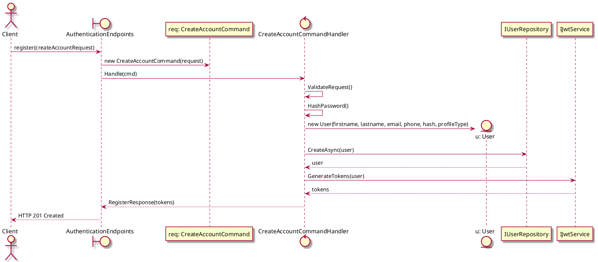
```plantuml
@startuml
skin rose
actor Client as c
boundary AuthenticationEndpoints as api
participant "req: CreateAccountCommand" as cmd
control CreateAccountCommandHandler as handler
entity "u: User" as user
participant IUserRepository as repo
participant IJwtService as jwt

c -> api : register(createAccountRequest)
api -> cmd : new CreateAccountCommand(request)
api -> handler : Handle(cmd)
handler -> handler : ValidateRequest()
handler -> handler : HashPassword()
create user
handler -> user : new User(firstname, lastname, email, phone, hash, profileType)
handler -> repo : CreateAsync(user)
repo --> handler : user
handler -> jwt : GenerateTokens(user)
jwt --> handler : tokens
handler --> api : RegisterResponse(tokens)
api --> c : HTTP 201 Created

@enduml
```

##### 6.2.1.2. Diagramme de classes

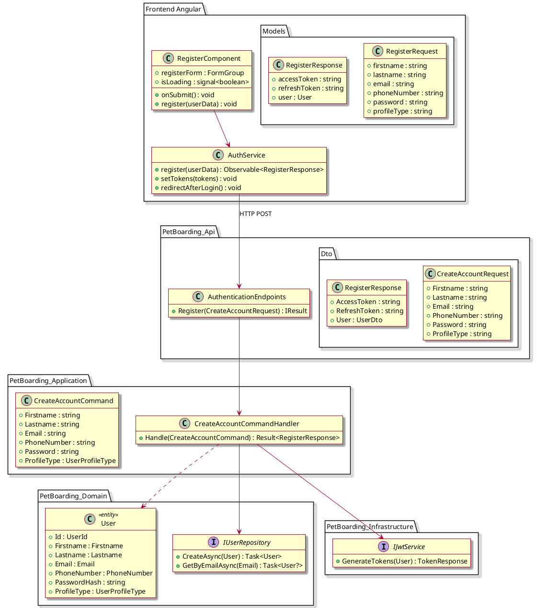
```plantuml
@startuml
skin rose
hide empty members

package "Frontend Angular" {
  class RegisterComponent {
    + registerForm : FormGroup
    + isLoading : signal<boolean>
    + onSubmit() : void
    + register(userData) : void
  }

  class AuthService {
    + register(userData) : Observable<RegisterResponse>
    + setTokens(tokens) : void
    + redirectAfterLogin() : void
  }

  package "Models" {
    class RegisterRequest {
      + firstname : string
      + lastname : string
      + email : string
      + phoneNumber : string
      + password : string
      + profileType : string
    }

    class RegisterResponse {
      + accessToken : string
      + refreshToken : string
      + user : User
    }
  }
}

package "PetBoarding_Api" {
  class AuthenticationEndpoints {
    + Register(CreateAccountRequest) : IResult
  }

  package "Dto" {
    class CreateAccountRequest {
      + Firstname : string
      + Lastname : string
      + Email : string
      + PhoneNumber : string
      + Password : string
      + ProfileType : string
    }

    class RegisterResponse {
      + AccessToken : string
      + RefreshToken : string
      + User : UserDto
    }
  }
}

package "PetBoarding_Application" {
  class CreateAccountCommandHandler {
    + Handle(CreateAccountCommand) : Result<RegisterResponse>
  }

  class CreateAccountCommand {
    + Firstname : string
    + Lastname : string
    + Email : string
    + PhoneNumber : string
    + Password : string
    + ProfileType : UserProfileType
  }
}

package "PetBoarding_Domain" {
  class User <<entity>> {
    + Id : UserId
    + Firstname : Firstname
    + Lastname : Lastname
    + Email : Email
    + PhoneNumber : PhoneNumber
    + PasswordHash : string
    + ProfileType : UserProfileType
  }

  interface IUserRepository {
    + CreateAsync(User) : Task<User>
    + GetByEmailAsync(Email) : Task<User?>
  }
}

package "PetBoarding_Infrastructure" {
  interface IJwtService {
    + GenerateTokens(User) : TokenResponse
  }
}

RegisterComponent --> AuthService
AuthService --> AuthenticationEndpoints : HTTP POST
AuthenticationEndpoints --> CreateAccountCommandHandler
CreateAccountCommandHandler --> IUserRepository
CreateAccountCommandHandler --> IJwtService
CreateAccountCommandHandler ..> User
@enduml
```

#### 6.2.2. Authentification d'un utilisateur

##### 6.2.2.1. Diagramme de séquences

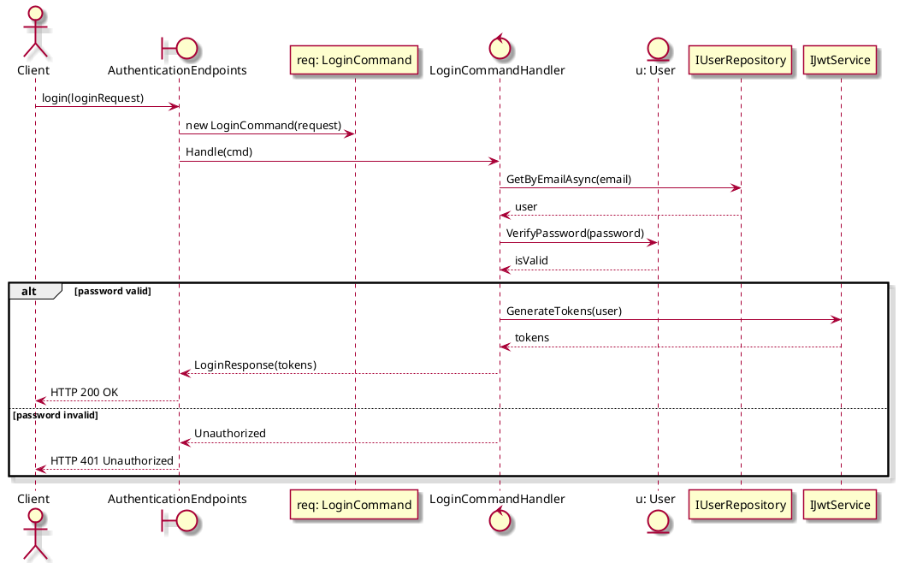
```plantuml
@startuml
skin rose
actor Client as c
boundary AuthenticationEndpoints as api
participant "req: LoginCommand" as cmd
control LoginCommandHandler as handler
entity "u: User" as user
participant IUserRepository as repo
participant IJwtService as jwt

c -> api : login(loginRequest)
api -> cmd : new LoginCommand(request)
api -> handler : Handle(cmd)
handler -> repo : GetByEmailAsync(email)
repo --> handler : user
handler -> user : VerifyPassword(password)
user --> handler : isValid
alt password valid
  handler -> jwt : GenerateTokens(user)
  jwt --> handler : tokens
  handler --> api : LoginResponse(tokens)
  api --> c : HTTP 200 OK
else password invalid
  handler --> api : Unauthorized
  api --> c : HTTP 401 Unauthorized
end

@enduml
```

##### 6.2.2.2. Diagramme de classes

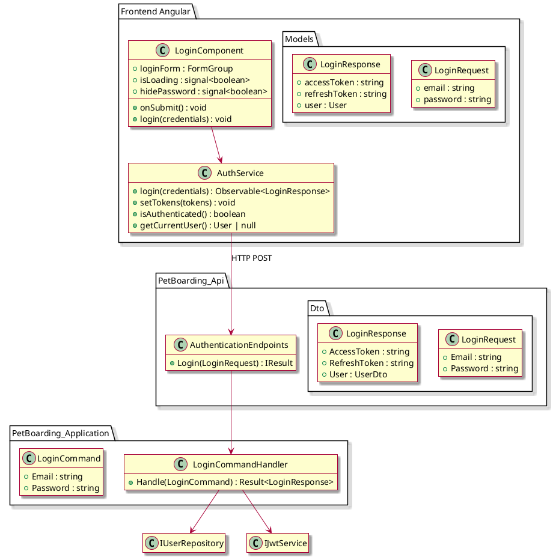
```plantuml
@startuml
skin rose
hide empty members

package "Frontend Angular" {
  class LoginComponent {
    + loginForm : FormGroup
    + isLoading : signal<boolean>
    + hidePassword : signal<boolean>
    + onSubmit() : void
    + login(credentials) : void
  }

  class AuthService {
    + login(credentials) : Observable<LoginResponse>
    + setTokens(tokens) : void
    + isAuthenticated() : boolean
    + getCurrentUser() : User | null
  }

  package "Models" {
    class LoginRequest {
      + email : string
      + password : string
    }

    class LoginResponse {
      + accessToken : string
      + refreshToken : string
      + user : User
    }
  }
}

package "PetBoarding_Api" {
  class AuthenticationEndpoints {
    + Login(LoginRequest) : IResult
  }

  package "Dto" {
    class LoginRequest {
      + Email : string
      + Password : string
    }

    class LoginResponse {
      + AccessToken : string
      + RefreshToken : string
      + User : UserDto
    }
  }
}

package "PetBoarding_Application" {
  class LoginCommandHandler {
    + Handle(LoginCommand) : Result<LoginResponse>
  }

  class LoginCommand {
    + Email : string
    + Password : string
  }
}

LoginComponent --> AuthService
AuthService --> AuthenticationEndpoints : HTTP POST
AuthenticationEndpoints --> LoginCommandHandler
LoginCommandHandler --> IUserRepository
LoginCommandHandler --> IJwtService

@enduml
```

### 6.3. Sous domaine : gestion des prestations

#### 6.3.1. Visualiser les prestations disponibles

##### 6.3.1.1. Diagramme de séquences

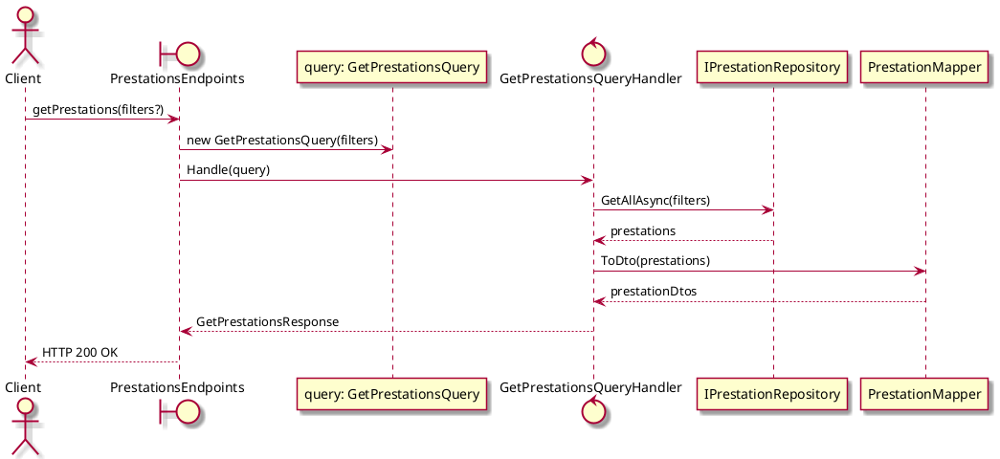
```plantuml
@startuml
skin rose
actor Client as c
boundary PrestationsEndpoints as api
participant "query: GetPrestationsQuery" as query
control GetPrestationsQueryHandler as handler
participant IPrestationRepository as repo
participant PrestationMapper as mapper

c -> api : getPrestations(filters?)
api -> query : new GetPrestationsQuery(filters)
api -> handler : Handle(query)
handler -> repo : GetAllAsync(filters)
repo --> handler : prestations
handler -> mapper : ToDto(prestations)
mapper --> handler : prestationDtos
handler --> api : GetPrestationsResponse
api --> c : HTTP 200 OK

@enduml
```

##### 6.3.1.2. Diagramme de classes

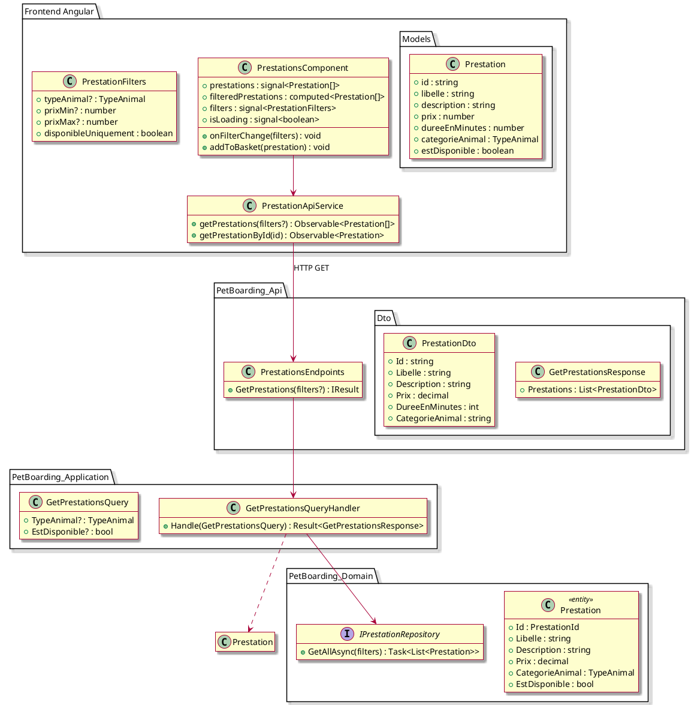
```plantuml
@startuml
skin rose
hide empty members

package "Frontend Angular" {
  class PrestationsComponent {
    + prestations : signal<Prestation[]>
    + filteredPrestations : computed<Prestation[]>
    + filters : signal<PrestationFilters>
    + isLoading : signal<boolean>
    + onFilterChange(filters) : void
    + addToBasket(prestation) : void
  }

  class PrestationFilters {
    + typeAnimal? : TypeAnimal
    + prixMin? : number
    + prixMax? : number
    + disponibleUniquement : boolean
  }

  class PrestationApiService {
    + getPrestations(filters?) : Observable<Prestation[]>
    + getPrestationById(id) : Observable<Prestation>
  }

  package "Models" {
    class Prestation {
      + id : string
      + libelle : string
      + description : string
      + prix : number
      + dureeEnMinutes : number
      + categorieAnimal : TypeAnimal
      + estDisponible : boolean
    }
  }
}

package "PetBoarding_Api" {
  class PrestationsEndpoints {
    + GetPrestations(filters?) : IResult
  }

  package "Dto" {
    class GetPrestationsResponse {
      + Prestations : List<PrestationDto>
    }

    class PrestationDto {
      + Id : string
      + Libelle : string
      + Description : string
      + Prix : decimal
      + DureeEnMinutes : int
      + CategorieAnimal : string
    }
  }
}

package "PetBoarding_Application" {
  class GetPrestationsQueryHandler {
    + Handle(GetPrestationsQuery) : Result<GetPrestationsResponse>
  }

  class GetPrestationsQuery {
    + TypeAnimal? : TypeAnimal
    + EstDisponible? : bool
  }
}

package "PetBoarding_Domain" {
  class Prestation <<entity>> {
    + Id : PrestationId
    + Libelle : string
    + Description : string
    + Prix : decimal
    + CategorieAnimal : TypeAnimal
    + EstDisponible : bool
  }

  interface IPrestationRepository {
    + GetAllAsync(filters) : Task<List<Prestation>>
  }
}

PrestationsComponent --> PrestationApiService
PrestationApiService --> PrestationsEndpoints : HTTP GET
PrestationsEndpoints --> GetPrestationsQueryHandler
GetPrestationsQueryHandler --> IPrestationRepository
GetPrestationsQueryHandler ..> Prestation

@enduml
```

### 6.4. Sous domaine : gestion des réservations

#### 6.4.1. Créer une réservation

##### 6.4.1.1. Diagramme de séquences

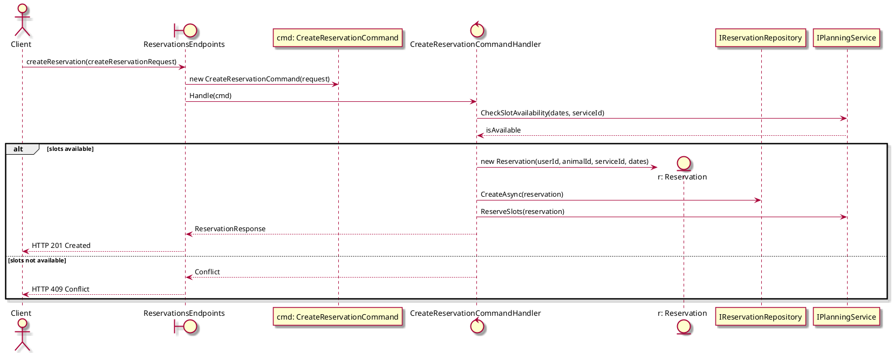
```plantuml
@startuml
skin rose
actor Client as c
boundary ReservationsEndpoints as api
participant "cmd: CreateReservationCommand" as cmd
control CreateReservationCommandHandler as handler
entity "r: Reservation" as reservation
participant IReservationRepository as repo
participant IPlanningService as planning

c -> api : createReservation(createReservationRequest)
api -> cmd : new CreateReservationCommand(request)
api -> handler : Handle(cmd)
handler -> planning : CheckSlotAvailability(dates, serviceId)
planning --> handler : isAvailable
alt slots available
  create reservation
  handler -> reservation : new Reservation(userId, animalId, serviceId, dates)
  handler -> repo : CreateAsync(reservation)
  handler -> planning : ReserveSlots(reservation)
  handler --> api : ReservationResponse
  api --> c : HTTP 201 Created
else slots not available
  handler --> api : Conflict
  api --> c : HTTP 409 Conflict
end

@enduml
```

##### 6.4.1.2. Diagramme de classes

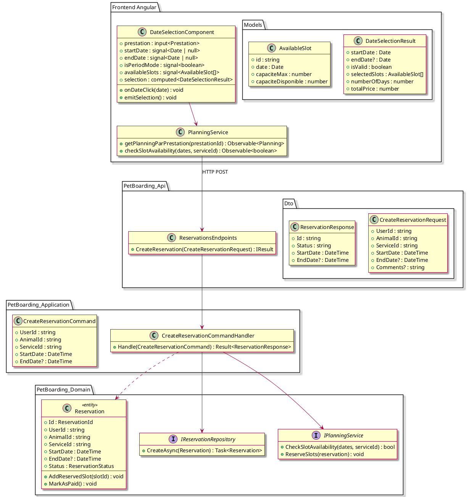
```plantuml
@startuml
skin rose
hide empty members

package "Frontend Angular" {
  class DateSelectionComponent {
    + prestation : input<Prestation>
    + startDate : signal<Date | null>
    + endDate : signal<Date | null>
    + isPeriodMode : signal<boolean>
    + availableSlots : signal<AvailableSlot[]>
    + selection : computed<DateSelectionResult>
    + onDateClick(date) : void
    + emitSelection() : void
  }

  class PlanningService {
    + getPlanningParPrestation(prestationId) : Observable<Planning>
    + checkSlotAvailability(dates, serviceId) : Observable<boolean>
  }

  package "Models" {
    class DateSelectionResult {
      + startDate : Date
      + endDate? : Date
      + isValid : boolean
      + selectedSlots : AvailableSlot[]
      + numberOfDays : number
      + totalPrice : number
    }

    class AvailableSlot {
      + id : string
      + date : Date
      + capaciteMax : number
      + capaciteDisponible : number
    }
  }
}

package "PetBoarding_Api" {
  class ReservationsEndpoints {
    + CreateReservation(CreateReservationRequest) : IResult
  }

  package "Dto" {
    class CreateReservationRequest {
      + UserId : string
      + AnimalId : string
      + ServiceId : string
      + StartDate : DateTime
      + EndDate? : DateTime
      + Comments? : string
    }

    class ReservationResponse {
      + Id : string
      + Status : string
      + StartDate : DateTime
      + EndDate? : DateTime
    }
  }
}

package "PetBoarding_Application" {
  class CreateReservationCommandHandler {
    + Handle(CreateReservationCommand) : Result<ReservationResponse>
  }

  class CreateReservationCommand {
    + UserId : string
    + AnimalId : string
    + ServiceId : string
    + StartDate : DateTime
    + EndDate? : DateTime
  }
}

package "PetBoarding_Domain" {
  class Reservation <<entity>> {
    + Id : ReservationId
    + UserId : string
    + AnimalId : string
    + ServiceId : string
    + StartDate : DateTime
    + EndDate? : DateTime
    + Status : ReservationStatus

    + AddReservedSlot(slotId) : void
    + MarkAsPaid() : void
  }

  interface IReservationRepository {
    + CreateAsync(Reservation) : Task<Reservation>
  }

  interface IPlanningService {
    + CheckSlotAvailability(dates, serviceId) : bool
    + ReserveSlots(reservation) : void
  }
}

DateSelectionComponent --> PlanningService
PlanningService --> ReservationsEndpoints : HTTP POST
ReservationsEndpoints --> CreateReservationCommandHandler
CreateReservationCommandHandler --> IReservationRepository
CreateReservationCommandHandler --> IPlanningService
CreateReservationCommandHandler ..> Reservation

@enduml
```

#### 6.4.2. Gérer le panier de réservations

##### 6.4.2.1. Diagramme de séquences

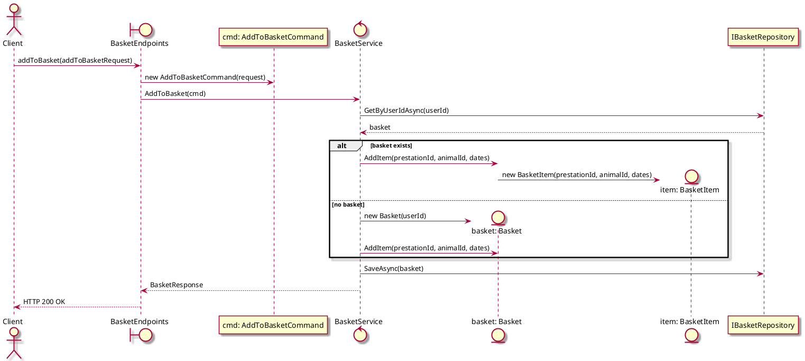
```plantuml
@startuml
skin rose
actor Client as c
boundary BasketEndpoints as api
participant "cmd: AddToBasketCommand" as cmd
control BasketService as service
entity "basket: Basket" as basket
entity "item: BasketItem" as item
participant IBasketRepository as repo

c -> api : addToBasket(addToBasketRequest)
api -> cmd : new AddToBasketCommand(request)
api -> service : AddToBasket(cmd)
service -> repo : GetByUserIdAsync(userId)
repo --> service : basket
alt basket exists
  service -> basket : AddItem(prestationId, animalId, dates)
  create item
  basket -> item : new BasketItem(prestationId, animalId, dates)
else no basket
  create basket
  service -> basket : new Basket(userId)
  service -> basket : AddItem(prestationId, animalId, dates)
end
service -> repo : SaveAsync(basket)
service --> api : BasketResponse
api --> c : HTTP 200 OK

@enduml
```

##### 6.4.2.2. Diagramme de classes

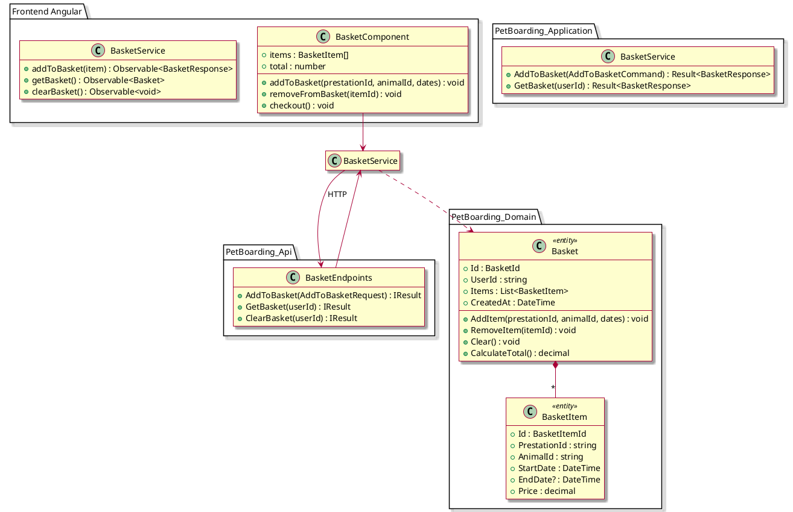
```plantuml
@startuml
skin rose
hide empty members

package "Frontend Angular" {
  class BasketComponent {
    + items : BasketItem[]
    + total : number
    + addToBasket(prestationId, animalId, dates) : void
    + removeFromBasket(itemId) : void
    + checkout() : void
  }

  class BasketService {
    + addToBasket(item) : Observable<BasketResponse>
    + getBasket() : Observable<Basket>
    + clearBasket() : Observable<void>
  }
}

package "PetBoarding_Api" {
  class BasketEndpoints {
    + AddToBasket(AddToBasketRequest) : IResult
    + GetBasket(userId) : IResult
    + ClearBasket(userId) : IResult
  }
}

package "PetBoarding_Application" {
  class BasketService {
    + AddToBasket(AddToBasketCommand) : Result<BasketResponse>
    + GetBasket(userId) : Result<BasketResponse>
  }
}

package "PetBoarding_Domain" {
  class Basket <<entity>> {
    + Id : BasketId
    + UserId : string
    + Items : List<BasketItem>
    + CreatedAt : DateTime

    + AddItem(prestationId, animalId, dates) : void
    + RemoveItem(itemId) : void
    + Clear() : void
    + CalculateTotal() : decimal
  }

  class BasketItem <<entity>> {
    + Id : BasketItemId
    + PrestationId : string
    + AnimalId : string
    + StartDate : DateTime
    + EndDate? : DateTime
    + Price : decimal
  }

  Basket *-- "*" BasketItem
}

BasketComponent --> BasketService
BasketService --> BasketEndpoints : HTTP
BasketEndpoints --> BasketService
BasketService ..> Basket

@enduml
```

- [6.5. Sous domaine : gestion du planning et des créneaux](#65-sous-domaine--gestion-du-planning-et-des-créneaux)
  - [6.5.1. Consulter les créneaux disponibles](#651-consulter-les-créneaux-disponibles)
    - [6.5.1.1. Diagramme de séquences](#6511-diagramme-de-séquences)
    - [6.5.1.2. Diagramme de classes](#6512-diagramme-de-classes)
  - [6.5.2. Créer un planning pour une prestation](#652-créer-un-planning-pour-une-prestation)
    - [6.5.2.1. Diagramme de séquences](#6521-diagramme-de-séquences)
    - [6.5.2.2. Diagramme de classes](#6522-diagramme-de-classes)

### 6.5. Sous domaine : gestion du planning et des créneaux

#### 6.5.1. Consulter les créneaux disponibles

##### 6.5.1.1. Diagramme de séquences

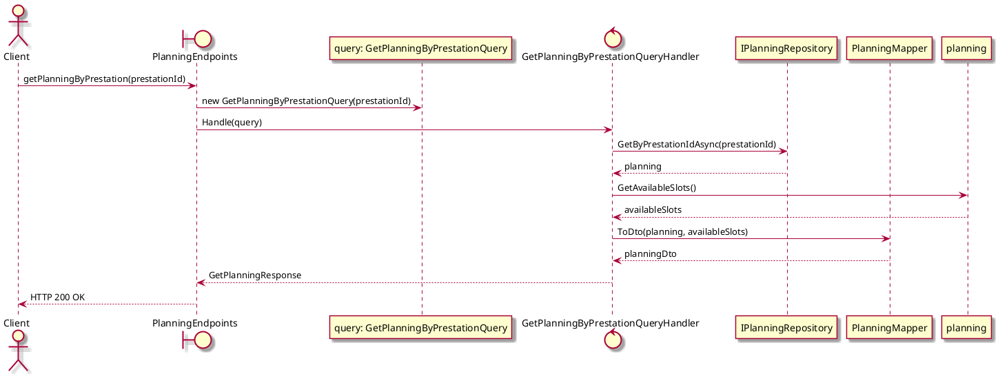
```plantuml
@startuml
skin rose
actor Client as c
boundary PlanningEndpoints as api
participant "query: GetPlanningByPrestationQuery" as query
control GetPlanningByPrestationQueryHandler as handler
participant IPlanningRepository as repo
participant PlanningMapper as mapper

c -> api : getPlanningByPrestation(prestationId)
api -> query : new GetPlanningByPrestationQuery(prestationId)
api -> handler : Handle(query)
handler -> repo : GetByPrestationIdAsync(prestationId)
repo --> handler : planning
handler -> planning : GetAvailableSlots()
planning --> handler : availableSlots
handler -> mapper : ToDto(planning, availableSlots)
mapper --> handler : planningDto
handler --> api : GetPlanningResponse
api --> c : HTTP 200 OK

@enduml
```

##### 6.5.1.2. Diagramme de classes

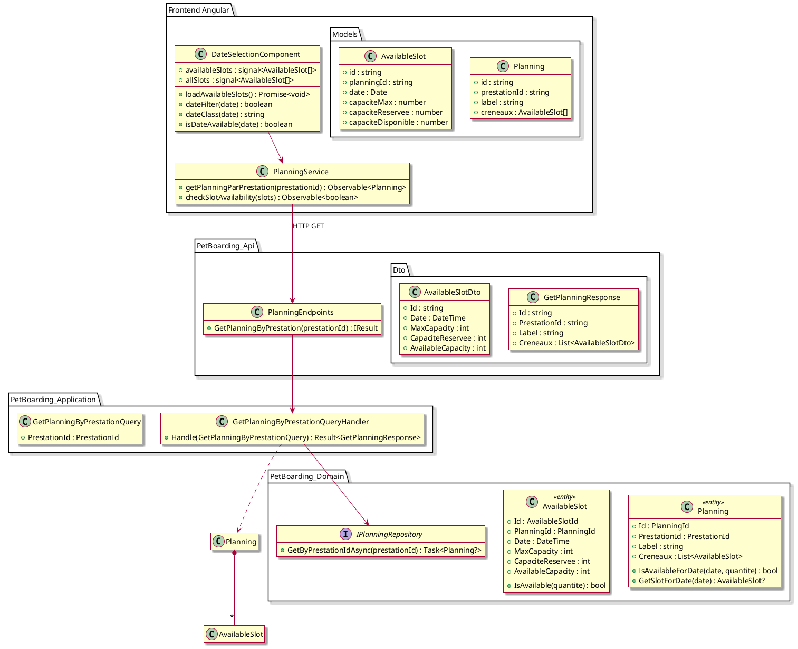
```plantuml
@startuml
skin rose
hide empty members

package "Frontend Angular" {
  class DateSelectionComponent {
    + availableSlots : signal<AvailableSlot[]>
    + allSlots : signal<AvailableSlot[]>
    + loadAvailableSlots() : Promise<void>
    + dateFilter(date) : boolean
    + dateClass(date) : string
    + isDateAvailable(date) : boolean
  }

  class PlanningService {
    + getPlanningParPrestation(prestationId) : Observable<Planning>
    + checkSlotAvailability(slots) : Observable<boolean>
  }

  package "Models" {
    class Planning {
      + id : string
      + prestationId : string
      + label : string
      + creneaux : AvailableSlot[]
    }

    class AvailableSlot {
      + id : string
      + planningId : string
      + date : Date
      + capaciteMax : number
      + capaciteReservee : number
      + capaciteDisponible : number
    }
  }
}

package "PetBoarding_Api" {
  class PlanningEndpoints {
    + GetPlanningByPrestation(prestationId) : IResult
  }

  package "Dto" {
    class GetPlanningResponse {
      + Id : string
      + PrestationId : string
      + Label : string
      + Creneaux : List<AvailableSlotDto>
    }

    class AvailableSlotDto {
      + Id : string
      + Date : DateTime
      + MaxCapacity : int
      + CapaciteReservee : int
      + AvailableCapacity : int
    }
  }
}

package "PetBoarding_Application" {
  class GetPlanningByPrestationQueryHandler {
    + Handle(GetPlanningByPrestationQuery) : Result<GetPlanningResponse>
  }

  class GetPlanningByPrestationQuery {
    + PrestationId : PrestationId
  }
}

package "PetBoarding_Domain" {
  class Planning <<entity>> {
    + Id : PlanningId
    + PrestationId : PrestationId
    + Label : string
    + Creneaux : List<AvailableSlot>
    + IsAvailableForDate(date, quantite) : bool
    + GetSlotForDate(date) : AvailableSlot?
  }

  class AvailableSlot <<entity>> {
    + Id : AvailableSlotId
    + PlanningId : PlanningId
    + Date : DateTime
    + MaxCapacity : int
    + CapaciteReservee : int
    + AvailableCapacity : int
    + IsAvailable(quantite) : bool
  }

  interface IPlanningRepository {
    + GetByPrestationIdAsync(prestationId) : Task<Planning?>
  }
}

DateSelectionComponent --> PlanningService
PlanningService --> PlanningEndpoints : HTTP GET
PlanningEndpoints --> GetPlanningByPrestationQueryHandler
GetPlanningByPrestationQueryHandler --> IPlanningRepository
GetPlanningByPrestationQueryHandler ..> Planning
Planning *-- "*" AvailableSlot

@enduml
```

#### 6.5.2. Créer un planning pour une prestation

##### 6.5.2.1. Diagramme de séquences

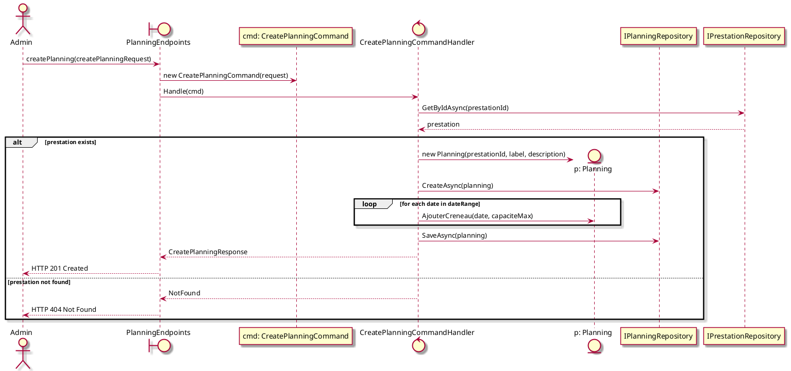
```plantuml
@startuml
skin rose
actor Admin as a
boundary PlanningEndpoints as api
participant "cmd: CreatePlanningCommand" as cmd
control CreatePlanningCommandHandler as handler
entity "p: Planning" as planning
participant IPlanningRepository as repo
participant IPrestationRepository as prestationRepo

a -> api : createPlanning(createPlanningRequest)
api -> cmd : new CreatePlanningCommand(request)
api -> handler : Handle(cmd)
handler -> prestationRepo : GetByIdAsync(prestationId)
prestationRepo --> handler : prestation
alt prestation exists
  create planning
  handler -> planning : new Planning(prestationId, label, description)
  handler -> repo : CreateAsync(planning)
  loop for each date in dateRange
    handler -> planning : AjouterCreneau(date, capaciteMax)
  end
  handler -> repo : SaveAsync(planning)
  handler --> api : CreatePlanningResponse
  api --> a : HTTP 201 Created
else prestation not found
  handler --> api : NotFound
  api --> a : HTTP 404 Not Found
end

@enduml
```

##### 6.5.2.2. Diagramme de classes

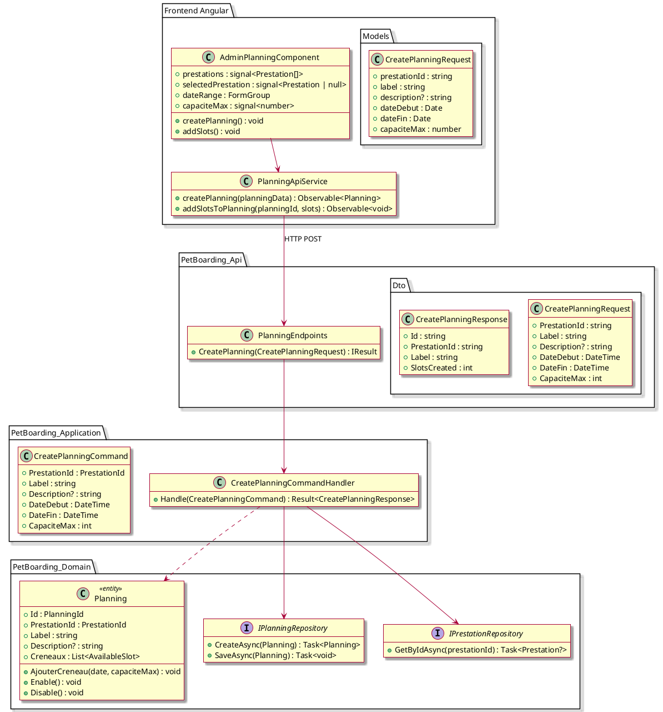
```plantuml
@startuml
skin rose
hide empty members

package "Frontend Angular" {
  class AdminPlanningComponent {
    + prestations : signal<Prestation[]>
    + selectedPrestation : signal<Prestation | null>
    + dateRange : FormGroup
    + capaciteMax : signal<number>
    + createPlanning() : void
    + addSlots() : void
  }

  class PlanningApiService {
    + createPlanning(planningData) : Observable<Planning>
    + addSlotsToPlanning(planningId, slots) : Observable<void>
  }

  package "Models" {
    class CreatePlanningRequest {
      + prestationId : string
      + label : string
      + description? : string
      + dateDebut : Date
      + dateFin : Date
      + capaciteMax : number
    }
  }
}

package "PetBoarding_Api" {
  class PlanningEndpoints {
    + CreatePlanning(CreatePlanningRequest) : IResult
  }

  package "Dto" {
    class CreatePlanningRequest {
      + PrestationId : string
      + Label : string
      + Description? : string
      + DateDebut : DateTime
      + DateFin : DateTime
      + CapaciteMax : int
    }

    class CreatePlanningResponse {
      + Id : string
      + PrestationId : string
      + Label : string
      + SlotsCreated : int
    }
  }
}

package "PetBoarding_Application" {
  class CreatePlanningCommandHandler {
    + Handle(CreatePlanningCommand) : Result<CreatePlanningResponse>
  }

  class CreatePlanningCommand {
    + PrestationId : PrestationId
    + Label : string
    + Description? : string
    + DateDebut : DateTime
    + DateFin : DateTime
    + CapaciteMax : int
  }
}

package "PetBoarding_Domain" {
  class Planning <<entity>> {
    + Id : PlanningId
    + PrestationId : PrestationId
    + Label : string
    + Description? : string
    + Creneaux : List<AvailableSlot>
    + AjouterCreneau(date, capaciteMax) : void
    + Enable() : void
    + Disable() : void
  }

  interface IPlanningRepository {
    + CreateAsync(Planning) : Task<Planning>
    + SaveAsync(Planning) : Task<void>
  }

  interface IPrestationRepository {
    + GetByIdAsync(prestationId) : Task<Prestation?>
  }
}

AdminPlanningComponent --> PlanningApiService
PlanningApiService --> PlanningEndpoints : HTTP POST
PlanningEndpoints --> CreatePlanningCommandHandler
CreatePlanningCommandHandler --> IPlanningRepository
CreatePlanningCommandHandler --> IPrestationRepository
CreatePlanningCommandHandler ..> Planning

@enduml
```

### 6.6. Sous domaine : gestion des animaux de compagnie

#### 6.6.1. Créer un animal de compagnie

##### 6.6.1.1. Diagramme de séquences

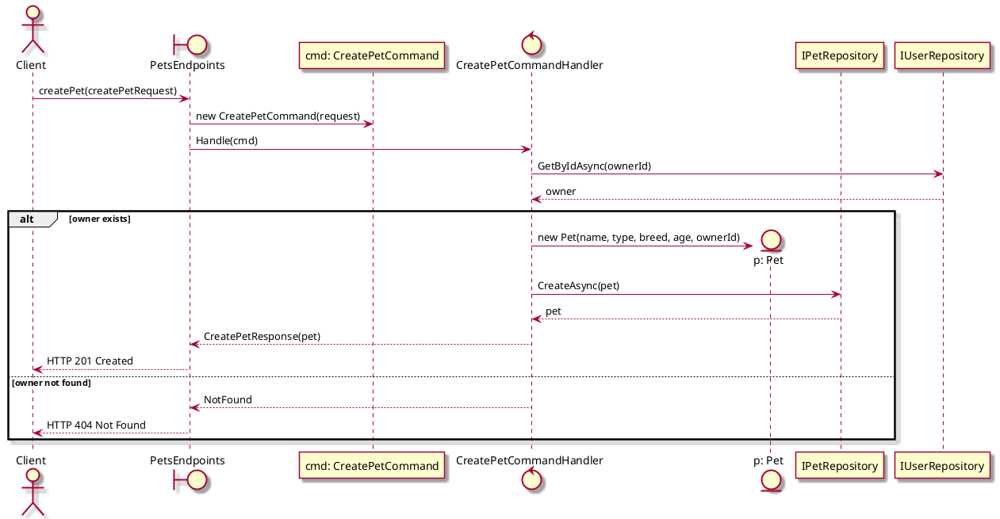
```plantuml
@startuml
skin rose
actor Client as c
boundary PetsEndpoints as api
participant "cmd: CreatePetCommand" as cmd
control CreatePetCommandHandler as handler
entity "p: Pet" as pet
participant IPetRepository as repo
participant IUserRepository as userRepo

c -> api : createPet(createPetRequest)
api -> cmd : new CreatePetCommand(request)
api -> handler : Handle(cmd)
handler -> userRepo : GetByIdAsync(ownerId)
userRepo --> handler : owner
alt owner exists
  create pet
  handler -> pet : new Pet(name, type, breed, age, ownerId)
  handler -> repo : CreateAsync(pet)
  repo --> handler : pet
  handler --> api : CreatePetResponse(pet)
  api --> c : HTTP 201 Created
else owner not found
  handler --> api : NotFound
  api --> c : HTTP 404 Not Found
end

@enduml
```

##### 6.6.1.2. Diagramme de classes

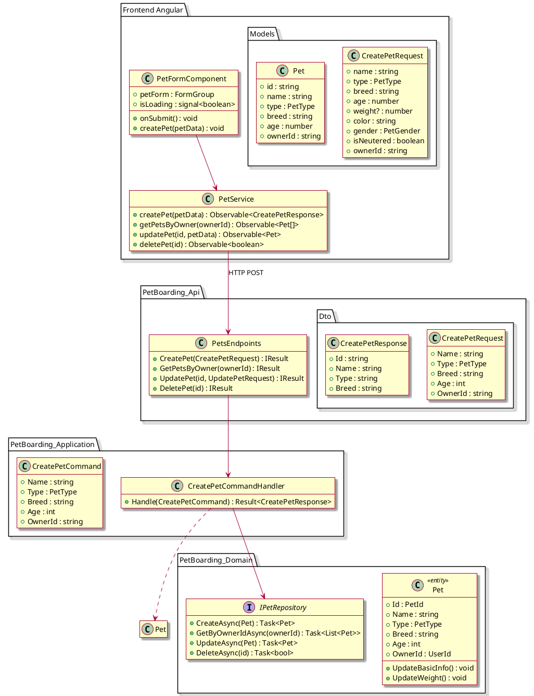
```plantuml
@startuml
skin rose
hide empty members

package "Frontend Angular" {
  class PetFormComponent {
    + petForm : FormGroup
    + isLoading : signal<boolean>
    + onSubmit() : void
    + createPet(petData) : void
  }

  class PetService {
    + createPet(petData) : Observable<CreatePetResponse>
    + getPetsByOwner(ownerId) : Observable<Pet[]>
    + updatePet(id, petData) : Observable<Pet>
    + deletePet(id) : Observable<boolean>
  }

  package "Models" {
    class CreatePetRequest {
      + name : string
      + type : PetType
      + breed : string
      + age : number
      + weight? : number
      + color : string
      + gender : PetGender
      + isNeutered : boolean
      + ownerId : string
    }

    class Pet {
      + id : string
      + name : string
      + type : PetType
      + breed : string
      + age : number
      + ownerId : string
    }
  }
}

package "PetBoarding_Api" {
  class PetsEndpoints {
    + CreatePet(CreatePetRequest) : IResult
    + GetPetsByOwner(ownerId) : IResult
    + UpdatePet(id, UpdatePetRequest) : IResult
    + DeletePet(id) : IResult
  }

  package "Dto" {
    class CreatePetRequest {
      + Name : string
      + Type : PetType
      + Breed : string
      + Age : int
      + OwnerId : string
    }

    class CreatePetResponse {
      + Id : string
      + Name : string
      + Type : string
      + Breed : string
    }
  }
}

package "PetBoarding_Application" {
  class CreatePetCommandHandler {
    + Handle(CreatePetCommand) : Result<CreatePetResponse>
  }

  class CreatePetCommand {
    + Name : string
    + Type : PetType
    + Breed : string
    + Age : int
    + OwnerId : string
  }
}

package "PetBoarding_Domain" {
  class Pet <<entity>> {
    + Id : PetId
    + Name : string
    + Type : PetType
    + Breed : string
    + Age : int
    + OwnerId : UserId

    + UpdateBasicInfo() : void
    + UpdateWeight() : void
  }

  interface IPetRepository {
    + CreateAsync(Pet) : Task<Pet>
    + GetByOwnerIdAsync(ownerId) : Task<List<Pet>>
    + UpdateAsync(Pet) : Task<Pet>
    + DeleteAsync(id) : Task<bool>
  }
}

PetFormComponent --> PetService
PetService --> PetsEndpoints : HTTP POST
PetsEndpoints --> CreatePetCommandHandler
CreatePetCommandHandler --> IPetRepository
CreatePetCommandHandler ..> Pet

@enduml
```

#### 6.6.2. Gérer le profil d'un animal

##### 6.6.2.1. Diagramme de séquences

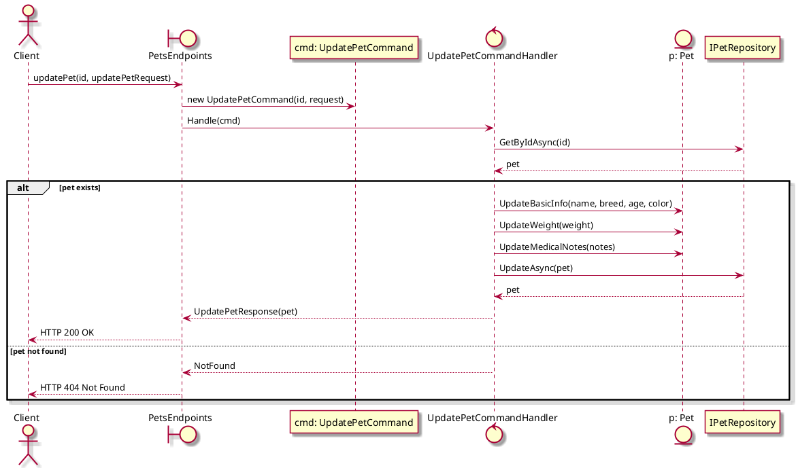
```plantuml
@startuml
skin rose
actor Client as c
boundary PetsEndpoints as api
participant "cmd: UpdatePetCommand" as cmd
control UpdatePetCommandHandler as handler
entity "p: Pet" as pet
participant IPetRepository as repo

c -> api : updatePet(id, updatePetRequest)
api -> cmd : new UpdatePetCommand(id, request)
api -> handler : Handle(cmd)
handler -> repo : GetByIdAsync(id)
repo --> handler : pet
alt pet exists
  handler -> pet : UpdateBasicInfo(name, breed, age, color)
  handler -> pet : UpdateWeight(weight)
  handler -> pet : UpdateMedicalNotes(notes)
  handler -> repo : UpdateAsync(pet)
  repo --> handler : pet
  handler --> api : UpdatePetResponse(pet)
  api --> c : HTTP 200 OK
else pet not found
  handler --> api : NotFound
  api --> c : HTTP 404 Not Found
end

@enduml
```

##### 6.6.2.2. Diagramme de classes

```plantuml
@startuml
skin rose
hide empty members

package "Frontend Angular" {
  class PetDetailsComponent {
    + pet : signal<Pet>
    + isEditing : signal<boolean>
    + editForm : FormGroup
    + enableEdit() : void
    + savePet() : void
    + deletePet() : void
  }

  class VaccinationComponent {
    + vaccinations : signal<Vaccination[]>
    + addVaccination(data) : void
    + updateVaccination(id, data) : void
    + deleteVaccination(id) : void
  }

  package "Models" {
    class Vaccination {
      + id : string
      + name : string
      + date : Date
      + expiryDate : Date
      + veterinarian : string
      + batchNumber : string
      + petId : string
    }
  }
}

package "PetBoarding_Application" {
  class UpdatePetCommandHandler {
    + Handle(UpdatePetCommand) : Result<UpdatePetResponse>
  }

  class GetPetByIdQueryHandler {
    + Handle(GetPetByIdQuery) : Result<PetResponse>
  }

  class DeletePetCommandHandler {
    + Handle(DeletePetCommand) : Result<bool>
  }
}

PetDetailsComponent --> PetService
VaccinationComponent --> PetService
PetsEndpoints --> UpdatePetCommandHandler
PetsEndpoints --> GetPetByIdQueryHandler
PetsEndpoints --> DeletePetCommandHandler

@enduml
```

### 6.7. Sous domaine : gestion des paiements

#### 6.7.1. Traiter un paiement

##### 6.7.1.1. Diagramme de séquences

```plantuml
@startuml
skin rose
actor Client as c
boundary PaymentEndpoints as api
participant "cmd: CreatePaymentCommand" as cmd
control CreatePaymentCommandHandler as handler
entity "p: Payment" as payment
participant IPaymentRepository as repo
participant IReservationRepository as resRepo
participant IDomainEventDispatcher as events

c -> api : createPayment(createPaymentRequest)
api -> cmd : new CreatePaymentCommand(request)
api -> handler : Handle(cmd)
handler -> resRepo : GetByIdAsync(reservationId)
resRepo --> handler : reservation
alt reservation exists
  create payment
  handler -> payment : new Payment(amount, method, reservationId)
  handler -> repo : CreateAsync(payment)
  repo --> handler : payment

  alt payment processing succeeds
    handler -> payment : MarkAsSuccess()
    handler -> payment : AddDomainEvent(PaymentProcessedEvent)
    handler -> events : DispatchAsync(PaymentProcessedEvent)
    handler --> api : CreatePaymentResponse(payment)
    api --> c : HTTP 201 Created
  else payment processing fails
    handler -> payment : MarkAsFailed(reason)
    handler --> api : PaymentFailed
    api --> c : HTTP 400 Bad Request
  end
else reservation not found
  handler --> api : NotFound
  api --> c : HTTP 404 Not Found
end

@enduml
```

##### 6.7.1.2. Diagramme de classes

```plantuml
@startuml
skin rose
hide empty members

package "PetBoarding_Domain" {
  class Payment <<entity>> {
    + Id : PaymentId
    + ReservationId : ReservationId
    + Amount : decimal
    + Method : PaymentMethod
    + Status : PaymentStatus
    + ExternalTransactionId? : string
    + ProcessedAt? : DateTime
    + FailureReason? : string

    + MarkAsSuccess() : void
    + MarkAsFailed(reason) : void
    + MarkAsCancelled() : void
  }

  interface IPaymentRepository {
    + CreateAsync(Payment) : Task<Payment>
    + GetByIdAsync(id) : Task<Payment?>
    + GetByReservationIdAsync(reservationId) : Task<List<Payment>>
    + UpdateAsync(Payment) : Task<Payment>
  }
}

package "PetBoarding_Application" {
  class CreatePaymentCommandHandler {
    + Handle(CreatePaymentCommand) : Result<CreatePaymentResponse>
  }

  class ProcessPaymentCommandHandler {
    + Handle(ProcessPaymentCommand) : Result<PaymentResult>
  }
}

package "Domain Events" {
  class PaymentProcessedEvent {
    + PaymentId : PaymentId
    + ReservationId : ReservationId
    + Amount : decimal
    + Status : PaymentStatus
    + ProcessedAt : DateTime
  }

  class PaymentProcessedEventHandler {
    + Handle(PaymentProcessedEvent) : Task
  }
}

Payment --> PaymentMethod
Payment --> PaymentStatus
CreatePaymentCommandHandler --> IPaymentRepository
PaymentProcessedEventHandler --> IEmailService

@enduml
```

### 6.8. Sous domaine : système de notifications

#### 6.8.1. Envoi d'email automatique

##### 6.8.1.1. Diagramme de séquences

```plantuml
@startuml
skin rose
participant UserRegisteredEvent as event
participant UserRegisteredEventConsumer as consumer
participant UserRegisteredEventHandler as handler
participant "cmd: SendWelcomeEmailCommand" as cmd
control SendWelcomeEmailCommandHandler as emailHandler
participant IEmailService as emailService
participant ITemplateService as templateService

event -> consumer : Consume(UserRegisteredEvent)
consumer -> handler : Handle(event)
handler -> cmd : new SendWelcomeEmailCommand(userId, email, name)
handler -> emailHandler : Handle(cmd)
emailHandler -> templateService : GetWelcomeTemplate(userModel)
templateService --> emailHandler : htmlContent
emailHandler -> emailService : SendAsync(emailMessage)
emailService --> emailHandler : EmailResult
emailHandler --> handler : result
handler --> consumer : completed

@enduml
```

##### 6.8.1.2. Diagramme de classes

```plantuml
@startuml
scale 0.8
skin rose
hide empty members

package "Domain Events" {
  class UserRegisteredEvent {
    + UserId : UserId
    + Email : Email
    + FirstName : string
    + LastName : string
    + OccurredOn : DateTime
  }

  class ReservationCreatedEvent {
    + ReservationId : ReservationId
    + UserId : UserId
    + PetName : string
    + ServiceName : string
    + StartDate : DateTime
  }

  class PaymentProcessedEvent {
    + PaymentId : PaymentId
    + Amount : decimal
    + Status : PaymentStatus
  }
}

package "Email Infrastructure" {
  interface IEmailService {
    + SendAsync(EmailMessage) : Task<EmailResult>
  }

  interface ITemplateService {
    + GetWelcomeTemplate(model) : Task<string>
    + GetReservationConfirmationTemplate(model) : Task<string>
    + GetPaymentConfirmationTemplate(model) : Task<string>
  }

  class EmailMessage {
    + ToEmail : string
    + ToName : string
    + Subject : string
    + Body : string
    + IsHtml : bool
  }

  class SmtpEmailService {
    + SendAsync(EmailMessage) : Task<EmailResult>
  }

  class SimpleTemplateService {
    + GetWelcomeTemplate(model) : Task<string>
    + ProcessTemplate(template, model) : string
  }
}

package "Event Handlers" {
  class UserRegisteredEventHandler {
    + Handle(UserRegisteredEvent) : Task
  }

  class ReservationCreatedEventHandler {
    + Handle(ReservationCreatedEvent) : Task
  }

  class PaymentProcessedEventHandler {
    + Handle(PaymentProcessedEvent) : Task
  }
}

SmtpEmailService --> IEmailService
SimpleTemplateService --> ITemplateService
UserRegisteredEventHandler --> IEmailService
UserRegisteredEventHandler --> ITemplateService

@enduml
```

## 7. Regroupement des classes

### 7.1. Groupe domaine

#### 7.1.1. Users Domain

```plantuml
@startuml
skin rose
hide empty members

package "Users Domain" {
  class User <<entity>> {
    + Id : UserId
    + Firstname : Firstname
    + Lastname : Lastname
    + Email : Email
    + PhoneNumber : PhoneNumber
    + PasswordHash : string
    + ProfileType : UserProfileType
    + Status : UserStatus
    + AddressId? : AddressId

    + ChangeForConfirmedStatus() : Result
    + ChangeForInactiveStatus() : Result
    + UpdateProfile() : Result
  }

  class UserId <<value object>> {
    + Value : Guid
  }

  class Email <<value object>> {
    + Value : string
  }

  class Firstname <<value object>> {
    + Value : string
  }

  class Lastname <<value object>> {
    + Value : string
  }

  class PhoneNumber <<value object>> {
    + Value : string
  }

  enum UserProfileType {
    CLIENT
    ADMIN
  }

  enum UserStatus {
    CREATED
    CONFIRMED
    INACTIVE
    DELETED
  }
}

@enduml
```

#### 7.1.2. Addresses Domain

```plantuml
@startuml
skin rose
hide empty members

package "Addresses Domain" {
  class Address <<entity>> {
    + Id : AddressId
    + StreetNumber : StreetNumber
    + StreetName : StreetName
    + Complement? : Complement
    + PostalCode : PostalCode
    + City : City
    + Country : Country
  }

  class AddressId <<value object>> {
    + Value : Guid
  }

  class StreetNumber <<value object>> {
    + Value : string
  }

  class StreetName <<value object>> {
    + Value : string
  }

  class Complement <<value object>> {
    + Value : string
  }

  class PostalCode <<value object>> {
    + Value : string
  }

  class City <<value object>> {
    + Value : string
  }

  class Country <<value object>> {
    + Value : string
  }
}

@enduml
```

#### 7.1.3. Pets Domain

```plantuml
@startuml
skin rose
hide empty members

package "Pets Domain" {
  class Pet <<entity>> {
    + Id : PetId
    + Name : string
    + Type : PetType
    + Breed : string
    + Age : int
    + Weight? : decimal
    + Color : string
    + Gender : PetGender
    + IsNeutered : bool
    + MicrochipNumber? : string
    + MedicalNotes? : string
    + SpecialNeeds? : string
    + PhotoUrl? : string
    + OwnerId : UserId
    + EmergencyContact? : EmergencyContact

    + UpdateBasicInfo(name, breed, age, color) : void
    + UpdateWeight(weight) : void
    + UpdateType(type) : void
    + UpdateGender(gender) : void
    + UpdateNeuteredStatus(isNeutered) : void
    + UpdateMedicalNotes(notes) : void
  }

  class PetId <<value object>> {
    + Value : Guid
  }

  class EmergencyContact <<value object>> {
    + Name : string
    + PhoneNumber : string
    + Relationship : string
  }

  enum PetType {
    CHIEN
    CHAT
    AUTRE
  }

  enum PetGender {
    MALE
    FEMALE
    UNKNOWN
  }
}

@enduml
```

#### 7.1.4. Prestations Domain

```plantuml
@startuml
skin rose
hide empty members

package "Prestations Domain" {
  class Prestation <<entity>> {
    + Id : PrestationId
    + Libelle : string
    + Description : string
    + CategorieAnimal : TypeAnimal
    + Prix : decimal
    + DureeEnMinutes : int
    + EstDisponible : bool
    + DateCreation : DateTime
    + DateModification? : DateTime

    + ModifierLibelle(libelle) : void
    + ModifierDescription(description) : void
    + ModifierPrix(prix) : void
    + ModifierDuree(duree) : void
    + ModifierCategorieAnimal(categorie) : void
    + RendreDisponible() : void
    + RendreIndisponible() : void
    + Activer() : void
    + Desactiver() : void
  }

  class PrestationId <<value object>> {
    + Value : Guid
  }

  enum TypeAnimal {
    CHAT
    CHIEN
    AUTRES
  }
}

@enduml
```

#### 7.1.5. Planning Domain

```plantuml
@startuml
skin rose
hide empty members

package "Planning Domain" {
  class Planning <<entity>> {
    + Id : PlanningId
    + PrestationId : PrestationId
    + Label : string
    + Description? : string
    + IsActive : bool
    + DateCreation : DateTime
    + DateModification? : DateTime
    + Creneaux : List<AvailableSlot>

    + AjouterCreneau(date, capaciteMax) : void
    + DeleteSlot(date) : void
    + UpdateSlotCapacity(date, capacite) : void
    + ModifierNom(nom) : void
    + ModifierDescription(description) : void
    + Enable() : void
    + Disable() : void
    + IsAvailableForDate(date, quantite) : bool
    + ReserveSlot(date, quantite) : void
    + CancelReservation(date, quantite) : void
  }

  class AvailableSlot <<entity>> {
    + Id : AvailableSlotId
    + PlanningId : PlanningId
    + Date : DateTime
    + MaxCapacity : int
    + CapaciteReservee : int
    + CreatedAt : DateTime
    + ModifiedAt? : DateTime

    + AvailableCapacity : int
    + IsAvailable(quantite) : bool
    + Reserver(quantite) : void
    + CancelReservation(quantite) : void
    + UpdateCapacity(nouveauMax) : void
    + AssignToPlanning(planningId) : void
  }

  class PlanningId <<value object>> {
    + Value : Guid
  }

  class AvailableSlotId <<value object>> {
    + Value : Guid
  }

  Planning *-- "*" AvailableSlot
}

@enduml
```

#### 7.1.6. Reservations Domain

```plantuml
@startuml
skin rose
hide empty members

package "Reservations Domain" {
  class Reservation <<entity>> {
    + Id : ReservationId
    + UserId : string
    + AnimalId : string
    + AnimalName : string
    + ServiceId : string
    + StartDate : DateTime
    + EndDate? : DateTime
    + Comments? : string
    + Status : ReservationStatus
    + TotalPrice? : decimal
    + PaidAt? : DateTime
    + ReservedSlots : List<ReservationSlot>

    + UpdateDates(startDate, endDate) : void
    + UpdateComments(comments) : void
    + SetTotalPrice(price) : void
    + MarkAsPaid() : void
    + StartService() : void
    + Complete() : void
    + Cancel() : void
    + AddReservedSlot(slotId) : void
    + ReleaseReservedSlot(slotId) : void
    + ReleaseAllReservedSlots() : void
    + GetReservedDates() : IEnumerable<DateTime>
    + GetNumberOfDays() : int
  }

  class ReservationSlot <<entity>> {
    + Id : ReservationSlotId
    + ReservationId : ReservationId
    + AvailableSlotId : Guid
    + ReservedAt : DateTime
    + ReleasedAt? : DateTime

    + IsActive : bool
    + MarkAsReleased() : void
  }

  class ReservationId <<value object>> {
    + Value : Guid
  }

  class ReservationSlotId <<value object>> {
    + Value : Guid
  }

  enum ReservationStatus {
    CREATED
    VALIDATED
    INPROGRESS
    COMPLETED
    CANCELLED
    CANCELAUTO
  }

  Reservation *-- "*" ReservationSlot
}

@enduml
```

#### 7.1.7. Baskets Domain

```plantuml
@startuml
skin rose
hide empty members

package "Baskets Domain" {
  class Basket <<entity>> {
    + Id : BasketId
    + UserId : string
    + Items : List<BasketItem>
    + Status : BasketStatus
    + CreatedAt : DateTime
    + UpdatedAt? : DateTime
    + ExpiresAt : DateTime

    + AddItem(prestationId, animalId, dates, price) : void
    + RemoveItem(itemId) : void
    + UpdateItem(itemId, quantity) : void
    + Clear() : void
    + CalculateTotal() : decimal
    + IsExpired() : bool
    + MarkAsCompleted() : void
    + MarkAsCancelled() : void
  }

  class BasketItem <<entity>> {
    + Id : BasketItemId
    + BasketId : BasketId
    + PrestationId : string
    + AnimalId : string
    + AnimalName : string
    + StartDate : DateTime
    + EndDate? : DateTime
    + Quantity : int
    + UnitPrice : decimal
    + TotalPrice : decimal
    + AddedAt : DateTime

    + UpdateQuantity(quantity) : void
    + UpdateDates(startDate, endDate) : void
    + CalculateTotalPrice() : void
  }

  class BasketId <<value object>> {
    + Value : Guid
  }

  class BasketItemId <<value object>> {
    + Value : Guid
  }

  enum BasketStatus {
    ACTIVE
    COMPLETED
    CANCELLED
    EXPIRED
  }

  Basket *-- "*" BasketItem
}

@enduml
```

#### 7.1.8. Payments Domain

```plantuml
@startuml
skin rose
hide empty members

package "Payments Domain" {
  class Payment <<entity>> {
    + Id : PaymentId
    + ReservationId? : ReservationId
    + Amount : decimal
    + Method : PaymentMethod
    + Status : PaymentStatus
    + ExternalTransactionId? : string
    + ProcessedAt? : DateTime
    + FailureReason? : string
    + Description : string
    + CreatedAt : DateTime

    + MarkAsSuccess() : void
    + MarkAsFailed(reason) : void
    + MarkAsCancelled() : void
    + UpdateExternalTransactionId(id) : void
  }

  class PaymentId <<value object>> {
    + Value : Guid
  }

  enum PaymentMethod {
    CREDIT_CARD
    DEBIT_CARD
    PAYPAL
    BANK_TRANSFER
    CASH
  }

  enum PaymentStatus {
    PENDING
    SUCCESS
    FAILED
    CANCELLED
    REFUNDED
  }
}

@enduml
```

#### 7.1.9. Email System Domain

```plantuml
@startuml
skin rose
hide empty members

package "Email System Domain" {
  class EmailMessage <<entity>> {
    + ToEmail : string
    + ToName : string
    + Subject : string
    + Body : string
    + IsHtml : bool
    + Attachments : List<EmailAttachment>
    + CreatedAt : DateTime

    + AddAttachment(attachment) : void
    + SetPlainTextBody() : void
    + SetHtmlBody() : void
  }

  class EmailAttachment <<value object>> {
    + FileName : string
    + ContentType : string
    + Content : byte[]
    + Size : long
  }

  class EmailResult {
    + IsSuccess : bool
    + ErrorMessage? : string
    + SentAt? : DateTime
    + MessageId? : string
    + FailureReason? : string
  }

  interface IEmailService {
    + SendAsync(EmailMessage) : Task<EmailResult>
    + SendBulkAsync(messages) : Task<List<EmailResult>>
  }

  interface ITemplateService {
    + ProcessTemplate(template, model) : string
    + GetWelcomeTemplate(model) : Task<string>
    + GetReservationConfirmationTemplate(model) : Task<string>
    + GetPaymentConfirmationTemplate(model) : Task<string>
  }
}

@enduml
```

#### 7.1.10. Domain Events System

```plantuml
@startuml
skin rose
hide empty members

package "Domain Events System" {
  interface IDomainEvent {
    + EventId : Guid
    + OccurredOn : DateTime
    + EventType : string
  }

  abstract class DomainEvent {
    + EventId : Guid
    + OccurredOn : DateTime
    + EventType : string
  }

  class UserRegisteredEvent {
    + UserId : UserId
    + Email : Email
    + FirstName : string
    + LastName : string
  }

  class PetRegisteredEvent {
    + PetId : PetId
    + Name : string
    + Type : PetType
    + OwnerId : UserId
  }

  class ReservationCreatedEvent {
    + ReservationId : ReservationId
    + UserId : UserId
    + PetId : PetId
    + ServiceId : PrestationId
    + StartDate : DateTime
    + EndDate? : DateTime
  }

  class ReservationStatusChangedEvent {
    + ReservationId : ReservationId
    + OldStatus : ReservationStatus
    + NewStatus : ReservationStatus
    + ChangedAt : DateTime
  }

  class PaymentProcessedEvent {
    + PaymentId : PaymentId
    + ReservationId : ReservationId
    + Amount : decimal
    + Status : PaymentStatus
    + ProcessedAt : DateTime
  }

  DomainEvent --> IDomainEvent
  UserRegisteredEvent --> DomainEvent
  PetRegisteredEvent --> DomainEvent
  ReservationCreatedEvent --> DomainEvent
  ReservationStatusChangedEvent --> DomainEvent
  PaymentProcessedEvent --> DomainEvent
}

@enduml
```

### 7.2. Groupe cycle de vie / Persistence

```plantuml
@startuml
scale 0.8
skin rose
hide empty members

  package "Repositories" {
    class BaseRepository<TEntity, TId> {
      + GetByIdAsync(id) : Task<TEntity?>
      + CreateAsync(entity) : Task<TEntity>
      + UpdateAsync(entity) : Task<TEntity>
      + DeleteAsync(id) : Task<bool>
    }

    class UserRepository {
      + GetByEmailAsync(email) : Task<User?>
      + CreateAsync(user) : Task<User>
    }

    class PrestationRepository {
      + GetAllAsync(filters) : Task<List<Prestation>>
      + GetByIdAsync(id) : Task<Prestation?>
    }

    class ReservationRepository {
      + GetByUserIdAsync(userId) : Task<List<Reservation>>
      + CreateAsync(reservation) : Task<Reservation>
    }

    class PetRepository {
      + GetByOwnerIdAsync(ownerId) : Task<List<Pet>>
      + CreateAsync(pet) : Task<Pet>
      + UpdateAsync(pet) : Task<Pet>
      + DeleteAsync(id) : Task<bool>
    }

    class PaymentRepository {
      + GetByReservationIdAsync(reservationId) : Task<List<Payment>>
      + CreateAsync(payment) : Task<Payment>
      + UpdateAsync(payment) : Task<Payment>
    }

    class PlanningRepository {
      + GetByPrestationIdAsync(prestationId) : Task<Planning?>
      + CreateAsync(planning) : Task<Planning>
      + UpdateAsync(planning) : Task<Planning>
    }

    class BasketRepository {
      + GetByUserIdAsync(userId) : Task<Basket?>
      + CreateAsync(basket) : Task<Basket>
      + UpdateAsync(basket) : Task<Basket>
      + DeleteAsync(id) : Task<bool>
    }

    BaseRepository <|-- UserRepository
    BaseRepository <|-- PrestationRepository
    BaseRepository <|-- ReservationRepository
    BaseRepository <|-- PetRepository
    BaseRepository <|-- PaymentRepository
    BaseRepository <|-- PlanningRepository
    BaseRepository <|-- BasketRepository
  }
}
@enduml
```

```plantuml
@startuml
skin rose
hide empty members

package "Configurations" {
  class UserConfiguration {
    + Configure(EntityTypeBuilder<User>) : void
  }

  class PrestationConfiguration {
    + Configure(EntityTypeBuilder<Prestation>) : void
  }

  class ReservationConfiguration {
    + Configure(EntityTypeBuilder<Reservation>) : void
  }

  class PetConfiguration {
    + Configure(EntityTypeBuilder<Pet>) : void
  }

  class PaymentConfiguration {
    + Configure(EntityTypeBuilder<Payment>) : void
  }

  class PlanningConfiguration {
    + Configure(EntityTypeBuilder<Planning>) : void
  }

  class AvailableSlotConfiguration {
    + Configure(EntityTypeBuilder<AvailableSlot>) : void
  }

  class BasketConfiguration {
    + Configure(EntityTypeBuilder<Basket>) : void
  }
}


@enduml
```

### 7.3. Groupe application

#### 7.3.1. Abstractions et interfaces de base

```plantuml
@startuml
skin rose
hide empty members

package "PetBoarding_Application" {
  package "Abstractions" {
    interface ICommandHandler<TCommand, TResponse> {
      + Handle(command) : Task<Result<TResponse>>
    }

    interface IQueryHandler<TQuery, TResponse> {
      + Handle(query) : Task<Result<TResponse>>
    }
  }
}

@enduml
```

#### 7.3.2. Handlers par domaine métier

##### Users Domain

```plantuml
@startuml
skin rose
hide empty members

package "Users Domain" {
  class CreateAccountCommandHandler {
    + Handle(CreateAccountCommand) : Task<Result<RegisterResponse>>
  }

  class LoginCommandHandler {
    + Handle(LoginCommand) : Task<Result<LoginResponse>>
  }

  class GetUserByIdQueryHandler {
    + Handle(GetUserByIdQuery) : Task<Result<GetUserResponse>>
  }

  class GetAllUsersQueryHandler {
    + Handle(GetAllUsersQuery) : Task<Result<GetAllUsersResponse>>
  }
}

@enduml
```

##### Pets Domain

```plantuml
@startuml
skin rose
hide empty members

package "Pets Domain" {
  class CreatePetCommandHandler {
    + Handle(CreatePetCommand) : Task<Result<CreatePetResponse>>
  }

  class GetPetByIdQueryHandler {
    + Handle(GetPetByIdQuery) : Task<Result<GetPetResponse>>
  }

  class GetPetsByOwnerQueryHandler {
    + Handle(GetPetsByOwnerQuery) : Task<Result<GetPetsByOwnerResponse>>
  }

  class UpdatePetCommandHandler {
    + Handle(UpdatePetCommand) : Task<Result<UpdatePetResponse>>
  }

  class DeletePetCommandHandler {
    + Handle(DeletePetCommand) : Task<Result<bool>>
  }
}

@enduml
```

##### Prestations Domain

```plantuml
@startuml
skin rose
hide empty members

package "Prestations Domain" {
  class GetPrestationsQueryHandler {
    + Handle(GetPrestationsQuery) : Task<Result<GetPrestationsResponse>>
  }

  class GetPrestationByIdQueryHandler {
    + Handle(GetPrestationByIdQuery) : Task<Result<GetPrestationResponse>>
  }

  class CreatePrestationCommandHandler {
    + Handle(CreatePrestationCommand) : Task<Result<CreatePrestationResponse>>
  }

  class UpdatePrestationCommandHandler {
    + Handle(UpdatePrestationCommand) : Task<Result<UpdatePrestationResponse>>
  }

  class DeletePrestationCommandHandler {
    + Handle(DeletePrestationCommand) : Task<Result<bool>>
  }
}

@enduml
```

##### Reservations Domain

```plantuml
@startuml
skin rose
hide empty members

package "Reservations Domain" {
  class CreateReservationCommandHandler {
    + Handle(CreateReservationCommand) : Task<Result<ReservationResponse>>
  }

  class GetReservationsQueryHandler {
    + Handle(GetReservationsQuery) : Task<Result<GetReservationsResponse>>
  }

  class UpdateReservationCommandHandler {
    + Handle(UpdateReservationCommand) : Task<Result<ReservationResponse>>
  }

  class CancelReservationCommandHandler {
    + Handle(CancelReservationCommand) : Task<Result<bool>>
  }
}

@enduml
```

##### Planning Domain

```plantuml
@startuml
skin rose
hide empty members

package "Planning Domain" {
  class CreatePlanningCommandHandler {
    + Handle(CreatePlanningCommand) : Task<Result<CreatePlanningResponse>>
  }

  class GetPlanningByPrestationQueryHandler {
    + Handle(GetPlanningByPrestationQuery) : Task<Result<GetPlanningResponse>>
  }

  class GetAllPlanningsQueryHandler {
    + Handle(GetAllPlanningsQuery) : Task<Result<GetAllPlanningsResponse>>
  }

  class ReserverCreneauxCommandHandler {
    + Handle(ReserverCreneauxCommand) : Task<Result<ReserverCreneauxResponse>>
  }

  class AnnulerReservationsCommandHandler {
    + Handle(AnnulerReservationsCommand) : Task<Result<bool>>
  }

  class VerifierDisponibiliteQueryHandler {
    + Handle(VerifierDisponibiliteQuery) : Task<Result<DisponibiliteResponse>>
  }

  class ReleaseSlotService {
    + ReleaseSlotAsync(slotId) : Task<void>
    + ReleaseSlotsForReservationAsync(reservationId) : Task<void>
  }
}

@enduml
```

##### Baskets Domain

```plantuml
@startuml
skin rose
hide empty members

package "Baskets Domain" {
  class AddItemToBasketCommandHandler {
    + Handle(AddItemToBasketCommand) : Task<Result<BasketItemResponse>>
  }

  class GetUserBasketQueryHandler {
    + Handle(GetUserBasketQuery) : Task<Result<BasketResponse>>
  }

  class UpdateBasketItemCommandHandler {
    + Handle(UpdateBasketItemCommand) : Task<Result<BasketItemResponse>>
  }

  class RemoveItemFromBasketCommandHandler {
    + Handle(RemoveItemFromBasketCommand) : Task<Result<bool>>
  }

  class ClearBasketCommandHandler {
    + Handle(ClearBasketCommand) : Task<Result<bool>>
  }
}

@enduml
```

### 7.4. Groupe interface utilisateur

Cette section regroupe uniquement les composants d'interface utilisateur (composants Angular, directives, pipes).

```plantuml
@startuml
!pragma layout smetana
skin rose
hide empty members

package "Shared Components" {
  package "Layout" {
    class HeaderComponent {
      + user : signal<User | null>
      + isAuthenticated : computed<boolean>
      + onLogout : output<void>
      + logout() : void
    }

    class NavigationComponent {
      + menuItems : MenuItem[]
      + activeRoute : signal<string>
      + isCollapsed : signal<boolean>
      + toggleMenu() : void
    }

    class FooterComponent {
      + currentYear : number
      + companyInfo : CompanyInfo
    }
  }

  package "Common" {
    class LoadingSpinnerComponent {
      + isLoading : input<boolean>
      + message : input<string>
    }

    class ConfirmDialogComponent {
      + title : input<string>
      + message : input<string>
      + onConfirm : output<boolean>
      + onCancel : output<boolean>
    }

    class ErrorMessageComponent {
      + error : input<string | null>
      + type : input<'error' | 'warning' | 'info'>
    }

    class DatePickerComponent {
      + selectedDate : model<Date | null>
      + minDate : input<Date | null>
      + maxDate : input<Date | null>
      + placeholder : input<string>
    }
  }
}

@enduml
```

```plantuml
@startuml
!pragma layout smetana
skin rose
hide empty members

package "Features 1 / 4" {
  package "Auth" {
    class LoginComponent {
      + loginForm : FormGroup
      + isLoading : signal<boolean>
      + hidePassword : signal<boolean>
      + onSubmit() : void
      + togglePasswordVisibility() : void
    }

    class RegisterComponent {
      + registerForm : FormGroup
      + isLoading : signal<boolean>
      + onSubmit() : void
      + validateForm() : boolean
    }
  }

  package "Profile" {
    class ProfileComponent {
      + user : signal<User | null>
      + isEditing : signal<boolean>
      + profileForm : FormGroup
      + enableEdit() : void
      + saveProfile() : void
      + cancelEdit() : void
    }

    class ProfileEditComponent {
      + user : input<User>
      + editForm : FormGroup
      + onSave : output<User>
      + onCancel : output<void>
      + saveProfile() : void
    }

    class AddressFormComponent {
      + addressForm : FormGroup
      + address : input<Address | null>
      + onAddressChange : output<Address>
      + validateAddress() : boolean
    }
  }
}

@enduml
```

```plantuml
@startuml
!pragma layout smetana
skin rose
hide empty members
package "Features 2 / 4" {
  package "Pets" {
    class PetsSectionComponent {
      + pets : signal<Pet[]>
      + isLoading : signal<boolean>
      + selectedPet : signal<Pet | null>
      + showAddForm : signal<boolean>
      + onPetSelect(pet) : void
      + toggleAddForm() : void
    }

    class PetsListComponent {
      + pets : input<Pet[]>
      + onPetSelect : output<Pet>
      + onPetEdit : output<Pet>
      + onPetDelete : output<string>
    }

    class PetCardComponent {
      + pet : input<Pet>
      + onClick : output<Pet>
      + onEdit : output<Pet>
      + onDelete : output<string>
    }

    class PetDetailsComponent {
      + pet : signal<Pet>
      + isEditing : signal<boolean>
      + editForm : FormGroup
      + enableEdit() : void
      + savePet() : void
      + deletePet() : void
    }

    class PetFormComponent {
      + petForm : FormGroup
      + isLoading : signal<boolean>
      + pet : input<Pet | null>
      + onSave : output<Pet>
      + onCancel : output<void>
      + onSubmit() : void
    }

    class PetAddComponent {
      + addForm : FormGroup
      + isVisible : input<boolean>
      + onPetAdded : output<Pet>
      + onCancel : output<void>
      + addPet() : void
    }

    class PetDialogComponent {
      + pet : input<Pet>
      + isOpen : input<boolean>
      + onClose : output<void>
      + onSave : output<Pet>
    }
  }

  package "Vaccinations" {
    class VaccinationComponent {
      + vaccinations : signal<Vaccination[]>
      + selectedPet : input<Pet>
      + showAddForm : signal<boolean>
      + loadVaccinations() : void
      + toggleAddForm() : void
    }

    class VaccinationListComponent {
      + vaccinations : input<Vaccination[]>
      + onEdit : output<Vaccination>
      + onDelete : output<string>
      + isExpiringSoon(vaccination) : boolean
    }

    class VaccinationFormComponent {
      + vaccinationForm : FormGroup
      + vaccination : input<Vaccination | null>
      + onSave : output<Vaccination>
      + onCancel : output<void>
      + onSubmit() : void
    }
  }
}

@enduml
```

```plantuml
@startuml
!pragma layout smetana
skin rose
hide empty members

package "Features 3 / 4" {

  package "Prestations" {
    class PrestationsComponent {
      + prestations : signal<Prestation[]>
      + filteredPrestations : computed<Prestation[]>
      + filters : signal<PrestationFilters>
      + isLoading : signal<boolean>
      + onFilterChange(filters) : void
    }

    class PrestationDetailComponent {
      + prestation : input<Prestation>
      + selectedDates : signal<Date[]>
      + onAddToBasket : output<BasketItem>
      + onDateSelect : output<Date[]>
      + addToBasket() : void
    }

    class PrestationCardComponent {
      + prestation : input<Prestation>
      + onClick : output<Prestation>
      + onAddToBasket : output<Prestation>
    }

    class DateSelectionComponent {
      + prestation : input<Prestation>
      + availableSlots : signal<AvailableSlot[]>
      + selectedDates : signal<Date[]>
      + onSelectionChange : output<DateSelectionResult>
      + onDateClick(date) : void
    }
  }

  package "Reservations" {
    class ReservationsComponent {
      + reservations : signal<Reservation[]>
      + filteredReservations : computed<Reservation[]>
      + statusFilter : signal<ReservationStatus | null>
      + isLoading : signal<boolean>
      + onStatusFilter(status) : void
    }

    class ReservationItemComponent {
      + reservation : input<Reservation>
      + onCancel : output<string>
      + onEdit : output<Reservation>
      + canCancel : computed<boolean>
      + cancelReservation() : void
    }

    class ReservationDetailComponent {
      + reservation : input<Reservation>
      + onStatusChange : output<{id: string, status: ReservationStatus}>
      + canModifyStatus : computed<boolean>
    }
  }
}

@enduml
```

```plantuml
@startuml
!pragma layout smetana
skin rose
hide empty members
package "Features 4 / 4" {

  package "Basket" {
    class BasketComponent {
      + basketItems : signal<BasketItem[]>
      + total : computed<number>
      + isLoading : signal<boolean>
      + isEmpty : computed<boolean>
      + checkout() : void
      + clearBasket() : void
    }

    class BasketItemComponent {
      + item : input<BasketItem>
      + onRemove : output<string>
      + onQuantityChange : output<{id: string, quantity: number}>
      + removeItem() : void
    }
  }
}

@enduml
```

### 7.5. Groupe services et infrastructure

Cette section regroupe les services, guards, interceptors et autres éléments d'infrastructure.

```plantuml
@startuml
!pragma layout smetana
skin rose
hide empty members

package "Core Services" {
  class AuthService {
    + login(credentials) : Observable<LoginResponse>
    + register(userData) : Observable<RegisterResponse>
    + logout() : void
    + isAuthenticated() : computed<boolean>
    + getCurrentUser() : computed<User | null>
    + refreshToken() : Observable<TokenResponse>
  }

  class UserService {
    + updateProfile(user) : Observable<User>
    + getProfile() : Observable<User>
    + uploadAvatar(file) : Observable<string>
  }
}

@enduml
```

```plantuml
@startuml
!pragma layout smetana
skin rose
hide empty members

package "Infrastructure" {
  class AuthGuard {
    + canActivate() : boolean
    + canActivateChild() : boolean
  }

  class AdminGuard {
    + canActivate() : boolean
  }

  class AuthInterceptor {
    + intercept(req, next) : Observable<HttpEvent>
    + addAuthHeader(req) : HttpRequest
    + handleUnauthorized(error) : Observable<HttpEvent>
  }

  class LoadingInterceptor {
    + intercept(req, next) : Observable<HttpEvent>
    + showLoading() : void
    + hideLoading() : void
  }

  class ErrorInterceptor {
    + intercept(req, next) : Observable<HttpEvent>
    + handleError(error) : Observable<never>
  }
}

@enduml
```

```plantuml
@startuml
!pragma layout smetana
skin rose
hide empty members

package "State Management" {
  class AuthStateService {
    + currentUser : signal<User | null>
    + isAuthenticated : computed<boolean>
    + setCurrentUser(user) : void
    + clearCurrentUser() : void
  }

  class BasketStateService {
    + basketItems : signal<BasketItem[]>
    + itemCount : computed<number>
    + total : computed<number>
    + addItem(item) : void
    + removeItem(id) : void
    + clearBasket() : void
  }
}

@enduml
```

```plantuml
@startuml
!pragma layout smetana
skin rose
hide empty members

package "Feature Services 1/4" {
  class PetService {
    + getPetsByOwner(ownerId) : Observable<Pet[]>
    + createPet(petData) : Observable<Pet>
    + updatePet(id, petData) : Observable<Pet>
    + deletePet(id) : Observable<boolean>
    + uploadPhoto(petId, file) : Observable<string>
  }

  class VaccinationService {
    + getVaccinationsByPet(petId) : Observable<Vaccination[]>
    + addVaccination(vaccination) : Observable<Vaccination>
    + updateVaccination(id, vaccination) : Observable<Vaccination>
    + deleteVaccination(id) : Observable<boolean>
  }
}

@enduml
```

```plantuml
@startuml
!pragma layout smetana
skin rose
hide empty members

package "Feature Services 2/4" {
  class PrestationApiService {
    + getPrestations(filters?) : Observable<Prestation[]>
    + getPrestationById(id) : Observable<Prestation>
  }

  class PlanningService {
    + getPlanningByPrestation(prestationId) : Observable<Planning>
    + checkAvailability(dates, serviceId) : Observable<boolean>
  }
}

@enduml
```

```plantuml
@startuml
!pragma layout smetana
skin rose
hide empty members

package "Feature Services 3/4" {
  class ReservationApiService {
    + createReservation(data) : Observable<Reservation>
    + getReservations(userId?) : Observable<Reservation[]>
    + updateReservation(id, data) : Observable<Reservation>
    + cancelReservation(id) : Observable<boolean>
  }
}

@enduml
```

```plantuml
@startuml
!pragma layout smetana
skin rose
hide empty members

package "Feature Services 4/4" {
  class BasketApiService {
    + addToBasket(item) : Observable<BasketResponse>
    + getBasket() : Observable<Basket>
    + updateBasketItem(id, data) : Observable<BasketItem>
    + removeFromBasket(itemId) : Observable<boolean>
    + clearBasket() : Observable<boolean>
  }

  class PaymentService {
    + createPayment(paymentData) : Observable<Payment>
    + processPayment(paymentId, data) : Observable<PaymentResult>
    + getPaymentHistory(userId) : Observable<Payment[]>
  }
}

@enduml
```

## 8. Choix, questions ouvertes et remarques

### 8.1. Architecture Clean Architecture

L'utilisation de la Clean Architecture apporte plusieurs avantages :

- **Indépendance des frameworks** : La logique métier ne dépend pas des technologies externes
- **Testabilité** : Chaque couche peut être testée indépendamment
- **Maintenabilité** : Les modifications dans une couche n'impactent pas les autres
- **Séparation des responsabilités** : Chaque couche a un rôle bien défini

### 8.2. Pattern CQRS

L'implémentation du pattern CQRS permet :

- **Séparation lecture/écriture** : Optimisation différenciée des requêtes et commandes
- **Scalabilité** : Possibilité de mettre à l'échelle indépendamment les parties lecture et écriture
- **Simplicité** : Handlers dédiés avec responsabilités uniques
- **Évolutivité** : Ajout facile de nouvelles fonctionnalités

### 8.3. Gestion des créneaux et planning

Le système de réservation implémente une gestion sophistiquée des créneaux :

- **ReservationSlot** : Entité de liaison entre réservations et créneaux disponibles
- **Gestion temps réel** : Évitement des conflits de réservation
- **Flexibilité** : Support des réservations ponctuelles et périodiques
- **Libération automatique** : Libération des créneaux en cas d'annulation

### 8.4. Critique de cette version du modèle

Points d'amélioration identifiés pour les prochaines versions :

- **Event Sourcing complet** : Migration vers Event Store pour un historique complet
- **Notifications temps réel** : Implémentation SignalR pour les mises à jour live
- **Paiements externes** : Intégration Stripe/PayPal pour les transactions réelles
- **Reporting avancé** : Dashboard d'analytics et KPIs métier
- **Microservices** : Division possible en services indépendants

## 9. Annexes

### 9.1. Terminologie

**Clean Architecture** : Architecture en couches avec inversion des dépendances, où les couches internes ne dépendent jamais des couches externes.

**CQRS** : Command Query Responsibility Segregation - Séparation des responsabilités entre les commandes (écriture) et les requêtes (lecture).

**Value Object** : Objet sans identité propre, défini uniquement par ses propriétés, immutable.

**Entity** : Objet avec une identité unique qui persiste dans le temps.

**Aggregate Root** : Entité racine qui contrôle l'accès aux autres entités de son agrégat.

**Repository Pattern** : Pattern d'abstraction de la couche de persistance.

### 9.2. Autres annexes

#### 9.2.1. Bibliographie

Sur la Clean Architecture :

- Martin R. C. _Clean Architecture: A Craftsman's Guide to Software Structure and Design_. Prentice Hall, 2017.

Sur le Domain Driven Design :

- Evans E. _Domain-driven design: tackling complexity in the heart of software_. Boston : Addison-Wesley, 2004.

Sur CQRS :

- Young G. _CQRS Documents_. [lien](https://cqrs.files.wordpress.com/2010/11/cqrs_documents.pdf)

Sur .NET et Entity Framework :

- Documentation Microsoft .NET : [https://docs.microsoft.com/fr-fr/dotnet/](https://docs.microsoft.com/fr-fr/dotnet/)
- Entity Framework Core : [https://docs.microsoft.com/fr-fr/ef/core/](https://docs.microsoft.com/fr-fr/ef/core/)

Sur Angular :

- Documentation Angular : [https://angular.io/docs](https://angular.io/docs)
- Guide des bonnes pratiques Angular : [https://angular.io/guide/styleguide](https://angular.io/guide/styleguide)
