# Projet _PetBoarding_ : Conception V 1.0

## 1. Table des matières

- [1. Table des matières](#1-table-des-matières)
- [2. Objectif du document](#2-objectif-du-document)
  - [2.1. Sur l'état du document](#21-sur-létat-du-document)
- [3. Architecture](#3-architecture)
  - [3.1. Choix des technologies](#31-choix-des-technologies)
    - [3.1.1. Administration du système](#311-administration-du-système)
    - [3.1.2. Côté clients](#312-côté-clients)
    - [3.1.3. Gestion des prestations et réservations](#313-gestion-des-prestations-et-réservations)
  - [3.2. Contraintes techniques](#32-contraintes-techniques)
- [4. Technologies utilisées](#4-technologies-utilisées)
  - [4.1. Serveur web](#41-serveur-web)
  - [4.2. Stockage des données](#42-stockage-des-données)
  - [4.3. Couche de persistance](#43-couche-de-persistance)
  - [4.4. Couche métier](#44-couche-métier)
  - [4.5. Couche application](#45-couche-application)
  - [4.6. Couche présentation](#46-couche-présentation)
  - [4.7. Authentification](#47-authentification)
  - [4.8. Environnement de développement](#48-environnement-de-développement)
  - [4.9. Tests](#49-tests)
  - [4.10. Architecture et dépendances](#410-architecture-et-dépendances)
  - [4.11. Déploiement](#411-déploiement)
- [5. Préliminaire à la conception](#5-préliminaire-à-la-conception)
- [6. Cas d'utilisation](#6-cas-dutilisation)
  - [6.1. Rappel : modèle conceptuel](#61-rappel--modèle-conceptuel)
  - [6.2. Sous domaine : gestion des utilisateurs](#62-sous-domaine--gestion-des-utilisateurs)
    - [6.2.1. Créer un compte utilisateur](#621-créer-un-compte-utilisateur)
      - [6.2.1.1. Diagramme de séquences](#6211-diagramme-de-séquences)
      - [6.2.1.2. Diagramme de classes](#6212-diagramme-de-classes)
    - [6.2.2. Authentification d'un utilisateur](#622-authentification-dun-utilisateur)
      - [6.2.2.1. Diagramme de séquences](#6221-diagramme-de-séquences)
      - [6.2.2.2. Diagramme de classes](#6222-diagramme-de-classes)
  - [6.3. Sous domaine : gestion des prestations](#63-sous-domaine--gestion-des-prestations)
    - [6.3.1. Visualiser les prestations disponibles](#631-visualiser-les-prestations-disponibles)
      - [6.3.1.1. Diagramme de séquences](#6311-diagramme-de-séquences)
      - [6.3.1.2. Diagramme de classes](#6312-diagramme-de-classes)
  - [6.4. Sous domaine : gestion des réservations](#64-sous-domaine--gestion-des-réservations)
    - [6.4.1. Créer une réservation](#641-créer-une-réservation)
      - [6.4.1.1. Diagramme de séquences](#6411-diagramme-de-séquences)
      - [6.4.1.2. Diagramme de classes](#6412-diagramme-de-classes)
    - [6.4.2. Gérer le panier de réservations](#642-gérer-le-panier-de-réservations)
      - [6.4.2.1. Diagramme de séquences](#6421-diagramme-de-séquences)
      - [6.4.2.2. Diagramme de classes](#6422-diagramme-de-classes)
  - [6.5. Sous domaine : gestion du planning et des créneaux](#65-sous-domaine--gestion-du-planning-et-des-créneaux)
    - [6.5.1. Consulter les créneaux disponibles](#651-consulter-les-créneaux-disponibles)
      - [6.5.1.1. Diagramme de séquences](#6511-diagramme-de-séquences)
      - [6.5.1.2. Diagramme de classes](#6512-diagramme-de-classes)
    - [6.5.2. Créer un planning pour une prestation](#652-créer-un-planning-pour-une-prestation)
      - [6.5.2.1. Diagramme de séquences](#6521-diagramme-de-séquences)
      - [6.5.2.2. Diagramme de classes](#6522-diagramme-de-classes)
- [7. Regroupement des classes](#7-regroupement-des-classes)
  - [7.1. Groupe domaine](#71-groupe-domaine)
  - [7.2. Groupe cycle de vie](#72-groupe-cycle-de-vie)
  - [7.3. Groupe application](#73-groupe-application)
  - [7.4. Groupe interface utilisateur](#74-groupe-interface-utilisateur)
- [8. Choix, questions ouvertes et remarques](#8-choix-questions-ouvertes-et-remarques)
  - [8.1. Architecture Clean Architecture](#81-architecture-clean-architecture)
  - [8.2. Pattern CQRS](#82-pattern-cqrs)
  - [8.3. Gestion des créneaux et planning](#83-gestion-des-créneaux-et-planning)
  - [8.4. Critique de cette version du modèle](#84-critique-de-cette-version-du-modèle)
- [9. Annexes](#9-annexes)
  - [9.1. Terminologie](#91-terminologie)
  - [9.2. Autres annexes](#92-autres-annexes)
    - [9.2.1. Bibliographie](#921-bibliographie)

## 2. Objectif du document

Ce document aborde l'architecture, la conception et les choix techniques pour l'implémentation du projet « PetBoarding ». Les diagrammes suivent le langage de modélisation UML et les principes de la Clean Architecture.

- On commencera par énumérer les diverses contraintes techniques qui pèsent sur notre projet ;
- on décrira ensuite les technologies choisies ;
- puis l'architecture (les deux étant évidemment liés) ;
- et enfin, nous décrirons le design de notre système en revenant sur les _use cases_.

### 2.1. Sur l'état du document

Ce document présente l'architecture et la conception du système PetBoarding dans sa version actuelle. Le projet implémente une architecture Clean Architecture avec séparation claire des responsabilités entre les couches Domain, Application, Infrastructure, Persistence et API.

## 3. Architecture

### 3.1. Choix des technologies

Il est bien entendu possible de sélectionner plusieurs technologies différentes pour un même type de couches. Les points à considérer sont en particulier :

- la complexité de l'interface utilisateur ;
- les contraintes de déploiement ;
- le nombre et le type d'utilisateurs ;
- l'interaction avec le **système** de réservation ;
- les performances ;
- le passage à l'échelle ;
- la sécurité

#### 3.1.1. Administration du système

- Gestion des prestations, des utilisateurs et des plannings ;
- Interface d'administration intégrée dans l'application web ;
- Authentification par JWT avec gestion des permissions ;
- Sécurité renforcée avec autorisation basée sur les rôles.

#### 3.1.2. Côté clients

L'interface utilisateur est moderne et responsive. Une Single Page Application (SPA) Angular convient parfaitement pour :

- La navigation fluide entre les prestations
- La gestion interactive du panier
- La visualisation du planning en temps réel
- L'expérience utilisateur optimisée sur mobile et desktop

#### 3.1.3. Gestion des prestations et réservations

- Interface complexe nécessitant une réactivité en temps réel ;
- Gestion des créneaux de disponibilité avec mise à jour instantanée ;
- Système de panier avec persistance temporaire ;
- Intégration possible avec des systèmes de paiement ;
- Notifications en temps réel pour les changements de planning.

### 3.2. Contraintes techniques

- Le système doit être accessible via le web pour les clients ;
- Gestion en temps réel des créneaux de disponibilité pour éviter les conflits de réservation ;
- L'application s'adresse à des centres de pension pour animaux avec gestion de multiples prestations ;
- Maîtrise des technologies .NET et Angular ;
- Le système doit être fiable pour la gestion des réservations et paiements ;
- L'application doit être sécurisée avec authentification et autorisation robustes.

## 4. Technologies utilisées

### 4.1. Serveur web

Pour des raisons de performance et de maintenabilité, on utilise une application .NET 8 avec des Minimal APIs hébergée dans un conteneur Docker. Le serveur utilisé est Kestrel.

### 4.2. Stockage des données

Les données sont stockées dans une base de données PostgreSQL, qui offre de bonnes performances et une fiabilité éprouvée pour les applications transactionnelles.

### 4.3. Couche de persistance

La couche de persistance utilise Entity Framework Core avec le pattern Repository et Unit of Work pour l'abstraction des données.

### 4.4. Couche métier

La couche métier suit les principes du Domain Driven Design avec :

- Entités riches avec logique métier
- Value Objects pour la sécurité de type
- Services de domaine pour la logique transversale
- Events de domaine pour la communication entre agrégats

### 4.5. Couche application

La couche application implémente le pattern CQRS (Command Query Responsibility Segregation) avec :

- Commands pour les opérations de modification
- Queries pour les opérations de lecture
- Handlers dédiés pour chaque commande/requête

### 4.6. Couche présentation

La couche présentation est composée de :

- **Backend** : Minimal APIs .NET avec pattern d'endpoints
- **Frontend** : Application Angular 19 avec architecture standalone components
- Communication via API REST avec authentification JWT

### 4.7. Authentification

Authentification et autorisation basées sur :

- JWT (JSON Web Tokens) avec refresh tokens
- Système de permissions granulaires
- Autorisation basée sur les rôles et permissions
- Intercepteurs pour la gestion automatique des tokens

### 4.8. Environnement de développement

- **Backend** : .NET 8 SDK, Docker pour la base de données
- **Frontend** : Node.js, Angular CLI
- Développement conteneurisé avec Docker Compose
- Hot reload pour les deux parties

### 4.9. Tests

- Tests d'architecture avec NetArchTest pour valider les contraintes de Clean Architecture
- Tests unitaires pour la logique métier
- Tests d'intégration pour les API

### 4.10. Architecture et dépendances

L'architecture suit les principes de la Clean Architecture avec inversion des dépendances :

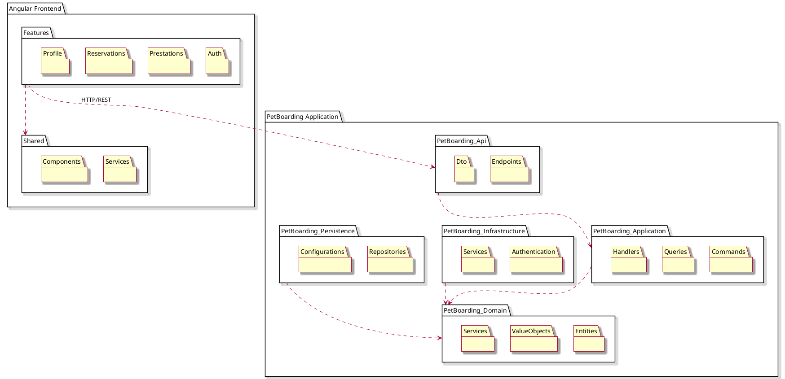
```plantuml
@startuml packages
skin rose

package "PetBoarding Application" {
  package "PetBoarding_Api" {
    package "Endpoints" {
    }
    package "Dto" {
    }
  }

  package "PetBoarding_Application" {
    package "Commands" {
    }
    package "Queries" {
    }
    package "Handlers" {
    }
  }

  package "PetBoarding_Domain" {
    package "Entities" {
    }
    package "ValueObjects" {
    }
    package "Services" {
    }
  }

  package "PetBoarding_Infrastructure" {
    package "Authentication" {
    }
    package "Services" {
    }
  }

  package "PetBoarding_Persistence" {
    package "Repositories" {
    }
    package "Configurations" {
    }
  }
}

package "Angular Frontend" {
  package "Features" {
    package "Auth" {
    }
    package "Prestations" {
    }
    package "Reservations" {
    }
    package "Profile" {
    }
  }

  package "Shared" {
    package "Services" {
    }
    package "Components" {
    }
  }
}

PetBoarding_Api ..> PetBoarding_Application
PetBoarding_Application ..> PetBoarding_Domain
PetBoarding_Infrastructure ..> PetBoarding_Domain
PetBoarding_Persistence ..> PetBoarding_Domain
Features ..> Shared
Features ..> PetBoarding_Api : HTTP/REST

@enduml
```

### 4.11. Déploiement

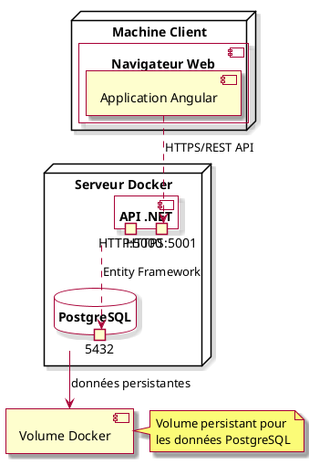
```plantuml
@startuml deploiement
!pragma layout smetana
skin rose

node "Machine Client" {
  component "Navigateur Web" {
    component "Application Angular"
  }
}

node "Serveur Docker" {
  component "API .NET" {
    port "HTTPS:5001" as https
    port "HTTP:5000" as http
  }

  database "PostgreSQL" as postgres {
    port "5432" as db_port
  }
}

component "Volume Docker" as volume

[Application Angular] ..> https : HTTPS/REST API
[API .NET] ..> db_port : Entity Framework
postgres --> volume : données persistantes

note right of volume
  Volume persistant pour
  les données PostgreSQL
end note

@enduml
```

## 5. Préliminaire à la conception

La conception suit une approche itérative basée sur les principes de la Clean Architecture. Le système PetBoarding gère la réservation de prestations pour animaux avec :

- Gestion des utilisateurs et authentification
- Catalogue de prestations par type d'animal
- Système de réservation avec planning en temps réel
- Panier de réservations avec paiement
- Gestion des profils utilisateurs et animaux

L'architecture CQRS permet une séparation claire entre les opérations de lecture et d'écriture, optimisant les performances et la maintenabilité.

## 6. Cas d'utilisation

### 6.1. Rappel : modèle conceptuel

Le modèle conceptuel principal comprend les entités suivantes :

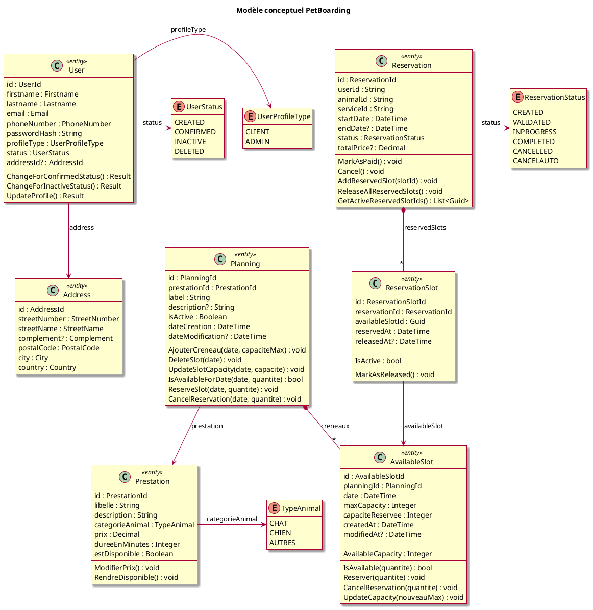
```plantuml
@startuml
skin rose
hide empty members
title Modèle conceptuel PetBoarding

class User <<entity>> {
  id : UserId
  firstname : Firstname
  lastname : Lastname
  email : Email
  phoneNumber : PhoneNumber
  passwordHash : String
  profileType : UserProfileType
  status : UserStatus
  addressId? : AddressId

  ChangeForConfirmedStatus() : Result
  ChangeForInactiveStatus() : Result
  UpdateProfile() : Result
}

class Address <<entity>> {
  id : AddressId
  streetNumber : StreetNumber
  streetName : StreetName
  complement? : Complement
  postalCode : PostalCode
  city : City
  country : Country
}

class Prestation <<entity>> {
  id : PrestationId
  libelle : String
  description : String
  categorieAnimal : TypeAnimal
  prix : Decimal
  dureeEnMinutes : Integer
  estDisponible : Boolean

  ModifierPrix() : void
  RendreDisponible() : void
}

class Planning <<entity>> {
  id : PlanningId
  prestationId : PrestationId
  label : String
  description? : String
  isActive : Boolean
  dateCreation : DateTime
  dateModification? : DateTime

  AjouterCreneau(date, capaciteMax) : void
  DeleteSlot(date) : void
  UpdateSlotCapacity(date, capacite) : void
  IsAvailableForDate(date, quantite) : bool
  ReserveSlot(date, quantite) : void
  CancelReservation(date, quantite) : void
}

class AvailableSlot <<entity>> {
  id : AvailableSlotId
  planningId : PlanningId
  date : DateTime
  maxCapacity : Integer
  capaciteReservee : Integer
  createdAt : DateTime
  modifiedAt? : DateTime

  AvailableCapacity : Integer
  IsAvailable(quantite) : bool
  Reserver(quantite) : void
  CancelReservation(quantite) : void
  UpdateCapacity(nouveauMax) : void
}

class Reservation <<entity>> {
  id : ReservationId
  userId : String
  animalId : String
  serviceId : String
  startDate : DateTime
  endDate? : DateTime
  status : ReservationStatus
  totalPrice? : Decimal

  MarkAsPaid() : void
  Cancel() : void
  AddReservedSlot(slotId) : void
  ReleaseAllReservedSlots() : void
  GetActiveReservedSlotIds() : List<Guid>
}

class ReservationSlot <<entity>> {
  id : ReservationSlotId
  reservationId : ReservationId
  availableSlotId : Guid
  reservedAt : DateTime
  releasedAt? : DateTime

  IsActive : bool
  MarkAsReleased() : void
}

enum UserProfileType {
  CLIENT
  ADMIN
}

enum UserStatus {
  CREATED
  CONFIRMED
  INACTIVE
  DELETED
}

enum TypeAnimal {
  CHAT
  CHIEN
  AUTRES
}

enum ReservationStatus {
  CREATED
  VALIDATED
  INPROGRESS
  COMPLETED
  CANCELLED
  CANCELAUTO
}

User --> Address : address
User -> UserProfileType : profileType
User -> UserStatus : status
Prestation -> TypeAnimal : categorieAnimal
Planning --> Prestation : prestation
Planning *-- "*" AvailableSlot : creneaux
Reservation -> ReservationStatus : status
Reservation *-- "*" ReservationSlot : reservedSlots
ReservationSlot --> AvailableSlot : availableSlot

@enduml
```

### 6.2. Sous domaine : gestion des utilisateurs

#### 6.2.1. Créer un compte utilisateur

##### 6.2.1.1. Diagramme de séquences

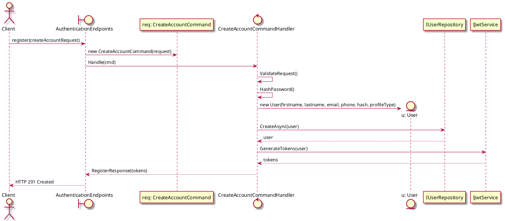
```plantuml
@startuml
skin rose
actor Client as c
boundary AuthenticationEndpoints as api
participant "req: CreateAccountCommand" as cmd
control CreateAccountCommandHandler as handler
entity "u: User" as user
participant IUserRepository as repo
participant IJwtService as jwt

c -> api : register(createAccountRequest)
api -> cmd : new CreateAccountCommand(request)
api -> handler : Handle(cmd)
handler -> handler : ValidateRequest()
handler -> handler : HashPassword()
create user
handler -> user : new User(firstname, lastname, email, phone, hash, profileType)
handler -> repo : CreateAsync(user)
repo --> handler : user
handler -> jwt : GenerateTokens(user)
jwt --> handler : tokens
handler --> api : RegisterResponse(tokens)
api --> c : HTTP 201 Created

@enduml
```

##### 6.2.1.2. Diagramme de classes

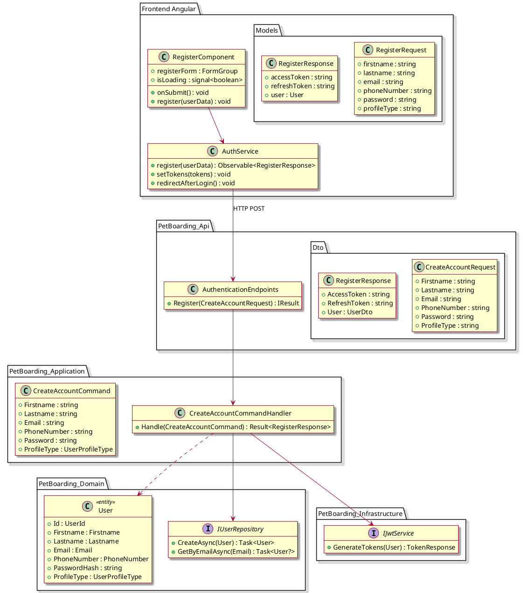
```plantuml
@startuml
skin rose
hide empty members

package "Frontend Angular" {
  class RegisterComponent {
    + registerForm : FormGroup
    + isLoading : signal<boolean>
    + onSubmit() : void
    + register(userData) : void
  }

  class AuthService {
    + register(userData) : Observable<RegisterResponse>
    + setTokens(tokens) : void
    + redirectAfterLogin() : void
  }

  package "Models" {
    class RegisterRequest {
      + firstname : string
      + lastname : string
      + email : string
      + phoneNumber : string
      + password : string
      + profileType : string
    }

    class RegisterResponse {
      + accessToken : string
      + refreshToken : string
      + user : User
    }
  }
}

package "PetBoarding_Api" {
  class AuthenticationEndpoints {
    + Register(CreateAccountRequest) : IResult
  }

  package "Dto" {
    class CreateAccountRequest {
      + Firstname : string
      + Lastname : string
      + Email : string
      + PhoneNumber : string
      + Password : string
      + ProfileType : string
    }

    class RegisterResponse {
      + AccessToken : string
      + RefreshToken : string
      + User : UserDto
    }
  }
}

package "PetBoarding_Application" {
  class CreateAccountCommandHandler {
    + Handle(CreateAccountCommand) : Result<RegisterResponse>
  }

  class CreateAccountCommand {
    + Firstname : string
    + Lastname : string
    + Email : string
    + PhoneNumber : string
    + Password : string
    + ProfileType : UserProfileType
  }
}

package "PetBoarding_Domain" {
  class User <<entity>> {
    + Id : UserId
    + Firstname : Firstname
    + Lastname : Lastname
    + Email : Email
    + PhoneNumber : PhoneNumber
    + PasswordHash : string
    + ProfileType : UserProfileType
  }

  interface IUserRepository {
    + CreateAsync(User) : Task<User>
    + GetByEmailAsync(Email) : Task<User?>
  }
}

package "PetBoarding_Infrastructure" {
  interface IJwtService {
    + GenerateTokens(User) : TokenResponse
  }
}

RegisterComponent --> AuthService
AuthService --> AuthenticationEndpoints : HTTP POST
AuthenticationEndpoints --> CreateAccountCommandHandler
CreateAccountCommandHandler --> IUserRepository
CreateAccountCommandHandler --> IJwtService
CreateAccountCommandHandler ..> User
@enduml
```

#### 6.2.2. Authentification d'un utilisateur

##### 6.2.2.1. Diagramme de séquences

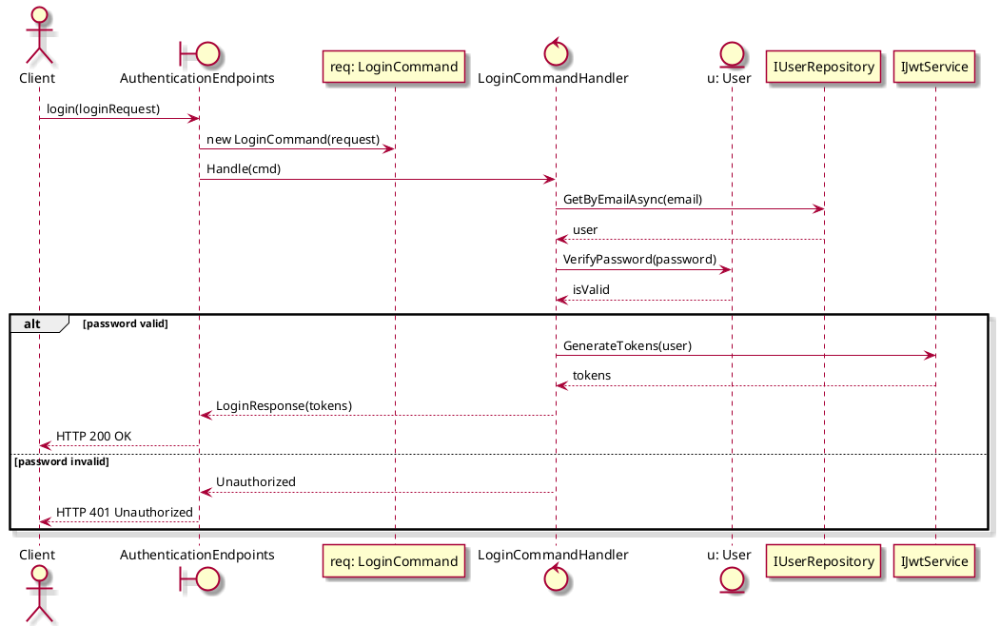
```plantuml
@startuml
skin rose
actor Client as c
boundary AuthenticationEndpoints as api
participant "req: LoginCommand" as cmd
control LoginCommandHandler as handler
entity "u: User" as user
participant IUserRepository as repo
participant IJwtService as jwt

c -> api : login(loginRequest)
api -> cmd : new LoginCommand(request)
api -> handler : Handle(cmd)
handler -> repo : GetByEmailAsync(email)
repo --> handler : user
handler -> user : VerifyPassword(password)
user --> handler : isValid
alt password valid
  handler -> jwt : GenerateTokens(user)
  jwt --> handler : tokens
  handler --> api : LoginResponse(tokens)
  api --> c : HTTP 200 OK
else password invalid
  handler --> api : Unauthorized
  api --> c : HTTP 401 Unauthorized
end

@enduml
```

##### 6.2.2.2. Diagramme de classes

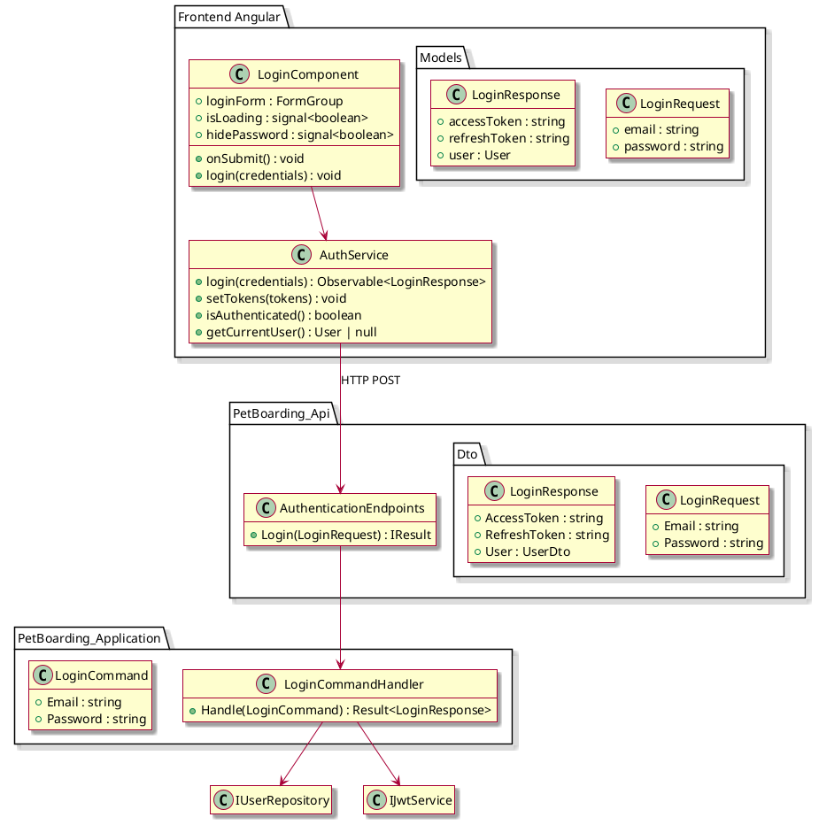
```plantuml
@startuml
skin rose
hide empty members

package "Frontend Angular" {
  class LoginComponent {
    + loginForm : FormGroup
    + isLoading : signal<boolean>
    + hidePassword : signal<boolean>
    + onSubmit() : void
    + login(credentials) : void
  }

  class AuthService {
    + login(credentials) : Observable<LoginResponse>
    + setTokens(tokens) : void
    + isAuthenticated() : boolean
    + getCurrentUser() : User | null
  }

  package "Models" {
    class LoginRequest {
      + email : string
      + password : string
    }

    class LoginResponse {
      + accessToken : string
      + refreshToken : string
      + user : User
    }
  }
}

package "PetBoarding_Api" {
  class AuthenticationEndpoints {
    + Login(LoginRequest) : IResult
  }

  package "Dto" {
    class LoginRequest {
      + Email : string
      + Password : string
    }

    class LoginResponse {
      + AccessToken : string
      + RefreshToken : string
      + User : UserDto
    }
  }
}

package "PetBoarding_Application" {
  class LoginCommandHandler {
    + Handle(LoginCommand) : Result<LoginResponse>
  }

  class LoginCommand {
    + Email : string
    + Password : string
  }
}

LoginComponent --> AuthService
AuthService --> AuthenticationEndpoints : HTTP POST
AuthenticationEndpoints --> LoginCommandHandler
LoginCommandHandler --> IUserRepository
LoginCommandHandler --> IJwtService

@enduml
```

### 6.3. Sous domaine : gestion des prestations

#### 6.3.1. Visualiser les prestations disponibles

##### 6.3.1.1. Diagramme de séquences

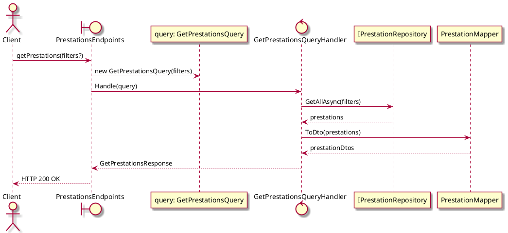
```plantuml
@startuml
skin rose
actor Client as c
boundary PrestationsEndpoints as api
participant "query: GetPrestationsQuery" as query
control GetPrestationsQueryHandler as handler
participant IPrestationRepository as repo
participant PrestationMapper as mapper

c -> api : getPrestations(filters?)
api -> query : new GetPrestationsQuery(filters)
api -> handler : Handle(query)
handler -> repo : GetAllAsync(filters)
repo --> handler : prestations
handler -> mapper : ToDto(prestations)
mapper --> handler : prestationDtos
handler --> api : GetPrestationsResponse
api --> c : HTTP 200 OK

@enduml
```

##### 6.3.1.2. Diagramme de classes

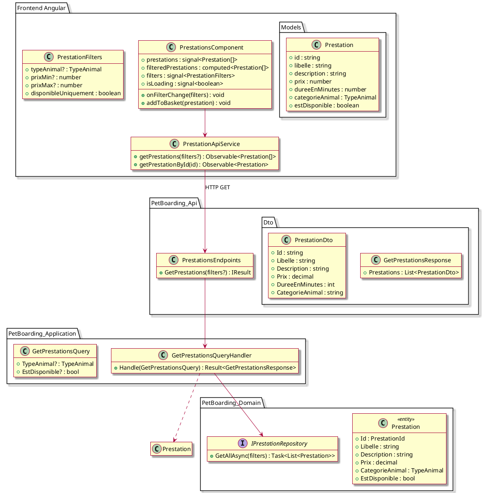
```plantuml
@startuml
skin rose
hide empty members

package "Frontend Angular" {
  class PrestationsComponent {
    + prestations : signal<Prestation[]>
    + filteredPrestations : computed<Prestation[]>
    + filters : signal<PrestationFilters>
    + isLoading : signal<boolean>
    + onFilterChange(filters) : void
    + addToBasket(prestation) : void
  }

  class PrestationFilters {
    + typeAnimal? : TypeAnimal
    + prixMin? : number
    + prixMax? : number
    + disponibleUniquement : boolean
  }

  class PrestationApiService {
    + getPrestations(filters?) : Observable<Prestation[]>
    + getPrestationById(id) : Observable<Prestation>
  }

  package "Models" {
    class Prestation {
      + id : string
      + libelle : string
      + description : string
      + prix : number
      + dureeEnMinutes : number
      + categorieAnimal : TypeAnimal
      + estDisponible : boolean
    }
  }
}

package "PetBoarding_Api" {
  class PrestationsEndpoints {
    + GetPrestations(filters?) : IResult
  }

  package "Dto" {
    class GetPrestationsResponse {
      + Prestations : List<PrestationDto>
    }

    class PrestationDto {
      + Id : string
      + Libelle : string
      + Description : string
      + Prix : decimal
      + DureeEnMinutes : int
      + CategorieAnimal : string
    }
  }
}

package "PetBoarding_Application" {
  class GetPrestationsQueryHandler {
    + Handle(GetPrestationsQuery) : Result<GetPrestationsResponse>
  }

  class GetPrestationsQuery {
    + TypeAnimal? : TypeAnimal
    + EstDisponible? : bool
  }
}

package "PetBoarding_Domain" {
  class Prestation <<entity>> {
    + Id : PrestationId
    + Libelle : string
    + Description : string
    + Prix : decimal
    + CategorieAnimal : TypeAnimal
    + EstDisponible : bool
  }

  interface IPrestationRepository {
    + GetAllAsync(filters) : Task<List<Prestation>>
  }
}

PrestationsComponent --> PrestationApiService
PrestationApiService --> PrestationsEndpoints : HTTP GET
PrestationsEndpoints --> GetPrestationsQueryHandler
GetPrestationsQueryHandler --> IPrestationRepository
GetPrestationsQueryHandler ..> Prestation

@enduml
```

### 6.4. Sous domaine : gestion des réservations

#### 6.4.1. Créer une réservation

##### 6.4.1.1. Diagramme de séquences

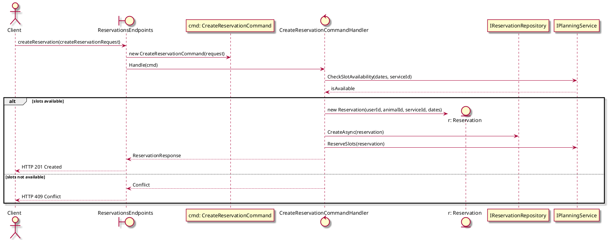
```plantuml
@startuml
skin rose
actor Client as c
boundary ReservationsEndpoints as api
participant "cmd: CreateReservationCommand" as cmd
control CreateReservationCommandHandler as handler
entity "r: Reservation" as reservation
participant IReservationRepository as repo
participant IPlanningService as planning

c -> api : createReservation(createReservationRequest)
api -> cmd : new CreateReservationCommand(request)
api -> handler : Handle(cmd)
handler -> planning : CheckSlotAvailability(dates, serviceId)
planning --> handler : isAvailable
alt slots available
  create reservation
  handler -> reservation : new Reservation(userId, animalId, serviceId, dates)
  handler -> repo : CreateAsync(reservation)
  handler -> planning : ReserveSlots(reservation)
  handler --> api : ReservationResponse
  api --> c : HTTP 201 Created
else slots not available
  handler --> api : Conflict
  api --> c : HTTP 409 Conflict
end

@enduml
```

##### 6.4.1.2. Diagramme de classes

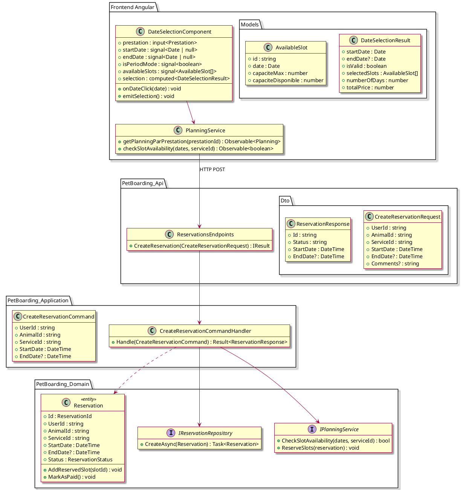
```plantuml
@startuml
skin rose
hide empty members

package "Frontend Angular" {
  class DateSelectionComponent {
    + prestation : input<Prestation>
    + startDate : signal<Date | null>
    + endDate : signal<Date | null>
    + isPeriodMode : signal<boolean>
    + availableSlots : signal<AvailableSlot[]>
    + selection : computed<DateSelectionResult>
    + onDateClick(date) : void
    + emitSelection() : void
  }

  class PlanningService {
    + getPlanningParPrestation(prestationId) : Observable<Planning>
    + checkSlotAvailability(dates, serviceId) : Observable<boolean>
  }

  package "Models" {
    class DateSelectionResult {
      + startDate : Date
      + endDate? : Date
      + isValid : boolean
      + selectedSlots : AvailableSlot[]
      + numberOfDays : number
      + totalPrice : number
    }

    class AvailableSlot {
      + id : string
      + date : Date
      + capaciteMax : number
      + capaciteDisponible : number
    }
  }
}

package "PetBoarding_Api" {
  class ReservationsEndpoints {
    + CreateReservation(CreateReservationRequest) : IResult
  }

  package "Dto" {
    class CreateReservationRequest {
      + UserId : string
      + AnimalId : string
      + ServiceId : string
      + StartDate : DateTime
      + EndDate? : DateTime
      + Comments? : string
    }

    class ReservationResponse {
      + Id : string
      + Status : string
      + StartDate : DateTime
      + EndDate? : DateTime
    }
  }
}

package "PetBoarding_Application" {
  class CreateReservationCommandHandler {
    + Handle(CreateReservationCommand) : Result<ReservationResponse>
  }

  class CreateReservationCommand {
    + UserId : string
    + AnimalId : string
    + ServiceId : string
    + StartDate : DateTime
    + EndDate? : DateTime
  }
}

package "PetBoarding_Domain" {
  class Reservation <<entity>> {
    + Id : ReservationId
    + UserId : string
    + AnimalId : string
    + ServiceId : string
    + StartDate : DateTime
    + EndDate? : DateTime
    + Status : ReservationStatus

    + AddReservedSlot(slotId) : void
    + MarkAsPaid() : void
  }

  interface IReservationRepository {
    + CreateAsync(Reservation) : Task<Reservation>
  }

  interface IPlanningService {
    + CheckSlotAvailability(dates, serviceId) : bool
    + ReserveSlots(reservation) : void
  }
}

DateSelectionComponent --> PlanningService
PlanningService --> ReservationsEndpoints : HTTP POST
ReservationsEndpoints --> CreateReservationCommandHandler
CreateReservationCommandHandler --> IReservationRepository
CreateReservationCommandHandler --> IPlanningService
CreateReservationCommandHandler ..> Reservation

@enduml
```

#### 6.4.2. Gérer le panier de réservations

##### 6.4.2.1. Diagramme de séquences

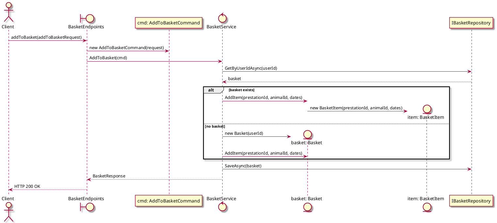
```plantuml
@startuml
skin rose
actor Client as c
boundary BasketEndpoints as api
participant "cmd: AddToBasketCommand" as cmd
control BasketService as service
entity "basket: Basket" as basket
entity "item: BasketItem" as item
participant IBasketRepository as repo

c -> api : addToBasket(addToBasketRequest)
api -> cmd : new AddToBasketCommand(request)
api -> service : AddToBasket(cmd)
service -> repo : GetByUserIdAsync(userId)
repo --> service : basket
alt basket exists
  service -> basket : AddItem(prestationId, animalId, dates)
  create item
  basket -> item : new BasketItem(prestationId, animalId, dates)
else no basket
  create basket
  service -> basket : new Basket(userId)
  service -> basket : AddItem(prestationId, animalId, dates)
end
service -> repo : SaveAsync(basket)
service --> api : BasketResponse
api --> c : HTTP 200 OK

@enduml
```

##### 6.4.2.2. Diagramme de classes

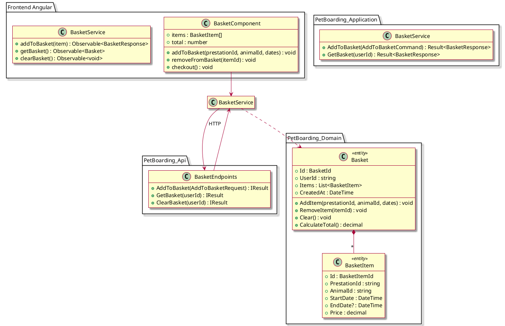
```plantuml
@startuml
skin rose
hide empty members

package "Frontend Angular" {
  class BasketComponent {
    + items : BasketItem[]
    + total : number
    + addToBasket(prestationId, animalId, dates) : void
    + removeFromBasket(itemId) : void
    + checkout() : void
  }

  class BasketService {
    + addToBasket(item) : Observable<BasketResponse>
    + getBasket() : Observable<Basket>
    + clearBasket() : Observable<void>
  }
}

package "PetBoarding_Api" {
  class BasketEndpoints {
    + AddToBasket(AddToBasketRequest) : IResult
    + GetBasket(userId) : IResult
    + ClearBasket(userId) : IResult
  }
}

package "PetBoarding_Application" {
  class BasketService {
    + AddToBasket(AddToBasketCommand) : Result<BasketResponse>
    + GetBasket(userId) : Result<BasketResponse>
  }
}

package "PetBoarding_Domain" {
  class Basket <<entity>> {
    + Id : BasketId
    + UserId : string
    + Items : List<BasketItem>
    + CreatedAt : DateTime

    + AddItem(prestationId, animalId, dates) : void
    + RemoveItem(itemId) : void
    + Clear() : void
    + CalculateTotal() : decimal
  }

  class BasketItem <<entity>> {
    + Id : BasketItemId
    + PrestationId : string
    + AnimalId : string
    + StartDate : DateTime
    + EndDate? : DateTime
    + Price : decimal
  }

  Basket *-- "*" BasketItem
}

BasketComponent --> BasketService
BasketService --> BasketEndpoints : HTTP
BasketEndpoints --> BasketService
BasketService ..> Basket

@enduml
```

- [6.5. Sous domaine : gestion du planning et des créneaux](#65-sous-domaine--gestion-du-planning-et-des-créneaux)
  - [6.5.1. Consulter les créneaux disponibles](#651-consulter-les-créneaux-disponibles)
    - [6.5.1.1. Diagramme de séquences](#6511-diagramme-de-séquences)
    - [6.5.1.2. Diagramme de classes](#6512-diagramme-de-classes)
  - [6.5.2. Créer un planning pour une prestation](#652-créer-un-planning-pour-une-prestation)
    - [6.5.2.1. Diagramme de séquences](#6521-diagramme-de-séquences)
    - [6.5.2.2. Diagramme de classes](#6522-diagramme-de-classes)

### 6.5. Sous domaine : gestion du planning et des créneaux

#### 6.5.1. Consulter les créneaux disponibles

##### 6.5.1.1. Diagramme de séquences

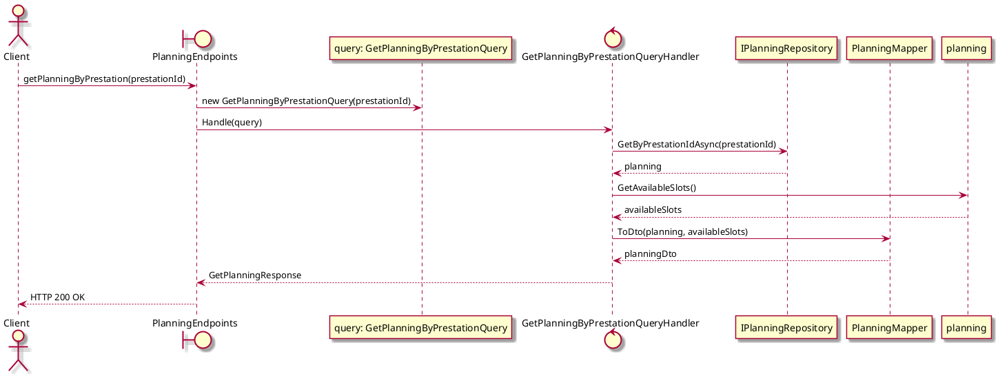
```plantuml
@startuml
skin rose
actor Client as c
boundary PlanningEndpoints as api
participant "query: GetPlanningByPrestationQuery" as query
control GetPlanningByPrestationQueryHandler as handler
participant IPlanningRepository as repo
participant PlanningMapper as mapper

c -> api : getPlanningByPrestation(prestationId)
api -> query : new GetPlanningByPrestationQuery(prestationId)
api -> handler : Handle(query)
handler -> repo : GetByPrestationIdAsync(prestationId)
repo --> handler : planning
handler -> planning : GetAvailableSlots()
planning --> handler : availableSlots
handler -> mapper : ToDto(planning, availableSlots)
mapper --> handler : planningDto
handler --> api : GetPlanningResponse
api --> c : HTTP 200 OK

@enduml
```

##### 6.5.1.2. Diagramme de classes

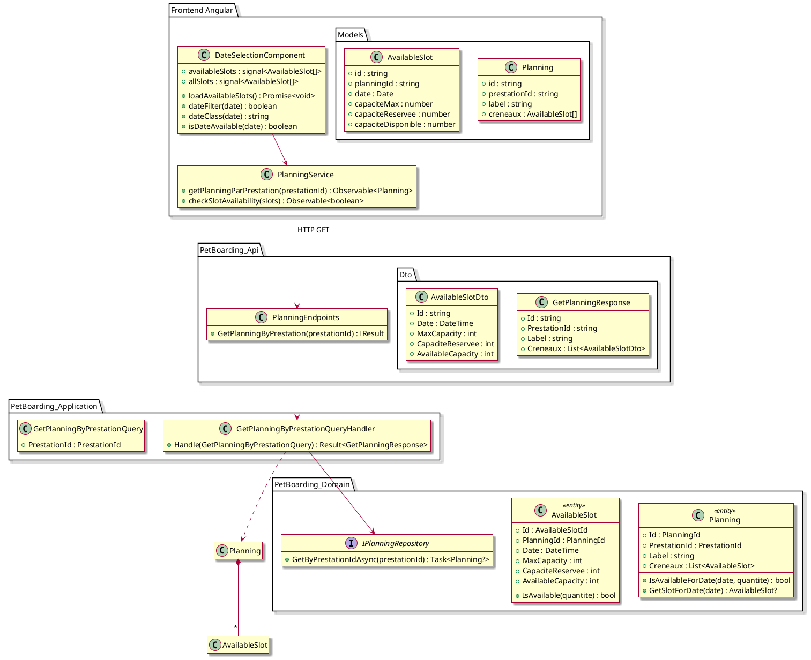
```plantuml
@startuml
skin rose
hide empty members

package "Frontend Angular" {
  class DateSelectionComponent {
    + availableSlots : signal<AvailableSlot[]>
    + allSlots : signal<AvailableSlot[]>
    + loadAvailableSlots() : Promise<void>
    + dateFilter(date) : boolean
    + dateClass(date) : string
    + isDateAvailable(date) : boolean
  }

  class PlanningService {
    + getPlanningParPrestation(prestationId) : Observable<Planning>
    + checkSlotAvailability(slots) : Observable<boolean>
  }

  package "Models" {
    class Planning {
      + id : string
      + prestationId : string
      + label : string
      + creneaux : AvailableSlot[]
    }

    class AvailableSlot {
      + id : string
      + planningId : string
      + date : Date
      + capaciteMax : number
      + capaciteReservee : number
      + capaciteDisponible : number
    }
  }
}

package "PetBoarding_Api" {
  class PlanningEndpoints {
    + GetPlanningByPrestation(prestationId) : IResult
  }

  package "Dto" {
    class GetPlanningResponse {
      + Id : string
      + PrestationId : string
      + Label : string
      + Creneaux : List<AvailableSlotDto>
    }

    class AvailableSlotDto {
      + Id : string
      + Date : DateTime
      + MaxCapacity : int
      + CapaciteReservee : int
      + AvailableCapacity : int
    }
  }
}

package "PetBoarding_Application" {
  class GetPlanningByPrestationQueryHandler {
    + Handle(GetPlanningByPrestationQuery) : Result<GetPlanningResponse>
  }

  class GetPlanningByPrestationQuery {
    + PrestationId : PrestationId
  }
}

package "PetBoarding_Domain" {
  class Planning <<entity>> {
    + Id : PlanningId
    + PrestationId : PrestationId
    + Label : string
    + Creneaux : List<AvailableSlot>
    + IsAvailableForDate(date, quantite) : bool
    + GetSlotForDate(date) : AvailableSlot?
  }

  class AvailableSlot <<entity>> {
    + Id : AvailableSlotId
    + PlanningId : PlanningId
    + Date : DateTime
    + MaxCapacity : int
    + CapaciteReservee : int
    + AvailableCapacity : int
    + IsAvailable(quantite) : bool
  }

  interface IPlanningRepository {
    + GetByPrestationIdAsync(prestationId) : Task<Planning?>
  }
}

DateSelectionComponent --> PlanningService
PlanningService --> PlanningEndpoints : HTTP GET
PlanningEndpoints --> GetPlanningByPrestationQueryHandler
GetPlanningByPrestationQueryHandler --> IPlanningRepository
GetPlanningByPrestationQueryHandler ..> Planning
Planning *-- "*" AvailableSlot

@enduml
```

#### 6.5.2. Créer un planning pour une prestation

##### 6.5.2.1. Diagramme de séquences

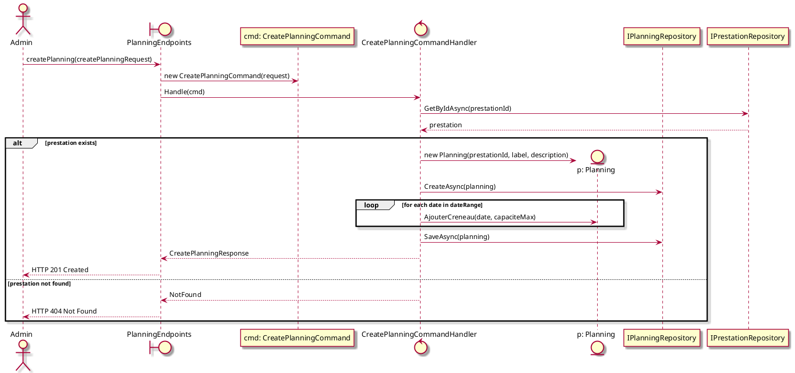
```plantuml
@startuml
skin rose
actor Admin as a
boundary PlanningEndpoints as api
participant "cmd: CreatePlanningCommand" as cmd
control CreatePlanningCommandHandler as handler
entity "p: Planning" as planning
participant IPlanningRepository as repo
participant IPrestationRepository as prestationRepo

a -> api : createPlanning(createPlanningRequest)
api -> cmd : new CreatePlanningCommand(request)
api -> handler : Handle(cmd)
handler -> prestationRepo : GetByIdAsync(prestationId)
prestationRepo --> handler : prestation
alt prestation exists
  create planning
  handler -> planning : new Planning(prestationId, label, description)
  handler -> repo : CreateAsync(planning)
  loop for each date in dateRange
    handler -> planning : AjouterCreneau(date, capaciteMax)
  end
  handler -> repo : SaveAsync(planning)
  handler --> api : CreatePlanningResponse
  api --> a : HTTP 201 Created
else prestation not found
  handler --> api : NotFound
  api --> a : HTTP 404 Not Found
end

@enduml
```

##### 6.5.2.2. Diagramme de classes

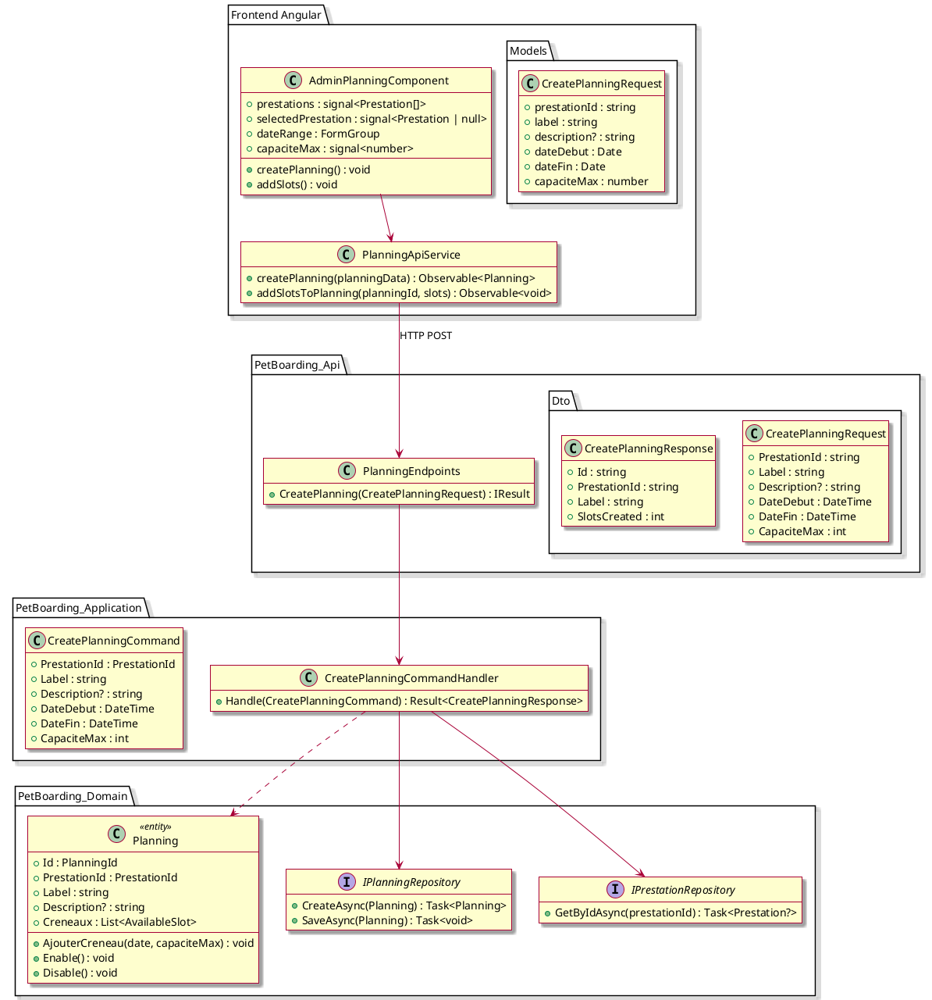
```plantuml
@startuml
skin rose
hide empty members

package "Frontend Angular" {
  class AdminPlanningComponent {
    + prestations : signal<Prestation[]>
    + selectedPrestation : signal<Prestation | null>
    + dateRange : FormGroup
    + capaciteMax : signal<number>
    + createPlanning() : void
    + addSlots() : void
  }

  class PlanningApiService {
    + createPlanning(planningData) : Observable<Planning>
    + addSlotsToPlanning(planningId, slots) : Observable<void>
  }

  package "Models" {
    class CreatePlanningRequest {
      + prestationId : string
      + label : string
      + description? : string
      + dateDebut : Date
      + dateFin : Date
      + capaciteMax : number
    }
  }
}

package "PetBoarding_Api" {
  class PlanningEndpoints {
    + CreatePlanning(CreatePlanningRequest) : IResult
  }

  package "Dto" {
    class CreatePlanningRequest {
      + PrestationId : string
      + Label : string
      + Description? : string
      + DateDebut : DateTime
      + DateFin : DateTime
      + CapaciteMax : int
    }

    class CreatePlanningResponse {
      + Id : string
      + PrestationId : string
      + Label : string
      + SlotsCreated : int
    }
  }
}

package "PetBoarding_Application" {
  class CreatePlanningCommandHandler {
    + Handle(CreatePlanningCommand) : Result<CreatePlanningResponse>
  }

  class CreatePlanningCommand {
    + PrestationId : PrestationId
    + Label : string
    + Description? : string
    + DateDebut : DateTime
    + DateFin : DateTime
    + CapaciteMax : int
  }
}

package "PetBoarding_Domain" {
  class Planning <<entity>> {
    + Id : PlanningId
    + PrestationId : PrestationId
    + Label : string
    + Description? : string
    + Creneaux : List<AvailableSlot>
    + AjouterCreneau(date, capaciteMax) : void
    + Enable() : void
    + Disable() : void
  }

  interface IPlanningRepository {
    + CreateAsync(Planning) : Task<Planning>
    + SaveAsync(Planning) : Task<void>
  }

  interface IPrestationRepository {
    + GetByIdAsync(prestationId) : Task<Prestation?>
  }
}

AdminPlanningComponent --> PlanningApiService
PlanningApiService --> PlanningEndpoints : HTTP POST
PlanningEndpoints --> CreatePlanningCommandHandler
CreatePlanningCommandHandler --> IPlanningRepository
CreatePlanningCommandHandler --> IPrestationRepository
CreatePlanningCommandHandler ..> Planning

@enduml
```

## 7. Regroupement des classes

### 7.1. Groupe domaine

#### 7.1.1. Users Domain

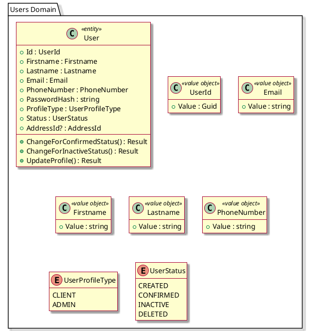
```plantuml
@startuml
skin rose
hide empty members

package "Users Domain" {
  class User <<entity>> {
    + Id : UserId
    + Firstname : Firstname
    + Lastname : Lastname
    + Email : Email
    + PhoneNumber : PhoneNumber
    + PasswordHash : string
    + ProfileType : UserProfileType
    + Status : UserStatus
    + AddressId? : AddressId

    + ChangeForConfirmedStatus() : Result
    + ChangeForInactiveStatus() : Result
    + UpdateProfile() : Result
  }

  class UserId <<value object>> {
    + Value : Guid
  }

  class Email <<value object>> {
    + Value : string
  }

  class Firstname <<value object>> {
    + Value : string
  }

  class Lastname <<value object>> {
    + Value : string
  }

  class PhoneNumber <<value object>> {
    + Value : string
  }

  enum UserProfileType {
    CLIENT
    ADMIN
  }

  enum UserStatus {
    CREATED
    CONFIRMED
    INACTIVE
    DELETED
  }
}

@enduml
```

#### 7.1.2. Addresses Domain

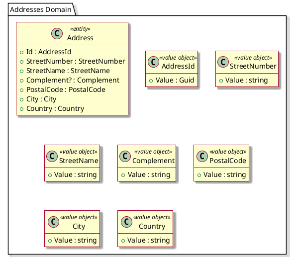
```plantuml
@startuml
skin rose
hide empty members

package "Addresses Domain" {
  class Address <<entity>> {
    + Id : AddressId
    + StreetNumber : StreetNumber
    + StreetName : StreetName
    + Complement? : Complement
    + PostalCode : PostalCode
    + City : City
    + Country : Country
  }

  class AddressId <<value object>> {
    + Value : Guid
  }
  
  class StreetNumber <<value object>> {
    + Value : string
  }
  
  class StreetName <<value object>> {
    + Value : string
  }
  
  class Complement <<value object>> {
    + Value : string
  }
  
  class PostalCode <<value object>> {
    + Value : string
  }
  
  class City <<value object>> {
    + Value : string
  }
  
  class Country <<value object>> {
    + Value : string
  }
}

@enduml
```

#### 7.1.3. Pets Domain

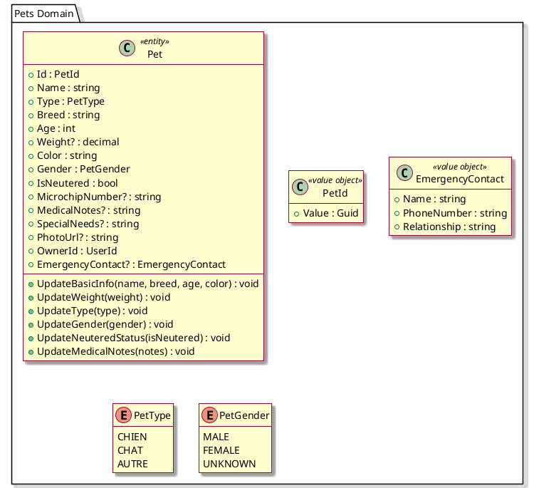
```plantuml
@startuml
skin rose
hide empty members

package "Pets Domain" {
  class Pet <<entity>> {
    + Id : PetId
    + Name : string
    + Type : PetType
    + Breed : string
    + Age : int
    + Weight? : decimal
    + Color : string
    + Gender : PetGender
    + IsNeutered : bool
    + MicrochipNumber? : string
    + MedicalNotes? : string
    + SpecialNeeds? : string
    + PhotoUrl? : string
    + OwnerId : UserId
    + EmergencyContact? : EmergencyContact
    
    + UpdateBasicInfo(name, breed, age, color) : void
    + UpdateWeight(weight) : void
    + UpdateType(type) : void
    + UpdateGender(gender) : void
    + UpdateNeuteredStatus(isNeutered) : void
    + UpdateMedicalNotes(notes) : void
  }

  class PetId <<value object>> {
    + Value : Guid
  }
  
  class EmergencyContact <<value object>> {
    + Name : string
    + PhoneNumber : string
    + Relationship : string
  }

  enum PetType {
    CHIEN
    CHAT
    AUTRE
  }

  enum PetGender {
    MALE
    FEMALE
    UNKNOWN
  }
}

@enduml
```

#### 7.1.4. Prestations Domain

```plantuml
@startuml
skin rose
hide empty members

package "Prestations Domain" {
  class Prestation <<entity>> {
    + Id : PrestationId
    + Libelle : string
    + Description : string
    + CategorieAnimal : TypeAnimal
    + Prix : decimal
    + DureeEnMinutes : int
    + EstDisponible : bool
    + DateCreation : DateTime
    + DateModification? : DateTime

    + ModifierLibelle(libelle) : void
    + ModifierDescription(description) : void
    + ModifierPrix(prix) : void
    + ModifierDuree(duree) : void
    + ModifierCategorieAnimal(categorie) : void
    + RendreDisponible() : void
    + RendreIndisponible() : void
    + Activer() : void
    + Desactiver() : void
  }

  class PrestationId <<value object>> {
    + Value : Guid
  }

  enum TypeAnimal {
    CHAT
    CHIEN
    AUTRES
  }
}

@enduml
```

#### 7.1.5. Planning Domain

```plantuml
@startuml
skin rose
hide empty members

package "Planning Domain" {
  class Planning <<entity>> {
    + Id : PlanningId
    + PrestationId : PrestationId
    + Label : string
    + Description? : string
    + IsActive : bool
    + DateCreation : DateTime
    + DateModification? : DateTime
    + Creneaux : List<AvailableSlot>
    
    + AjouterCreneau(date, capaciteMax) : void
    + DeleteSlot(date) : void
    + UpdateSlotCapacity(date, capacite) : void
    + ModifierNom(nom) : void
    + ModifierDescription(description) : void
    + Enable() : void
    + Disable() : void
    + IsAvailableForDate(date, quantite) : bool
    + ReserveSlot(date, quantite) : void
    + CancelReservation(date, quantite) : void
  }
  
  class AvailableSlot <<entity>> {
    + Id : AvailableSlotId
    + PlanningId : PlanningId
    + Date : DateTime
    + MaxCapacity : int
    + CapaciteReservee : int
    + CreatedAt : DateTime
    + ModifiedAt? : DateTime
    
    + AvailableCapacity : int
    + IsAvailable(quantite) : bool
    + Reserver(quantite) : void
    + CancelReservation(quantite) : void
    + UpdateCapacity(nouveauMax) : void
    + AssignToPlanning(planningId) : void
  }

  class PlanningId <<value object>> {
    + Value : Guid
  }
  
  class AvailableSlotId <<value object>> {
    + Value : Guid
  }
  
  Planning *-- "*" AvailableSlot
}

@enduml
```

#### 7.1.6. Reservations Domain

```plantuml
@startuml
skin rose
hide empty members

package "Reservations Domain" {
  class Reservation <<entity>> {
    + Id : ReservationId
    + UserId : string
    + AnimalId : string
    + AnimalName : string
    + ServiceId : string
    + StartDate : DateTime
    + EndDate? : DateTime
    + Comments? : string
    + Status : ReservationStatus
    + TotalPrice? : decimal
    + PaidAt? : DateTime
    + ReservedSlots : List<ReservationSlot>

    + UpdateDates(startDate, endDate) : void
    + UpdateComments(comments) : void
    + SetTotalPrice(price) : void
    + MarkAsPaid() : void
    + StartService() : void
    + Complete() : void
    + Cancel() : void
    + AddReservedSlot(slotId) : void
    + ReleaseReservedSlot(slotId) : void
    + ReleaseAllReservedSlots() : void
    + GetReservedDates() : IEnumerable<DateTime>
    + GetNumberOfDays() : int
  }
  
  class ReservationSlot <<entity>> {
    + Id : ReservationSlotId
    + ReservationId : ReservationId
    + AvailableSlotId : Guid
    + ReservedAt : DateTime
    + ReleasedAt? : DateTime
    
    + IsActive : bool
    + MarkAsReleased() : void
  }

  class ReservationId <<value object>> {
    + Value : Guid
  }
  
  class ReservationSlotId <<value object>> {
    + Value : Guid
  }

  enum ReservationStatus {
    CREATED
    VALIDATED
    INPROGRESS
    COMPLETED
    CANCELLED
    CANCELAUTO
  }
  
  Reservation *-- "*" ReservationSlot
}

@enduml
```

#### 7.1.7. Baskets Domain

```plantuml
@startuml
skin rose
hide empty members

package "Baskets Domain" {
  class Basket <<entity>> {
    + Id : BasketId
    + UserId : string
    + Items : List<BasketItem>
    + Status : BasketStatus
    + CreatedAt : DateTime
    + UpdatedAt? : DateTime
    + ExpiresAt : DateTime
    
    + AddItem(prestationId, animalId, dates, price) : void
    + RemoveItem(itemId) : void
    + UpdateItem(itemId, quantity) : void
    + Clear() : void
    + CalculateTotal() : decimal
    + IsExpired() : bool
    + MarkAsCompleted() : void
    + MarkAsCancelled() : void
  }
  
  class BasketItem <<entity>> {
    + Id : BasketItemId
    + BasketId : BasketId
    + PrestationId : string
    + AnimalId : string
    + AnimalName : string
    + StartDate : DateTime
    + EndDate? : DateTime
    + Quantity : int
    + UnitPrice : decimal
    + TotalPrice : decimal
    + AddedAt : DateTime
    
    + UpdateQuantity(quantity) : void
    + UpdateDates(startDate, endDate) : void
    + CalculateTotalPrice() : void
  }

  class BasketId <<value object>> {
    + Value : Guid
  }
  
  class BasketItemId <<value object>> {
    + Value : Guid
  }

  enum BasketStatus {
    ACTIVE
    COMPLETED
    CANCELLED
    EXPIRED
  }
  
  Basket *-- "*" BasketItem
}

@enduml
```

### 7.2. Groupe cycle de vie

```plantuml
@startuml
skin rose
hide empty members

package "PetBoarding_Persistence" {
  package "Repositories" {
    class BaseRepository<TEntity, TId> {
      + GetByIdAsync(id) : Task<TEntity?>
      + CreateAsync(entity) : Task<TEntity>
      + UpdateAsync(entity) : Task<TEntity>
      + DeleteAsync(id) : Task<bool>
    }

    class UserRepository {
      + GetByEmailAsync(email) : Task<User?>
      + CreateAsync(user) : Task<User>
    }

    class PrestationRepository {
      + GetAllAsync(filters) : Task<List<Prestation>>
      + GetByIdAsync(id) : Task<Prestation?>
    }

    class ReservationRepository {
      + GetByUserIdAsync(userId) : Task<List<Reservation>>
      + CreateAsync(reservation) : Task<Reservation>
    }

    BaseRepository <|-- UserRepository
    BaseRepository <|-- PrestationRepository
    BaseRepository <|-- ReservationRepository
  }

  package "Configurations" {
    class UserConfiguration {
      + Configure(EntityTypeBuilder<User>) : void
    }

    class PrestationConfiguration {
      + Configure(EntityTypeBuilder<Prestation>) : void
    }

    class ReservationConfiguration {
      + Configure(EntityTypeBuilder<Reservation>) : void
    }
  }
}

@enduml
```

### 7.3. Groupe application

#### 7.3.1. Abstractions et interfaces de base

```plantuml
@startuml
skin rose
hide empty members

package "PetBoarding_Application" {
  package "Abstractions" {
    interface ICommandHandler<TCommand, TResponse> {
      + Handle(command) : Task<Result<TResponse>>
    }

    interface IQueryHandler<TQuery, TResponse> {
      + Handle(query) : Task<Result<TResponse>>
    }
  }
}

@enduml
```

#### 7.3.2. Handlers par domaine métier

##### Users Domain

```plantuml
@startuml
skin rose
hide empty members

package "Users Domain" {
  class CreateAccountCommandHandler {
    + Handle(CreateAccountCommand) : Task<Result<RegisterResponse>>
  }

  class LoginCommandHandler {
    + Handle(LoginCommand) : Task<Result<LoginResponse>>
  }

  class GetUserByIdQueryHandler {
    + Handle(GetUserByIdQuery) : Task<Result<GetUserResponse>>
  }

  class GetAllUsersQueryHandler {
    + Handle(GetAllUsersQuery) : Task<Result<GetAllUsersResponse>>
  }
}

@enduml
```

##### Pets Domain

```plantuml
@startuml
skin rose
hide empty members

package "Pets Domain" {
  class CreatePetCommandHandler {
    + Handle(CreatePetCommand) : Task<Result<CreatePetResponse>>
  }

  class GetPetByIdQueryHandler {
    + Handle(GetPetByIdQuery) : Task<Result<GetPetResponse>>
  }

  class GetPetsByOwnerQueryHandler {
    + Handle(GetPetsByOwnerQuery) : Task<Result<GetPetsByOwnerResponse>>
  }

  class UpdatePetCommandHandler {
    + Handle(UpdatePetCommand) : Task<Result<UpdatePetResponse>>
  }

  class DeletePetCommandHandler {
    + Handle(DeletePetCommand) : Task<Result<bool>>
  }
}

@enduml
```

##### Prestations Domain

```plantuml
@startuml
skin rose
hide empty members

package "Prestations Domain" {
  class GetPrestationsQueryHandler {
    + Handle(GetPrestationsQuery) : Task<Result<GetPrestationsResponse>>
  }

  class GetPrestationByIdQueryHandler {
    + Handle(GetPrestationByIdQuery) : Task<Result<GetPrestationResponse>>
  }

  class CreatePrestationCommandHandler {
    + Handle(CreatePrestationCommand) : Task<Result<CreatePrestationResponse>>
  }

  class UpdatePrestationCommandHandler {
    + Handle(UpdatePrestationCommand) : Task<Result<UpdatePrestationResponse>>
  }

  class DeletePrestationCommandHandler {
    + Handle(DeletePrestationCommand) : Task<Result<bool>>
  }
}

@enduml
```

##### Reservations Domain

```plantuml
@startuml
skin rose
hide empty members

package "Reservations Domain" {
  class CreateReservationCommandHandler {
    + Handle(CreateReservationCommand) : Task<Result<ReservationResponse>>
  }

  class GetReservationsQueryHandler {
    + Handle(GetReservationsQuery) : Task<Result<GetReservationsResponse>>
  }

  class UpdateReservationCommandHandler {
    + Handle(UpdateReservationCommand) : Task<Result<ReservationResponse>>
  }

  class CancelReservationCommandHandler {
    + Handle(CancelReservationCommand) : Task<Result<bool>>
  }
}

@enduml
```

##### Planning Domain

```plantuml
@startuml
skin rose
hide empty members

package "Planning Domain" {
  class CreatePlanningCommandHandler {
    + Handle(CreatePlanningCommand) : Task<Result<CreatePlanningResponse>>
  }

  class GetPlanningByPrestationQueryHandler {
    + Handle(GetPlanningByPrestationQuery) : Task<Result<GetPlanningResponse>>
  }

  class GetAllPlanningsQueryHandler {
    + Handle(GetAllPlanningsQuery) : Task<Result<GetAllPlanningsResponse>>
  }

  class ReserverCreneauxCommandHandler {
    + Handle(ReserverCreneauxCommand) : Task<Result<ReserverCreneauxResponse>>
  }

  class AnnulerReservationsCommandHandler {
    + Handle(AnnulerReservationsCommand) : Task<Result<bool>>
  }

  class VerifierDisponibiliteQueryHandler {
    + Handle(VerifierDisponibiliteQuery) : Task<Result<DisponibiliteResponse>>
  }

  class ReleaseSlotService {
    + ReleaseSlotAsync(slotId) : Task<void>
    + ReleaseSlotsForReservationAsync(reservationId) : Task<void>
  }
}

@enduml
```

##### Baskets Domain

```plantuml
@startuml
skin rose
hide empty members

package "Baskets Domain" {
  class AddItemToBasketCommandHandler {
    + Handle(AddItemToBasketCommand) : Task<Result<BasketItemResponse>>
  }

  class GetUserBasketQueryHandler {
    + Handle(GetUserBasketQuery) : Task<Result<BasketResponse>>
  }

  class UpdateBasketItemCommandHandler {
    + Handle(UpdateBasketItemCommand) : Task<Result<BasketItemResponse>>
  }

  class RemoveItemFromBasketCommandHandler {
    + Handle(RemoveItemFromBasketCommand) : Task<Result<bool>>
  }

  class ClearBasketCommandHandler {
    + Handle(ClearBasketCommand) : Task<Result<bool>>
  }
}

@enduml
```

### 7.4. Groupe interface utilisateur

```plantuml
@startuml
skin rose
hide empty members

package "ng_PetBoarding_app" {

  package "Features" {
    package "Auth" {
      class LoginComponent {
        + onSubmit() : void
        + login(credentials) : void
      }

      class RegisterComponent {
        + onSubmit() : void
        + register(userData) : void
      }

      class AuthService {
        + login(credentials) : Observable<LoginResponse>
        + register(userData) : Observable<RegisterResponse>
        + logout() : void
        + isAuthenticated() : boolean
      }
    }

    package "Prestations" {
      class PrestationsComponent {
        + prestations : Prestation[]
        + filteredPrestations : Prestation[]
        + onFilterChange(filters) : void
      }

      class PrestationDetailComponent {
        + prestation : Prestation
        + addToBasket() : void
        + selectDates() : void
      }
    }

    package "Reservations" {
      class ReservationsComponent {
        + reservations : Reservation[]
        + loadReservations() : void
      }

      class ReservationItemComponent {
        + reservation : Reservation
        + cancelReservation() : void
      }
    }

    package "Basket" {
      class BasketComponent {
        + basketItems : BasketItem[]
        + total : number
        + checkout() : void
        + removeItem(itemId) : void
      }
    }
  }

  package "Shared" {
    package "Services" {
      class PrestationApiService {
        + getPrestations() : Observable<Prestation[]>
      }

      class ReservationApiService {
        + createReservation(data) : Observable<Reservation>
        + getReservations() : Observable<Reservation[]>
      }

      class BasketApiService {
        + addToBasket(item) : Observable<BasketResponse>
        + getBasket() : Observable<Basket>
      }
    }

    package "Guards" {
      class AuthGuard {
        + canActivate() : boolean
      }
    }
  }
}

@enduml
```

## 8. Choix, questions ouvertes et remarques

### 8.1. Architecture Clean Architecture

L'utilisation de la Clean Architecture apporte plusieurs avantages :

- **Indépendance des frameworks** : La logique métier ne dépend pas des technologies externes
- **Testabilité** : Chaque couche peut être testée indépendamment
- **Maintenabilité** : Les modifications dans une couche n'impactent pas les autres
- **Séparation des responsabilités** : Chaque couche a un rôle bien défini

### 8.2. Pattern CQRS

L'implémentation du pattern CQRS permet :

- **Séparation lecture/écriture** : Optimisation différenciée des requêtes et commandes
- **Scalabilité** : Possibilité de mettre à l'échelle indépendamment les parties lecture et écriture
- **Simplicité** : Handlers dédiés avec responsabilités uniques
- **Évolutivité** : Ajout facile de nouvelles fonctionnalités

### 8.3. Gestion des créneaux et planning

Le système de réservation implémente une gestion sophistiquée des créneaux :

- **ReservationSlot** : Entité de liaison entre réservations et créneaux disponibles
- **Gestion temps réel** : Évitement des conflits de réservation
- **Flexibilité** : Support des réservations ponctuelles et périodiques
- **Libération automatique** : Libération des créneaux en cas d'annulation

### 8.4. Critique de cette version du modèle

Points d'amélioration identifiés :

- **Gestion des événements** : Implémentation possible d'Event Sourcing pour l'historique des réservations
- **Notifications** : Ajout d'un système de notifications en temps réel (SignalR)
- **Cache** : Optimisation des performances avec mise en cache des prestations
- **Paiements** : Intégration avec des systèmes de paiement externes
- **Reporting** : Ajout de fonctionnalités de reporting et statistiques

## 9. Annexes

### 9.1. Terminologie

**Clean Architecture** : Architecture en couches avec inversion des dépendances, où les couches internes ne dépendent jamais des couches externes.

**CQRS** : Command Query Responsibility Segregation - Séparation des responsabilités entre les commandes (écriture) et les requêtes (lecture).

**Value Object** : Objet sans identité propre, défini uniquement par ses propriétés, immutable.

**Entity** : Objet avec une identité unique qui persiste dans le temps.

**Aggregate Root** : Entité racine qui contrôle l'accès aux autres entités de son agrégat.

**Repository Pattern** : Pattern d'abstraction de la couche de persistance.

### 9.2. Autres annexes

#### 9.2.1. Bibliographie

Sur la Clean Architecture :

- Martin R. C. _Clean Architecture: A Craftsman's Guide to Software Structure and Design_. Prentice Hall, 2017.

Sur le Domain Driven Design :

- Evans E. _Domain-driven design: tackling complexity in the heart of software_. Boston : Addison-Wesley, 2004.

Sur CQRS :

- Young G. _CQRS Documents_. [lien](https://cqrs.files.wordpress.com/2010/11/cqrs_documents.pdf)

Sur .NET et Entity Framework :

- Documentation Microsoft .NET : [https://docs.microsoft.com/fr-fr/dotnet/](https://docs.microsoft.com/fr-fr/dotnet/)
- Entity Framework Core : [https://docs.microsoft.com/fr-fr/ef/core/](https://docs.microsoft.com/fr-fr/ef/core/)

Sur Angular :

- Documentation Angular : [https://angular.io/docs](https://angular.io/docs)
- Guide des bonnes pratiques Angular : [https://angular.io/guide/styleguide](https://angular.io/guide/styleguide)
